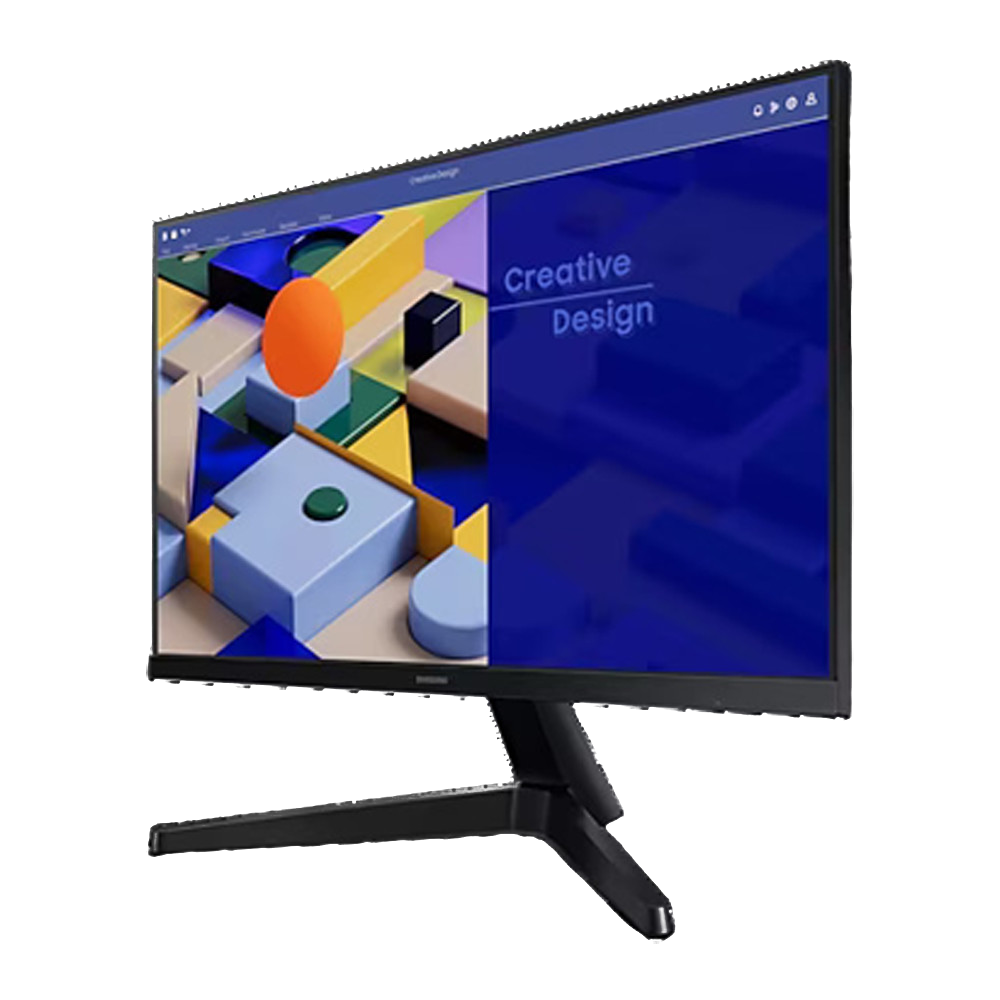

# **Contenu de l'emballage**
___

Les éléments inclus dans l'emballage sont décrits ci-dessous.

!!! warning "Important"

    S'il manque une pièce ou si elle est défectueuse, [envoyez-nous un courriel](mailto:support@agnospcb.com).

## **Composants**
___

| Composant | Image |
| --------- | :-----: |
| Plateforme AOI pré-assemblée|  {width=300px} |
|1x Cordon d'alimentation CA|  {width=300px}|
| Bloc multiprise |  {width=300px}|
| Adaptateur CA EU vers UK/USA si nécessaire |  {width=300px}|
| Tapis ESD + Dragonne ESD + Fil de terre |  {width=300px}|
| Kit d'entretien |  {width=300px} |
| Souris et clavier |  {width=300px}|
|Câble HDMI|  {width=300px}|
|Câble USB A vers USB B coudé |  {width=300px}|
| Moniteur IPS FULL-HD 24¨ | {width=300px} |
|  **\*UNITÉS EN LIGNE SEULEMENT\*** Mini-ordinateur pré-programmé + Souris et clavier |  {width=300px} |
|  **\*UNITÉS HORS LIGNE SEULEMENT\*** Ordinateur de bureau pré-programmé + Souris et clavier |  {width=300px} |