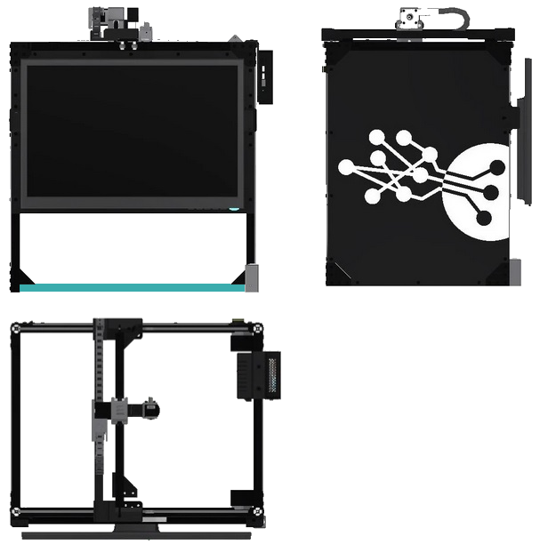
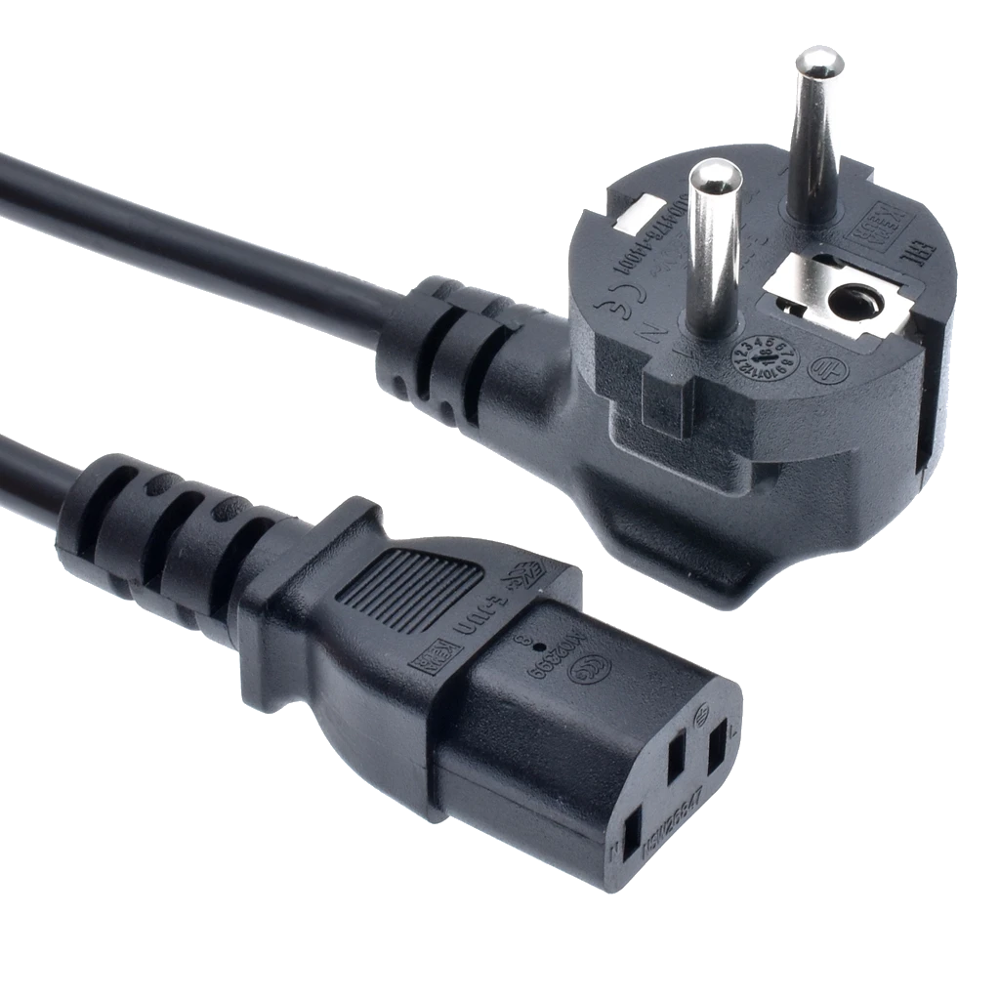
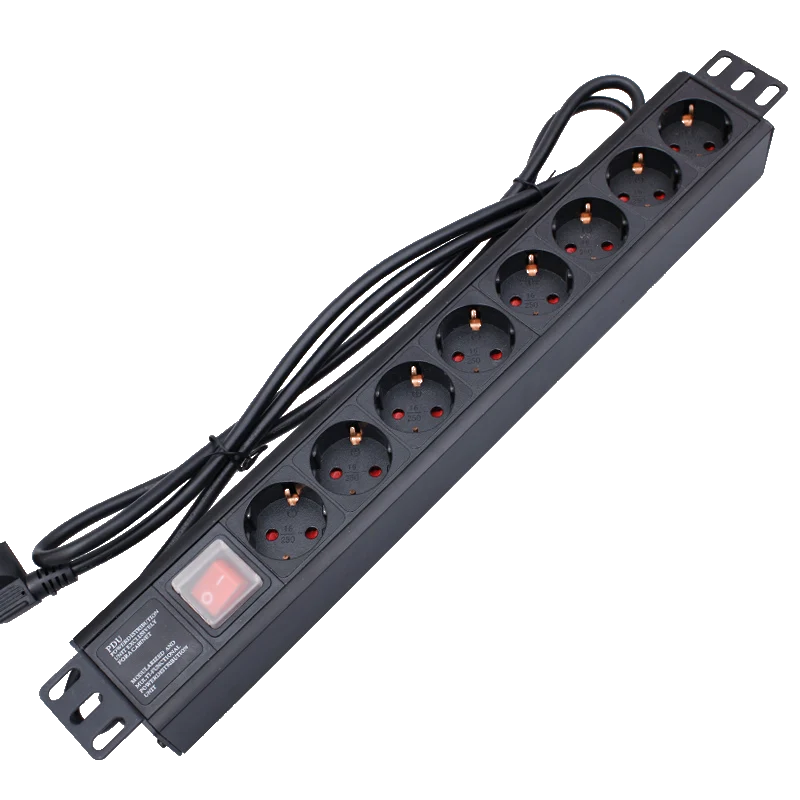
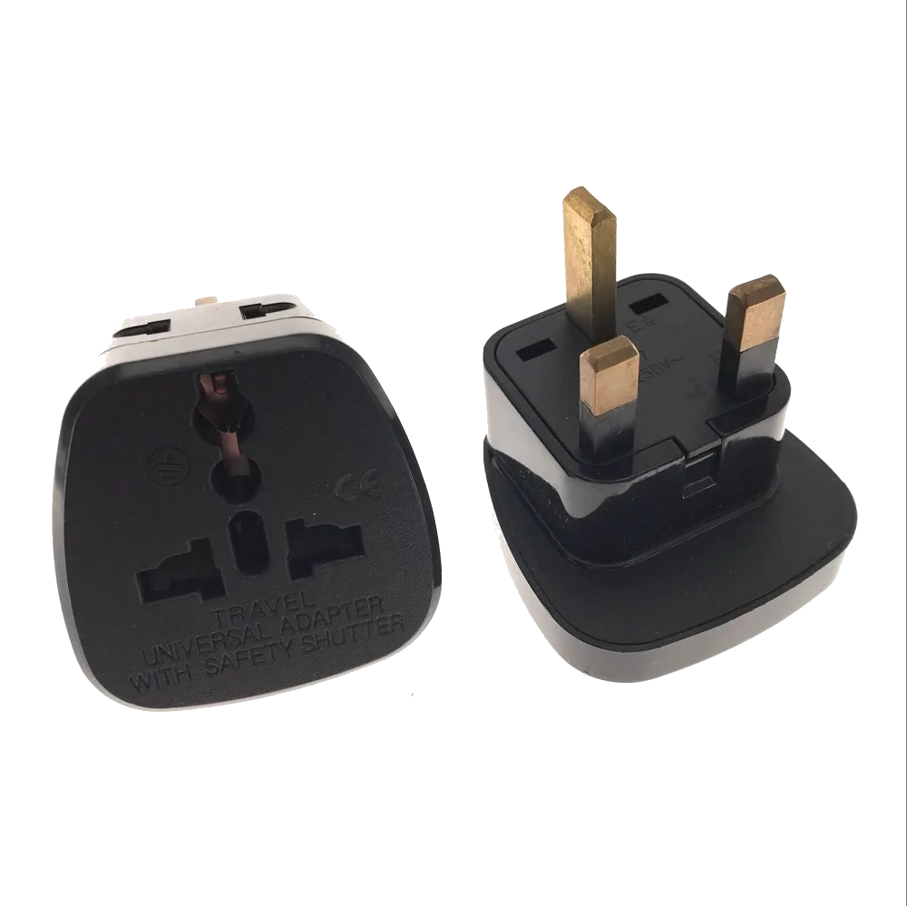
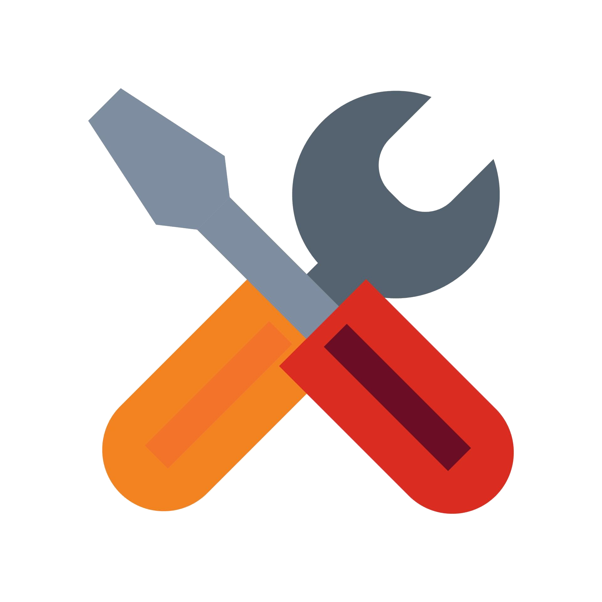
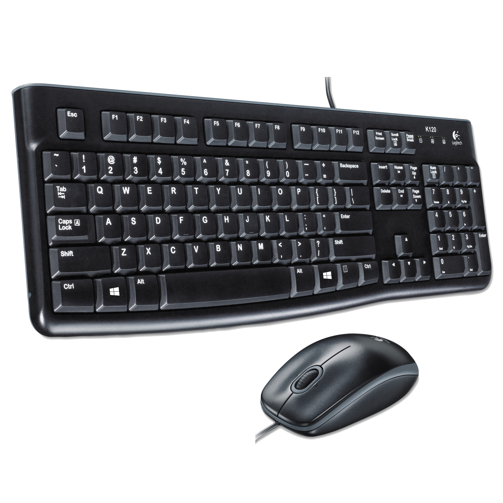
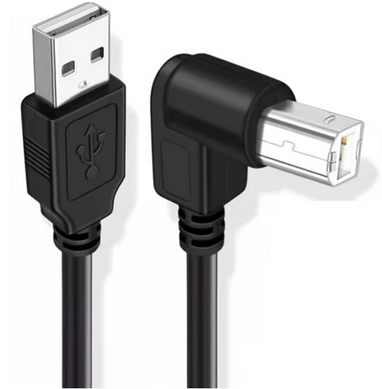
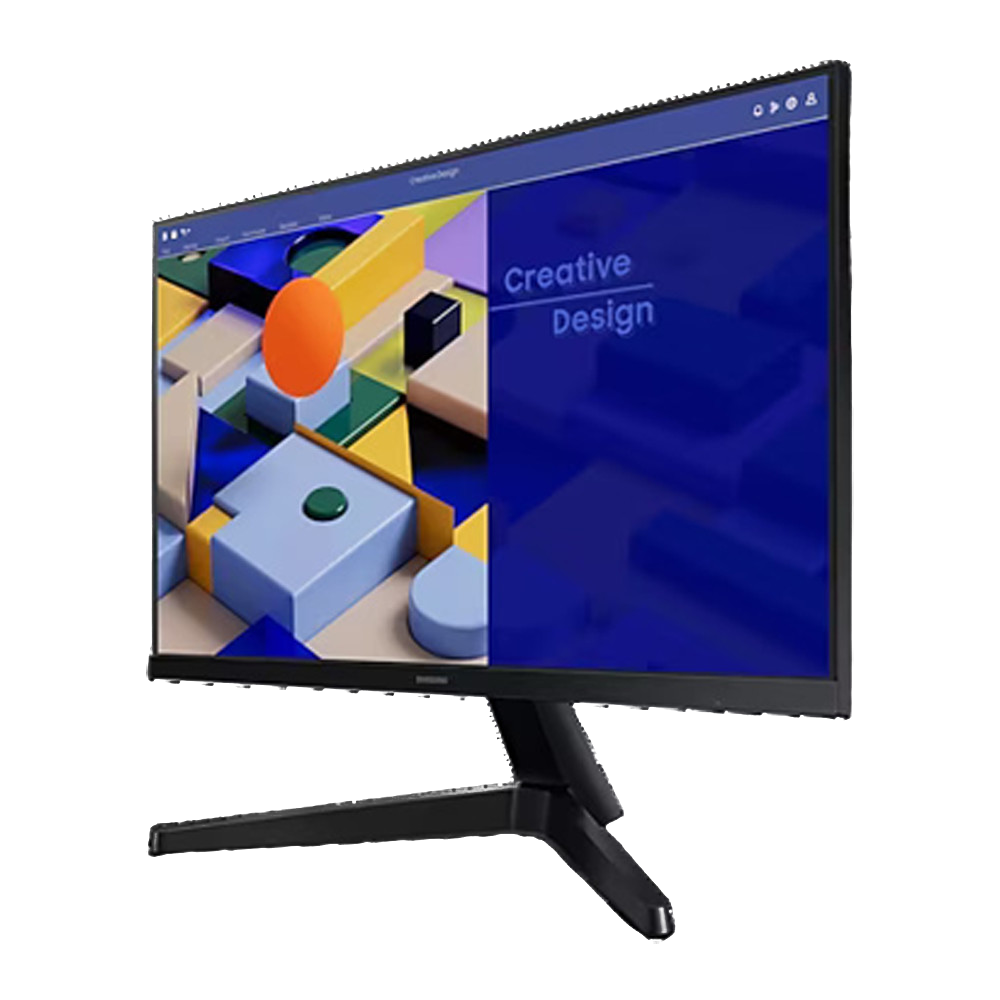
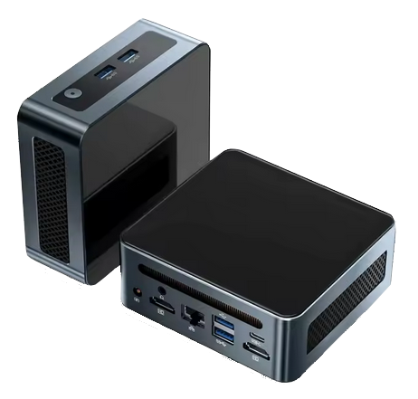

# **Contenuto della confezione**
___

Gli elementi inclusi nella confezione sono descritti di seguito.

!!! warning "Importante"

    Se manca qualche pezzo o se è difettoso, [inviaci un'email](mailto:support@agnospcb.com).

## **Componenti**
___

| Componente | Immagine |
| --------- | :-----: |
| Piattaforma AOI pre-assemblata|  {width=300px} |
|1x Cavo di alimentazione CA|  {width=300px}|
| Ciabatta elettrica |  {width=300px}|
| Adattatore CA da EU a UK/USA se richiesto |  {width=300px}|
| Tappetino ESD + Cinturino da polso ESD + Cavo di messa a terra |  {width=300px}|
| Kit di manutenzione |  {width=300px} |
| Mouse e tastiera |  {width=300px}|
|Cavo HDMI|  {width=300px}|
|Cavo USB A a USB B angolato |  {width=300px}|
| Monitor FULL-HD IPS da 24” | {width=300px} |
|  **\*SOLO UNITÀ ONLINE\*** Mini-computer pre-programmato + Tastiera e mouse |  {width=300px} |
|  **\*SOLO UNITÀ OFFLINE\*** Computer desktop pre-programmato + Tastiera e mouse |  {width=300px} |