# Package contents

The items included in the package are listed below. Once you have checked them, continue with the [unboxing guide](./Unboxing.md).

!!! info "Important"

    If any part is missing or defective, [send us an email](mailto:support@agnospcb.com).

## Components

| Component | Image |
| --------- | :-----: |
| Pre-mounted AOI platform| 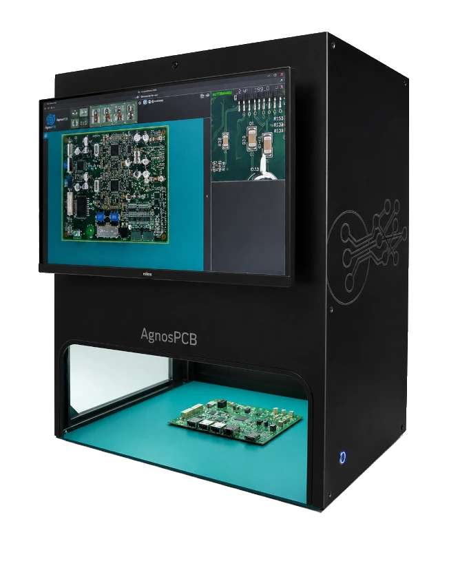{width=300px} |
|1x AC power cord| 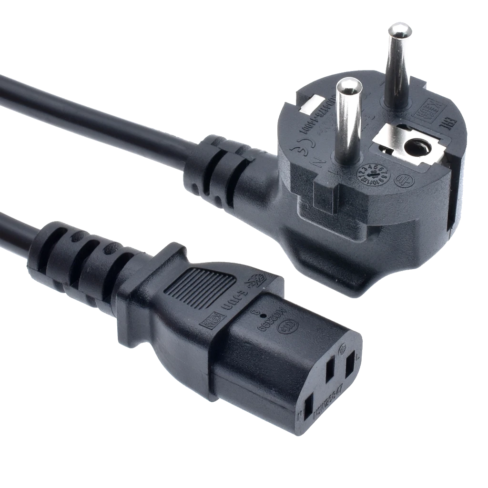{width=300px}|
| Socket strip | 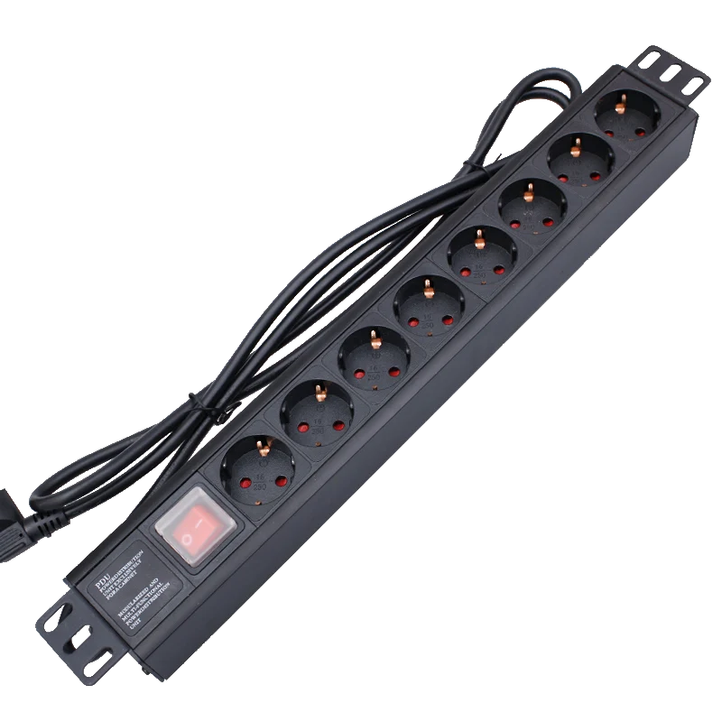{width=300px}|
| EU to UK/USA AC adapter if required | 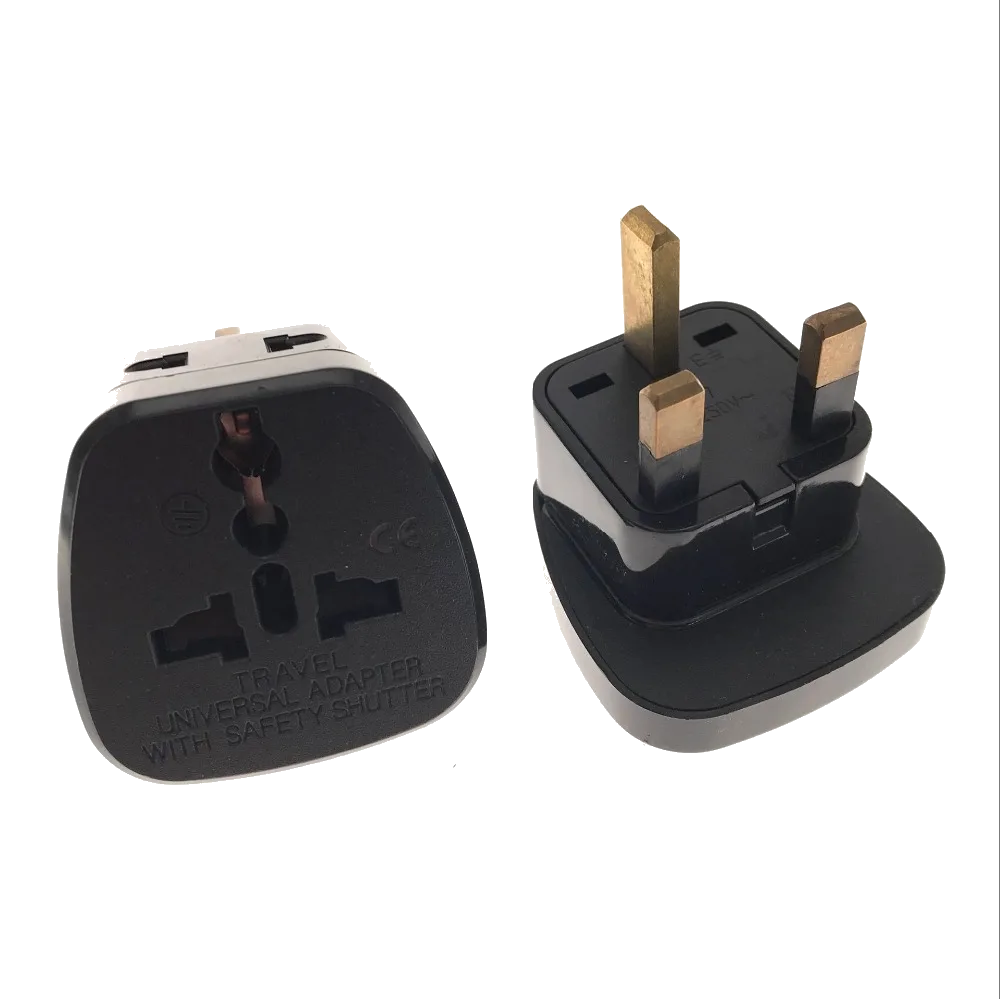{width=300px}|
| ESD MAT + ESD Wrist Strap + Ground Lead | 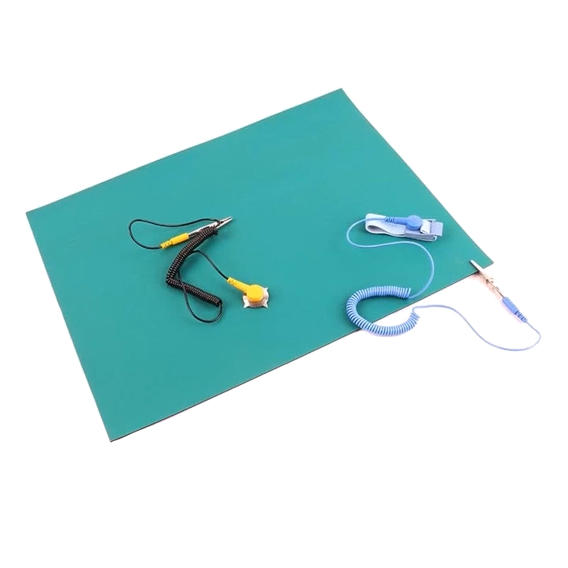{width=300px}|
| Maintenance kit | {width=300px} |
| Mouse & Keyboard | 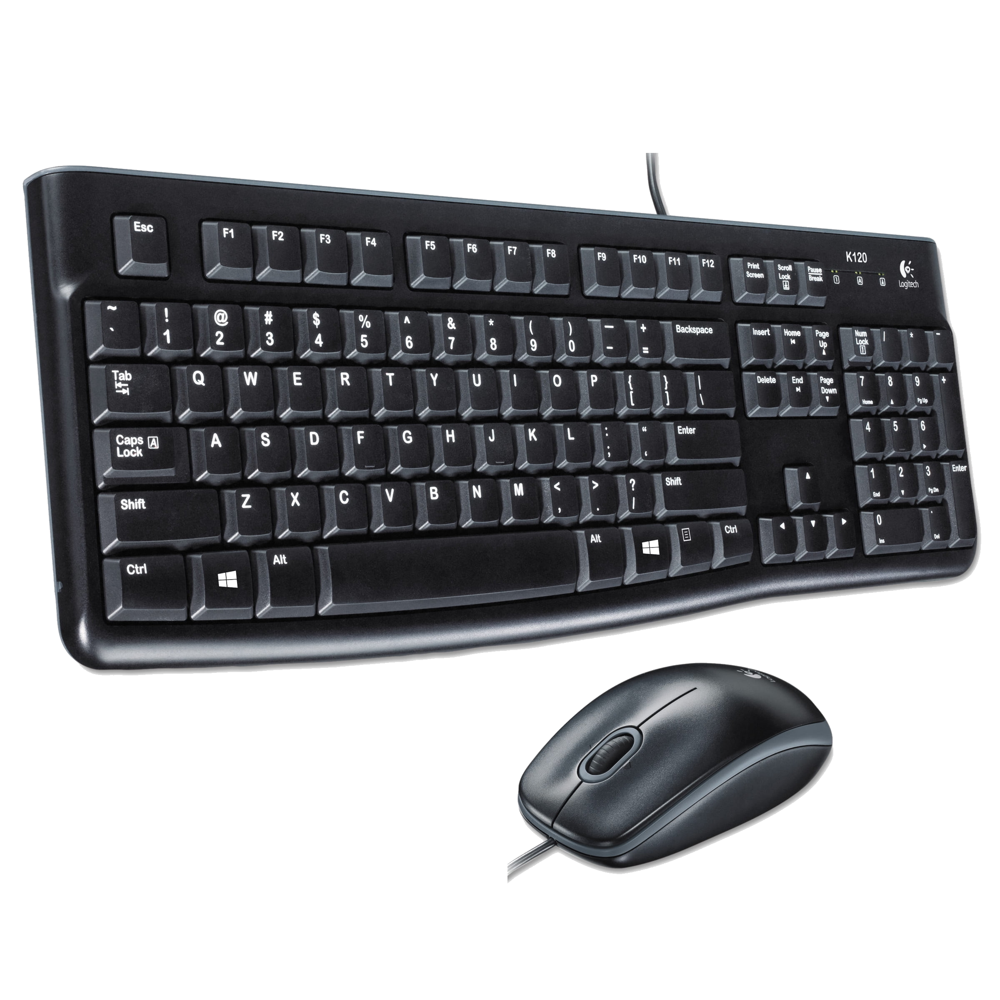{width=300px}|
|HDMI cable| 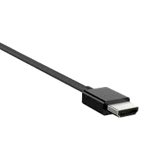{width=300px}|
|USB A to USB B angled cable | 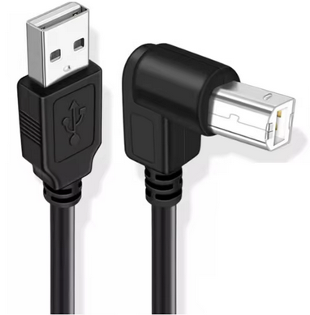{width=300px}|
| 24" FULL-HD IPS monitor |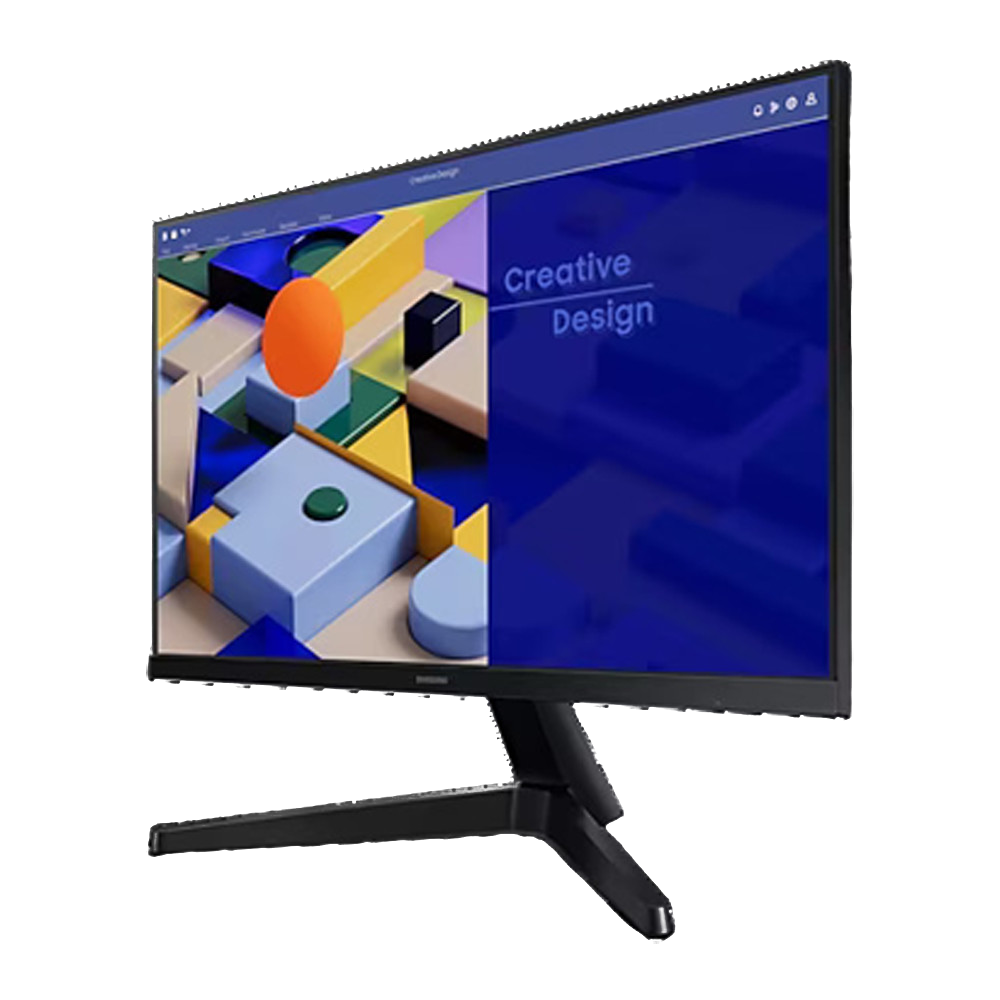{width=300px} |
|  **\*ONLINE UNITS ONLY\*** Pre-programmed Mini-computer + Keyboard and mouse | 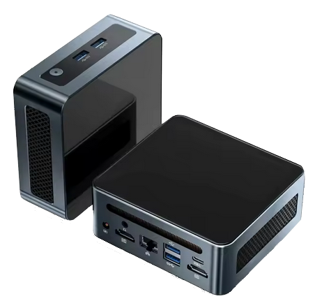{width=300px} |
|  **\*OFFLINE UNITS ONLY\*** Pre-programmed desktop computer + Keyboard and mouse | 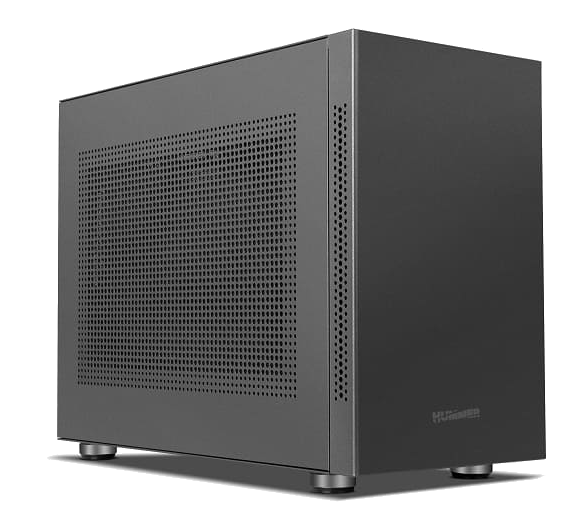{width=300px} |
