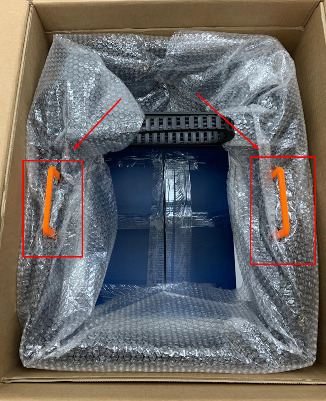
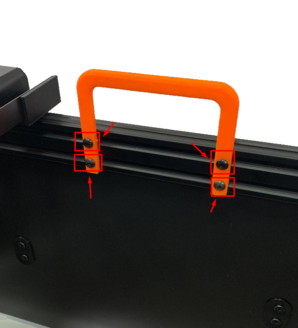
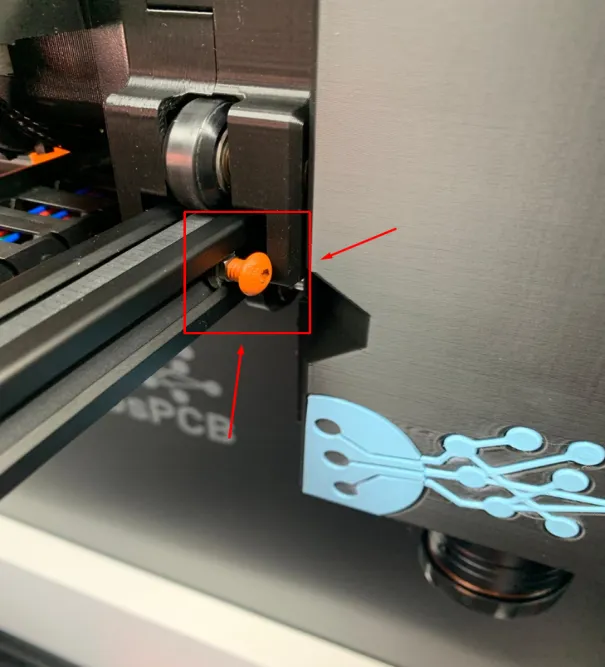
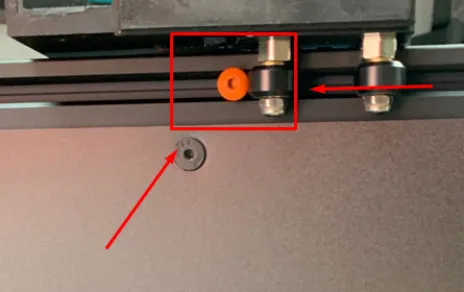
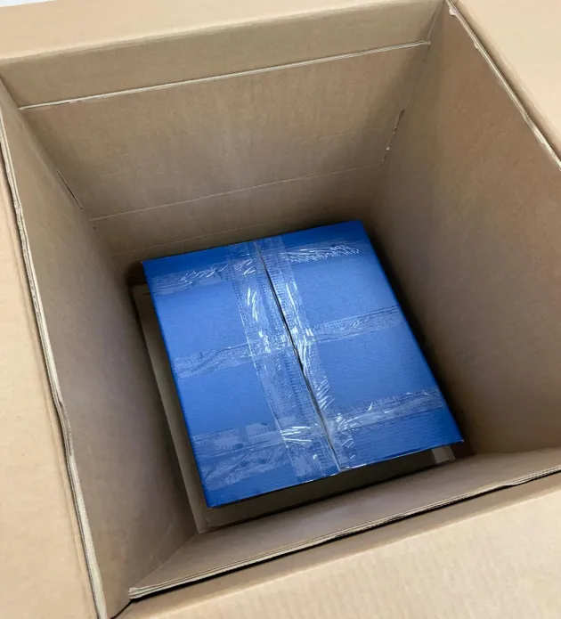

!!! warning "Wichtig"

    Falls ein Teil fehlt oder defekt ist, [senden Sie uns bitte eine E-Mail](mailto:support@agnospcb.com).

!!! warning "Wichtig"

    Nach dem Auspacken stellen Sie sicher, dass Sie alle **orangenen Teile** von der Inspektionsplattform entfernen.

## Schritt 1
**Die Inspektionsplattform herausnehmen**

Beginnen Sie damit, an den **orangenen Griffen** auf dem Foto zu ziehen, um die Inspektionsplattform vorsichtig aus der Verpackung zu heben.

{.center}

---

## Schritt 2
**Die orangenen Griffe entfernen**

Entfernen Sie die orangenen Griffe, indem Sie die **vier Befestigungsschrauben** lösen. Vergessen Sie nicht, die Schrauben und Muttern aus den Profilen zu entfernen, sobald der Griff abgenommen ist. Wiederholen Sie diesen Vorgang für den Griff auf der gegenüberliegenden Seite.

{.center}

---

## Schritt 3
**Die Befestigungsschrauben des Wagens entfernen**

Lösen Sie die Schrauben, die den Wagen fixiert halten.

{.center}

{.center}

---

## Schritt 4
**Die blaue Box mit Zubehör herausnehmen**

Nehmen Sie die **blaue Box**, die sämtliches benötigtes Zubehör enthält, aus der Verpackung. Die Liste der Komponenten finden Sie [hier](Package_content.md).

{.center}