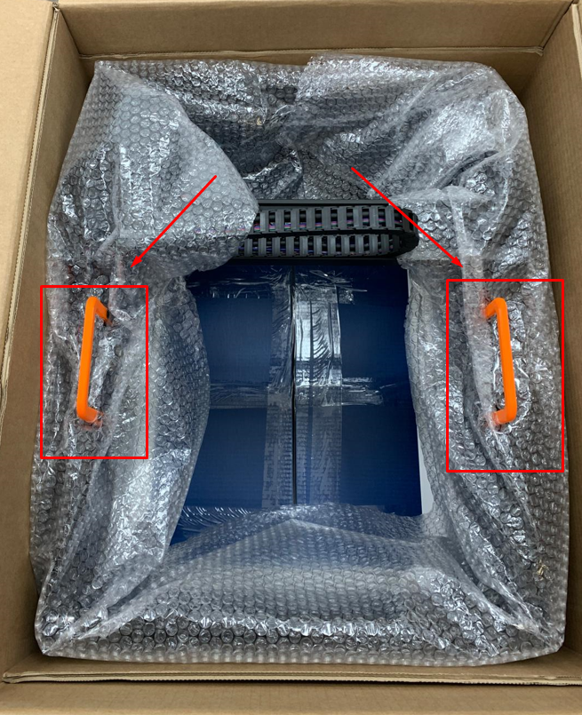

!!! warning "Importante"

    Si falta alguna pieza o está defectuosa, [envíenos un correo electrónico](mailto:support@agnospcb.com).

!!! warning "Importante"

    Después de completar el desembalaje, asegúrese de retirar todas las **piezas naranjas** de la plataforma de inspección.

## Paso 1
**Extraer la plataforma de inspección**

Comience tirando de las **asas naranjas** que se muestran en la fotografía para levantar con cuidado la plataforma de inspección y sacarla del embalaje.

{.center}

---

## Paso 2
**Retirar las asas naranjas**

Retire las asas naranjas desenroscando los **cuatro tornillos de fijación**. No olvide retirar los tornillos y las tuercas de los perfiles una vez que se haya extraído el asa. Repita este proceso para el asa del lado opuesto.

{.center}

---

## Paso 3
**Retirar los tornillos de fijación del carro**

Desenrosque los tornillos que mantienen fijo el carro.

{.center}

{.center}

---

## Paso 4
**Sacar la caja azul con accesorios**

Saque del embalaje la **caja azul** que contiene todos los accesorios necesarios. La lista de componentes se encuentra [aquí](Package_content.md).

{.center}