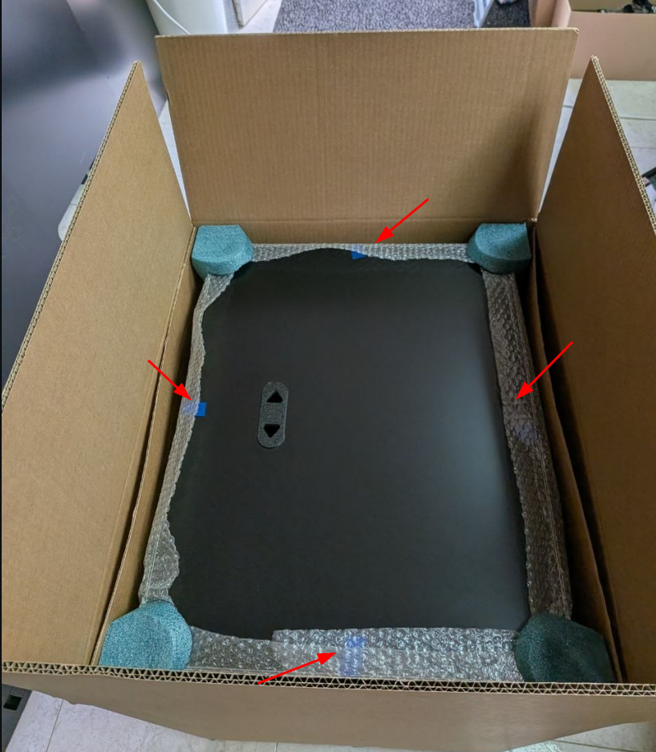
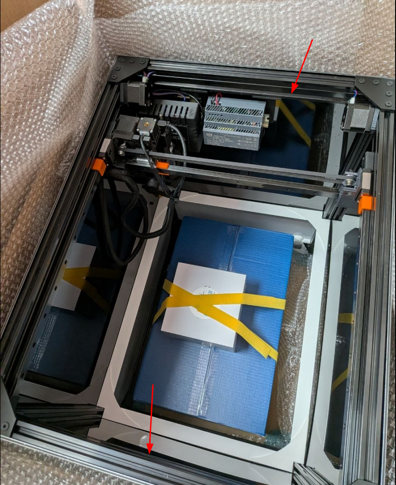
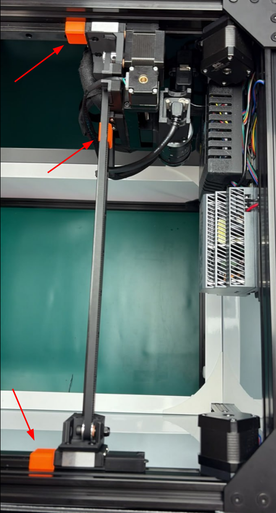
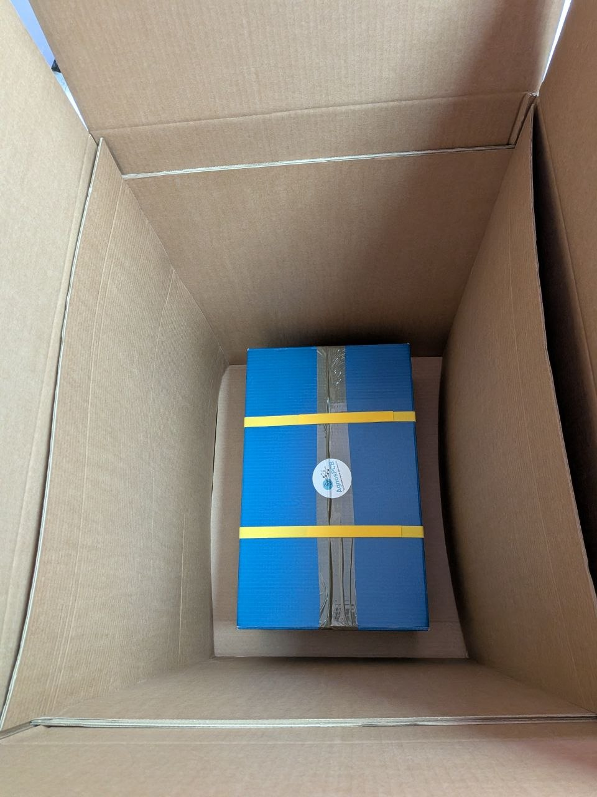

# Guide de déballage

!!! info "Important"

    Si une pièce est manquante ou défectueuse, [envoyez-nous un e-mail](mailto:support@agnospcb.com).

!!! warning "Important"

    Une fois le déballage terminé, veillez à retirer toutes les pièces orange de la plateforme d'inspection.

## Étape 1

**Retirer le capot supérieur**

Commencez par retirer le ruban adhésif des quatre côtés du capot supérieur de la chambre d'inspection, puis retirez-le.

{.center width=500px}

## Étape 2

**Sortir la chambre d'inspection**

Tenez la chambre d'inspection par les cadres latéraux supérieurs en aluminium et sortez-la du carton.

!!! warning "Important"

    Cette opération doit être réalisée par deux personnes.

{.center width=500px}

## Étape 3

**Retirer les pièces de fixation de la caméra**

{.center width=500px}

## Étape 4

**Sortir la boîte bleue contenant les accessoires**

Sortez de l'emballage la boîte bleue qui contient tous les accessoires nécessaires. Liste des composants [ici](Package_content.md).

{.center width=500px}
