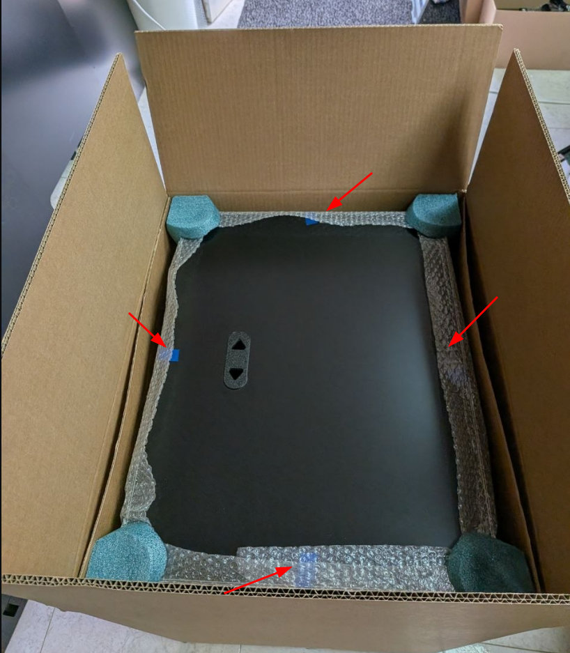
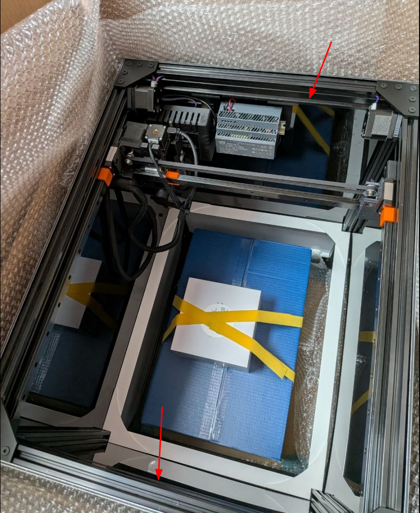
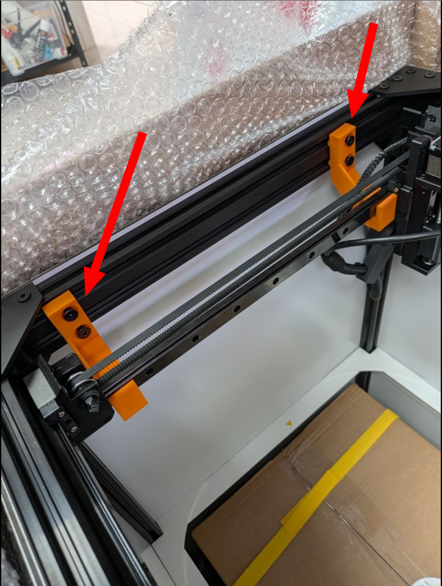
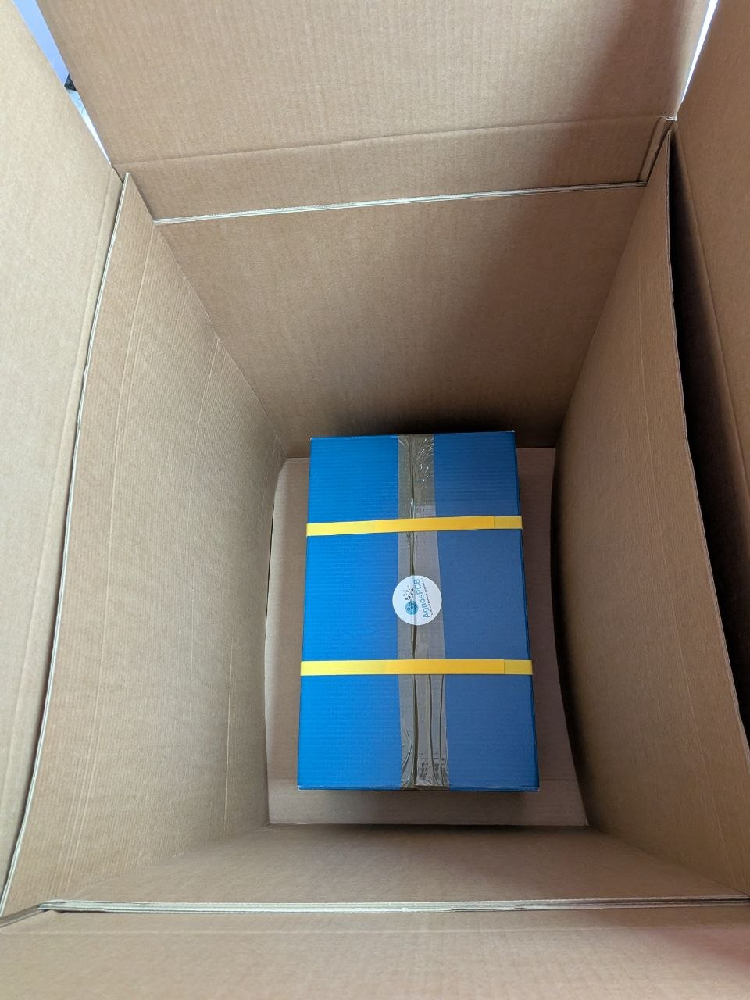
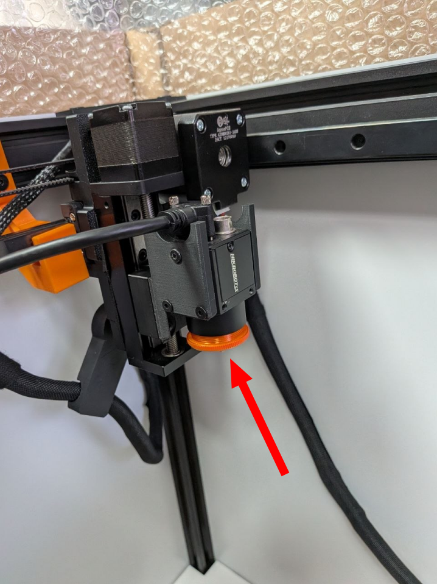
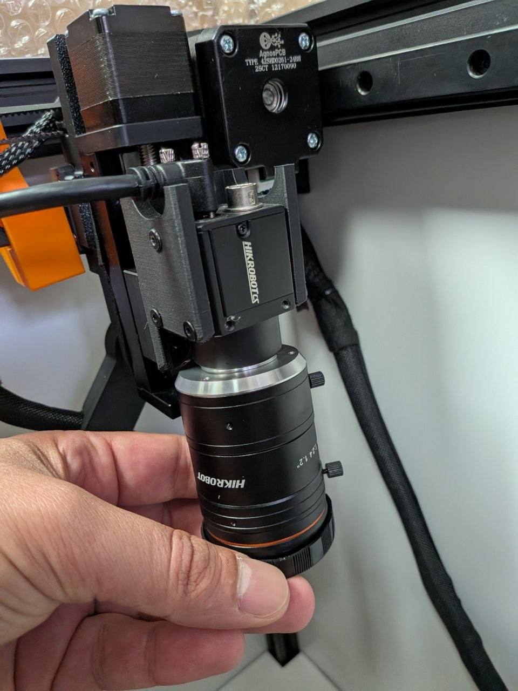

# Guida all'unboxing

!!! info "Importante"

    Se una parte manca o è difettosa, [inviateci un'e-mail](mailto:support@agnospcb.com).

!!! warning "Importante"

    Una volta completato l'unboxing, assicuratevi di rimuovere tutte le parti arancioni dalla piattaforma di ispezione.

## Passo 1

**Rimuovere il coperchio superiore**

Iniziate rimuovendo il nastro adesivo dai quattro lati del coperchio superiore della camera di ispezione, quindi sollevate il coperchio.

{.center width=500px}

## Passo 2

**Estrarre la camera di ispezione**

Afferrate la camera di ispezione dai telai laterali superiori in alluminio ed estraetela dalla scatola.

!!! warning "Importante"

    Questa operazione deve essere eseguita da due persone.

{.center width=500px}

## Passo 3

**Rimuovere gli elementi di fissaggio della telecamera**

{.center width=500px}

## Passo 4

**Estrarre la scatola con gli accessori**

Estraete dall'imballaggio la scatola che contiene tutti gli accessori necessari. Elenco dei componenti [qui](Package_content.md).

{.center width=500px}

## Passo 5

**Rimuovere il tappo della telecamera**

{.center width=500px}

## Passo 6

**Installare l'obiettivo**

Avvitate l'obiettivo sulla telecamera fino all'arresto.

!!! warning "Importante"

    L'obiettivo è regolato con i parametri necessari per l'uso sulla macchina. Evitate di toccare le ghiere di messa a fuoco e del diaframma.

{.center width=500px}
