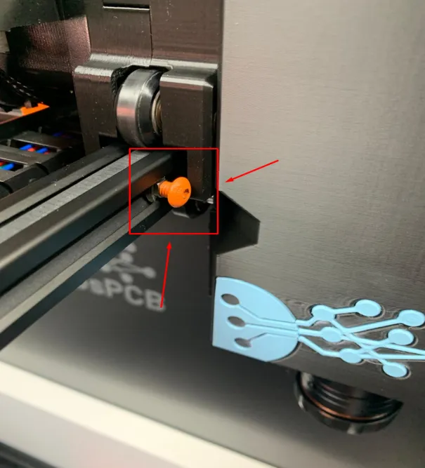
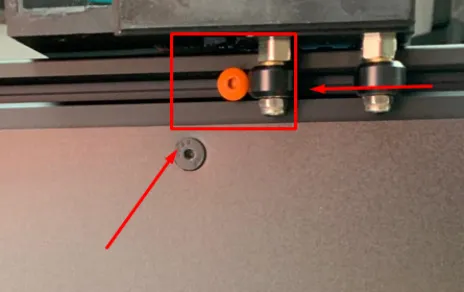

!!! warning "Importante"

    Se manca qualche pezzo o se è difettoso, [inviaci un'email](mailto:support@agnospcb.com).

!!! warning "Importante"

    Dopo aver completato l'unboxing, assicurati di rimuovere tutte le **parti arancioni** dalla piattaforma di ispezione.

## Passaggio 1
**Estrarre la piattaforma di ispezione**

Inizia tirando le **maniglie arancioni** mostrate nella fotografia per sollevare con attenzione la piattaforma di ispezione e rimuoverla dall'imballaggio.

{.center}

---

## Passaggio 2
**Rimuovere le maniglie arancioni**

Rimuovi le maniglie arancioni svitando le **quattro viti di fissaggio**. Non dimenticare di rimuovere le viti e i dadi dai profilati una volta che la maniglia è stata estratta. Ripeti questo processo per la maniglia sul lato opposto.

{.center}

---

## Passaggio 3
**Rimuovere le viti di fissaggio del carrello**

Svitare le viti che mantengono fisso il carrello.

{.center}

{.center}

---

## Passaggio 4
**Estrarre la scatola blu con gli accessori**

Prendi la **scatola blu** che contiene tutti gli accessori necessari dall'imballaggio. L'elenco dei componenti è disponibile [qui](Package_content.md).

{.center}