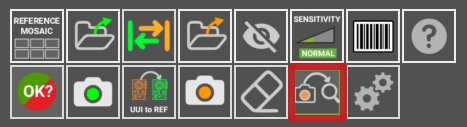

## **Domande generali**
___

??? question "Esistono piani di noleggio o prova per le piattaforme di ispezione ONLINE e OFFLINE?"

    Sì, abbiamo un piano di noleggio per le unità OFFLINE per **un minimo di 2 mesi**. Se alla fine decidi di acquistarla, il costo del noleggio sarà detratto dal prezzo finale dell'unità. [Contattaci](mailto:support@agnospcb.com) per richiedere un preventivo.

??? question "Come si genera un rapporto di errore non rilevato?"

    Puoi segnalare un difetto non rilevato spostando il cursore sull'area del difetto e premendo il tasto **freccia GIÙ**. Le immagini vengono segnalate al nostro server e le usiamo per addestrare la Rete Neurale a rilevare tali errori. L'errore sarà incluso nel prossimo aggiornamento della Rete Neurale.

??? question "Qual è la dimensione massima di PCB che può essere ispezionata con questo sistema?"

    Il nuovo **AI-4050** consente l'ispezione di PCBA (schede a circuito stampato assemblate) fino a 40 x 50 cm (16 x 19").

??? question "Qual è la differenza tra 'aggiornamenti del client' e 'aggiornamenti della rete neurale'? Con quale frequenza vengono forniti questi aggiornamenti?"

    Gli aggiornamenti del client si riferiscono all'interfaccia grafica utilizzata dall'operatore che include funzionalità per facilitare le ispezioni PCBA. Per quanto riguarda gli aggiornamenti della rete neurale, questi si riferiscono all'architettura che esegue le ispezioni e restituisce il risultato al software client. Le unità **ONLINE** non richiedono aggiornamenti della rete neurale poiché utilizzano l'ultima versione rilasciata sul server di AgnosPCB. Le unità **OFFLINE** possono anche aggiornare l'architettura della rete neurale con facilità, semplicemente con un'unità USB. La rete neurale viene solitamente aggiornata ogni 3-4 mesi.

??? question "Come posso gestire il mio abbonamento online?"

    [Contattaci](mailto:support@agnospcb.com) ogni volta che devi apportare una modifica al tuo abbonamento.

??? question "L'IA di AgnosPCB impara da sola dalle ispezioni che elabora?"

    No, non lo fa. Non possiamo permettere alla rete neurale di imparare da sola poiché ciò potrebbe portare a un comportamento software non corretto e compromettere le prestazioni del sistema. I nostri ingegneri monitorano attentamente i campioni di addestramento, li implementano nella rete neurale ed eseguono test approfonditi per evitare comportamenti indesiderati.

??? question "Cosa posso fare se il sistema non rileva un difetto?"

    Se noti che il software non rileva alcuni difetti o segna costantemente un falso positivo, inviaci semplicemente una [email](mailto:support@agnospcb.com) con le immagini in cui l'errore non viene rilevato (immagini di RIFERIMENTO e UUI) e implementeremo il difetto nel prossimo aggiornamento della rete neurale.

??? question "Cosa posso fare con gli errori rilevati che sono falsi positivi?"

    Puoi muoverti tra gli errori rilevati con i tasti freccia SINISTRA e DESTRA. Per contrassegnare un elemento come falso positivo, premi il tasto **freccia SU** e ci verrà segnalato (solo nelle unità ONLINE). Anche per le unità OFFLINE puoi contrassegnarlo come falso positivo con il tasto freccia SU. Verrà generata un'immagine ritagliata nella cartella REPORTS. Inviacela via email e la incorporeremo nella prossima architettura della rete neurale. Questo *feedback* è importante per noi al fine di migliorare il tasso di rilevamento.

??? question "Come funziona il sistema con i package in stile QFN?"

    L'hardware attuale non è in grado di vedere come sono saldati i componenti QFN, ma è in grado di rilevare posizionamenti errati, spostamenti, torsioni o contaminazioni vicino all'IC.

??? question "Voglio utilizzare il mio sistema ottico e di illuminazione, come posso integrare il software di ispezione AgnosPCB?"

    Se intendi utilizzare il tuo hardware, hai 2 opzioni:

    - Utilizzare la nostra [applicazione Windows](https://agnospcb.com/software-tool-download/) + sottoscrivere uno dei [nostri piani](https://agnospcb.com/pricing-eur/). Richiede un computer Windows e una connessione Internet stabile. In questo modo, potrai archiviare le immagini scattate dalla tua telecamera in una cartella specifica dove il software le acquisirà e ispezionerà automaticamente. Puoi anche caricare le immagini manualmente poiché questa versione non supporta il controllo remoto della telecamera.

    - Configurare le nostre [API](https://agnospcb.com/agnospcb-api/) + sottoscrivere un [piano](https://agnospcb.com/pricing-eur/) GOLD o superiore. Si tratta di uno *script* Python che ti consente di integrare facilmente il nostro software di ispezione nel tuo sistema. Può funzionare su qualsiasi sistema in grado di eseguire uno *script* Python. Richiede una connessione Internet stabile.

??? question "Vorrei costruire la mia scatola luminosa. Avete dei consigli per la sua configurazione?"

    Per risultati ottimali, l'illuminazione dovrebbe essere sia adeguata che coerente, con l'obiettivo di eliminare le ombre. Si consiglia di utilizzare **illuminazione bianca** per una migliore chiarezza. È possibile utilizzare un anello luminoso se fornisce un'illuminazione sufficiente. Tuttavia, la considerazione chiave è mantenere **condizioni di illuminazione coerenti** in ogni momento. Fai attenzione alle influenze dell'illuminazione esterna che possono variare le condizioni tra le foto. Ciò può causare problemi all'algoritmo di rilevamento. Se possibile, racchiudi l'area di ispezione il più possibile.

??? question "La versione OFFLINE consente ispezioni illimitate?"

    Le unità OFFLINE prevedono un acquisto una tantum con ispezioni illimitate.

??? question "Posso usare la mia attuale telecamera/AOI per ispezionare?"

    Sì, è possibile. Le immagini possono essere archiviate nella cartella PCB\_IN per l'elaborazione automatica, caricate manualmente come file o inviate direttamente al servizio API.

??? question "Quale telecamera è consigliata?"

    Una telecamera con una risoluzione di almeno **20 MP** dovrebbe fornire dettagli sufficienti per l'ispezione dei componenti. Per quanto riguarda l'obiettivo, dovresti mirare a una lunghezza focale che abbia un equilibrio tra la visualizzazione di componenti sufficientemente grandi affinché la rete neurale possa rilevare i difetti e che non produca effetti di rimpicciolimento sui componenti alti.

??? question "È possibile ispezionare i componenti THT (Through-Hole Technology)?"

    Il sistema AOI di AgnosPCB non è progettato specificamente per i componenti con tecnologia a foro passante (THT - Through-Hole Technology). Ciò è dovuto alle potenziali grandi differenze di prospettiva causate dall'altezza dei componenti THT, che possono portare a falsi positivi nella Rete Neurale. Inoltre, la saldatura dei componenti THT è spesso nascosta, rendendo l'ispezione difficile nella maggior parte dei casi.
    
    Tuttavia, sebbene non sia ottimizzato per i componenti THT, il sistema AOI può comunque essere utilizzato per tali componenti. Può aiutare a rilevare spostamenti, polarità errata, inversione o posizionamento errato dei componenti THT.

??? question "Come posso usare la telecamera per scattare foto di RIFERIMENTO e UUI con il software di ispezione?"

    L'attuale versione di Windows non supporta il controllo della telecamera poiché presenta problemi di driver ed è stata progettata solo per testare le capacità del sistema AOI. La versione ufficiale è basata su Linux e supporta il controllo della telecamera, la lettura di codici a barre e la generazione di rapporti.
    
    Tuttavia, puoi condividere la cartella PCB\_IN nella tua rete, inserirvi tutte le immagini e il software le elaborerà automaticamente. Devi prima caricare il RIFERIMENTO PCBA nel software e attivare il pulsante di **elaborazione automatica**.
    