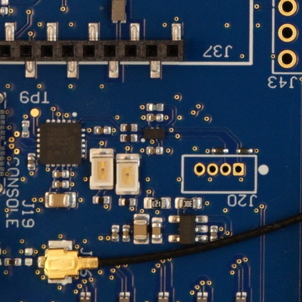

# **Tipps**
---
## **Einen guten REFERENZ erstellen**

- Legen Sie die **grüne Matte** unter die Plattform, sodass der gesamte Inspektionsbereich abgedeckt ist, und stellen Sie sicher, dass der Tisch von der Kamera aus nicht sichtbar ist.
- Stellen Sie sicher, dass die PCBA **korrekt bestückt** ist. Dies ist wichtig, da ein darauf enthaltener Fehler bei nachfolgend inspizierten PCBAs nicht markiert wird.
- Vermeiden Sie die Verwendung von PCBAs mit Verunreinigungen. **Reinigen Sie die PCBA**, bevor Sie das Bild aufnehmen.
    
    {width=400px, .center}

- Vermeiden Sie es, verschiedene Komponenten mit denselben Spezifikationen zu mischen. Die Software ist nicht in der Lage, die Beschriftung zu "lesen" und markiert sie, selbst wenn sie dieselben Spezifikationen aufweisen. Wenn eine Komponente während der Produktion geändert wurde, **erstellen Sie ein neues REFERENZbild**, um die Markierung falscher Positive zu vermeiden.
- Vermeiden Sie es, Bilder mit Kabeln oder Komponenten mit **hoher Positionsschwankung** aufzunehmen. Dies würde die Rate falscher Positive erhöhen.
    
    **REFERENZ:**
    {width=300px, .center} 
    
    **UUI:**
    {width=300px, .center}

     **Ergebnis:**
    {width=300px, .center}

- Stellen Sie sicher, dass das Bild korrekt fokussiert ist und alle Komponenten **scharf** aussehen. Falls nicht, wiederholen Sie die Aufnahme.

    {width=400px, .center}

- Stellen Sie sicher, dass **keine anderen Objekte als die PCBA** auf dem Bild vorhanden sind.
    
    {width=400px, .center}

- Wählen Sie die **korrekte Bildkomposition**, um unnötige Bilder zu vermeiden und die Verarbeitungszeit zu verkürzen.
    
    {width=600px, .center}

    {width=400px, .center}

- Mischen Sie keine gelöteten und vorgelöteten PCBAs. Wenn Sie ein REFERENZbild mit gelöteten Komponenten aufnehmen, inspizieren Sie keine ungelöteten UUI-PCBAs, da dies zu einer Markierung mit einer sehr hohen Rate falscher Positive führen würde.
- Mischen Sie, wie bei gelöteten/vorgelöteten PCBAs, keine beschichteten und unbeschichteten PCBAs.

---
## **Eine gute Inspektion durchführen**

- Befolgen Sie die Tipps zur Aufnahme des REFERENZ.
- Platzieren Sie die zu inspizierende PCBA an **derselben Stelle und in derselben Position**, an der die REFERENZ-PCBA aufgenommen wurde. Die Live-Ansicht zeigt ein Phantombild der REFERENZ-PCBA an, um die Ausrichtung zu unterstützen. Es ist nicht erforderlich, die UUI exakt an derselben Stelle zu platzieren, da die Software die Ausrichtung korrigiert.