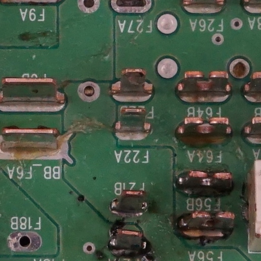

# **Consejos**
---
## **Obtener una buena REFERENCIA**

- Coloque la **alfombrilla verde** debajo de la plataforma, cubriendo toda el área de inspección, y asegúrese de que la mesa no sea visible desde la cámara.
- Asegúrese de que la PCBA esté **montada correctamente**. Esto es importante porque si hay un error en ella, no se marcará en las PCBA posteriores inspeccionadas.
- Evite usar PCBA con contaminación. **Limpie la PCBA** antes de tomar la fotografía.
    
    {width=400px, .center}

- Evite mezclar diferentes componentes con las mismas especificaciones. El software no es capaz de "leer" el etiquetado y los marcará aunque tengan las mismas especificaciones. Si un componente ha cambiado durante la producción, **tome una nueva imagen de REFERENCIA** para evitar el marcado de falsos positivos.
- Evite tomar imágenes con cables o componentes con **alta variabilidad de posición**. Esto aumentaría la tasa de falsos positivos.
    
    **REFERENCIA:**
    {width=300px, .center} 
    
    **UUI:**
    {width=300px, .center}

     **Resultado:**
    {width=300px, .center}

- Asegúrese de que la imagen se haya tomado correctamente enfocada y que todos los componentes se vean **nítidos**. Si no es así, repita la captura.

    {width=400px, .center}

- Asegúrese de que **no haya otros objetos que no sean la PCBA** en la imagen.
    
    {width=400px, .center}

- Seleccione la **composición correcta de las imágenes** para evitar tomar imágenes innecesarias y para acortar el tiempo de procesamiento.
    
    {width=600px, .center}

    {width=400px, .center}

- No mezcle PCBA soldadas y presoldadas. Si toma una imagen de REFERENCIA con componentes soldados, no inspeccione PCBA UUI sin soldar, ya que esto resultará en un marcado con una tasa muy alta de falsos positivos.
- Al igual que con las PCBA soldadas/presoldadas, no mezcle PCBA recubiertas (coated) y no recubiertas.

---
## **Realizar una buena inspección**

- Siga los consejos para la toma de REFERENCIA.
- Coloque la PCBA a inspeccionar en la **misma ubicación y posición** en la que se capturó la PCBA de REFERENCIA. La vista en vivo mostrará una imagen fantasma de la PCBA de REFERENCIA para ayudar con la alineación. No es necesario colocar la UUI exactamente en la misma ubicación, ya que el software corrige la alineación.