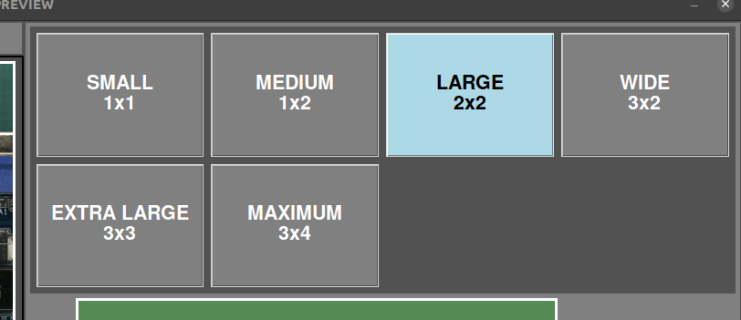

# **Conseils**
---
## **Obtenir une bonne RÉFÉRENCE**

- Placez le **tapis vert** sous la plateforme, couvrant toute la zone d'inspection, et assurez-vous que la table n'est pas visible par la caméra.
- Assurez-vous que le PCBA est correctement monté. C'est important car s'il contient une erreur, celle-ci ne sera pas signalée sur les PCBA inspectés ultérieurement.
- Évitez d'utiliser des PCBA avec de la contamination. **Nettoyez le PCBA** avant de prendre la photo.
    
    {width=400px, .center}

- Évitez de mélanger différents composants avec les mêmes spécifications. Le logiciel n'est pas capable de "lire" l'étiquetage et les signalera même s'ils ont les mêmes spécifications. Si un composant a été modifié pendant la production, **prenez une nouvelle image de RÉFÉRENCE** pour éviter le marquage de faux positifs.
- Évitez de prendre des images avec des câbles ou des composants ayant une **grande variabilité de position**. Cela augmenterait le taux de faux positifs.
    
    **RÉFÉRENCE :**
    {width=300px, .center} 
    
    **UUI :**
    {width=300px, .center}

     **Résultat :**
    {width=300px, .center}

- Assurez-vous que l'image est correctement mise au point et que tous les composants semblent **nets**. Si ce n'est pas le cas, répétez la capture.

    {width=400px, .center}

- Assurez-vous qu'il n'y a **aucun objet autre que le PCBA** dans l'image.
    
    {width=400px, .center}

- Sélectionnez la **composition d'images correcte** pour éviter de prendre des images inutiles et pour raccourcir le temps de traitement.
    
    {width=600px, .center}

    {width=400px, .center}

- Ne mélangez pas les PCBA soudés et pré-soudés. Si vous prenez une image de RÉFÉRENCE avec des composants soudés, n'inspectez pas de PCBA UUI non soudés, cela entraînerait un marquage avec un taux très élevé de faux positifs.
- Comme pour les PCBA soudés/pré-soudés, ne mélangez pas les PCBA revêtus (coatés) et non revêtus.

---
## **Effectuer une bonne inspection**

- Suivez les conseils pour la prise de RÉFÉRENCE.
- Placez le PCBA à inspecter au **même emplacement et dans la même position** que le PCBA de RÉFÉRENCE capturé. La vue en direct affichera une image fantôme du PCBA de RÉFÉRENCE pour aider à l'alignement. Il n'est pas nécessaire de placer l'UUI exactement au même emplacement, car le logiciel corrige l'alignement.