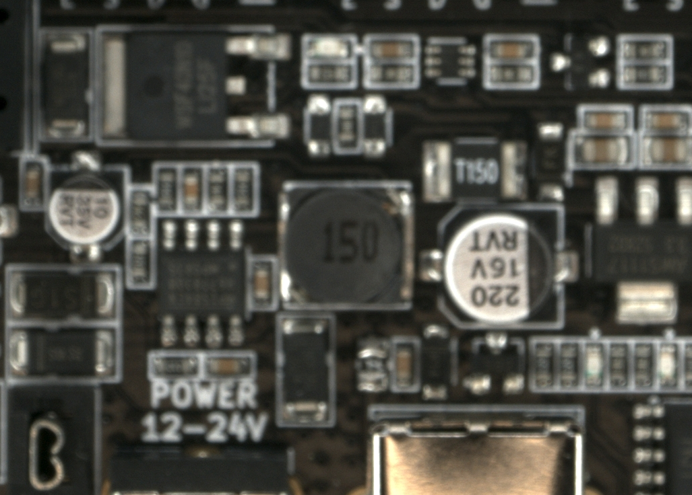
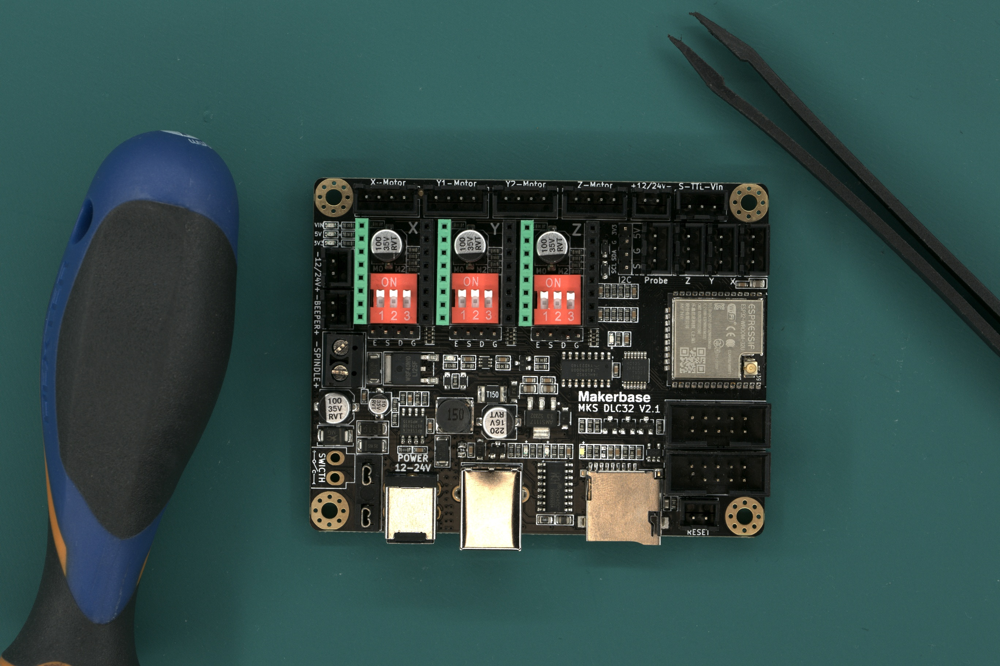

# **Consigli**
---
## **Ottenere un buon RIFERIMENTO**

- Posiziona il **tappetino verde** sotto la piattaforma, coprendo l'intera area di ispezione, e assicurati che il tavolo non sia visibile dalla telecamera.
- Assicurati che la PCBA sia **montata correttamente**. Questo è importante perché se è presente un errore, non verrà segnalato sulle successive PCBA ispezionate.
- Evita di usare PCBA con contaminazione. **Pulisci la PCBA** prima di scattare la foto.
    
    {width=400px, .center}

- Evita di mescolare componenti diversi con le stesse specifiche. Il software non è in grado di "leggere" l'etichettatura e li segnalerà anche se hanno le stesse specifiche. Se un componente è cambiato durante la produzione, **scatta una nuova immagine di RIFERIMENTO** per evitare di marcare falsi positivi.
- Evita di scattare immagini con cavi o componenti con **elevata variabilità di posizione**. Ciò aumenterebbe il tasso di falsi positivi.
    
    **RIFERIMENTO:**
    {width=300px, .center} 
    
    **UUI:**
    {width=300px, .center}

     **Risultato:**
    {width=300px, .center}

- Assicurati che l'immagine sia stata messa a fuoco correttamente e che tutti i componenti appaiano **nitidi**. In caso contrario, ripeti l'acquisizione.

    {width=400px, .center}

- Assicurati che **non ci siano oggetti diversi dalla PCBA** nell'immagine.
    
    {width=400px, .center}

- Seleziona la **composizione corretta delle immagini** per evitare di scattare immagini inutili e per accorciare il tempo di elaborazione.
    
    {width=600px, .center}

    {width=400px, .center}

- Non mescolare PCBA saldate e pre-saldate. Se scatti una foto di RIFERIMENTO con componenti saldati, non ispezionare PCBA UUI non saldate, poiché ciò comporterebbe una marcatura con un tasso molto elevato di falsi positivi.
- Come per le PCBA saldate/pre-saldate, non mescolare PCBA rivestite (coated) e non rivestite.

---
## **Eseguire una buona ispezione**

- Segui i consigli per l'acquisizione del RIFERIMENTO.
- Posiziona la PCBA da ispezionare nella **stessa posizione** in cui è stata acquisita la PCBA di RIFERIMENTO. La visualizzazione in diretta mostrerà un'immagine fantasma della PCBA di RIFERIMENTO per aiutare con l'allineamento. Non è necessario posizionare la UUI esattamente nella stessa posizione, poiché il software corregge l'allineamento.