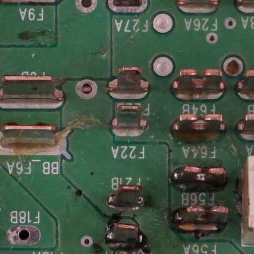
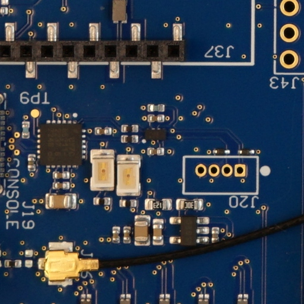
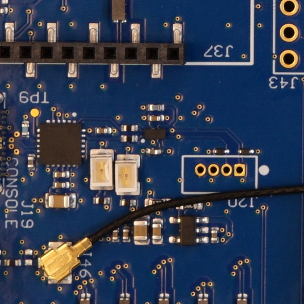
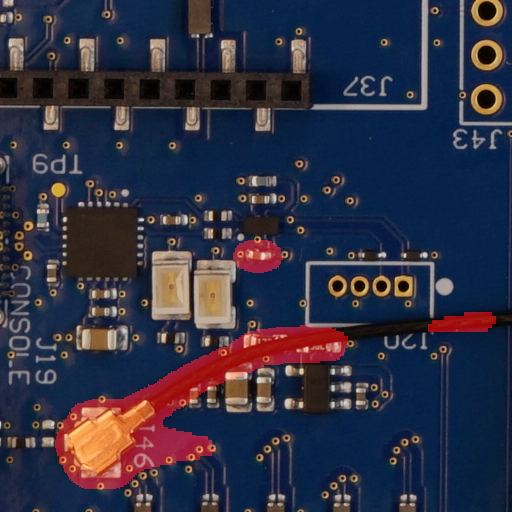
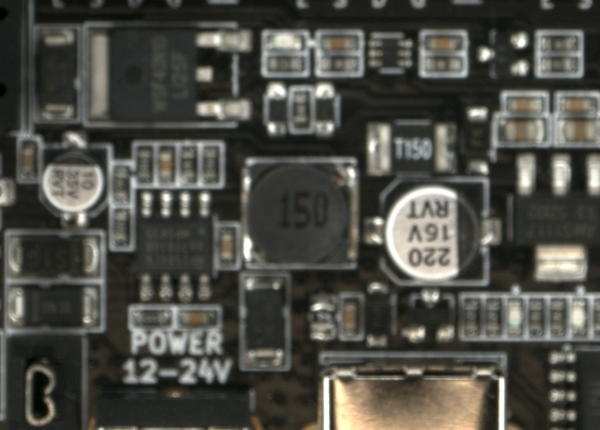
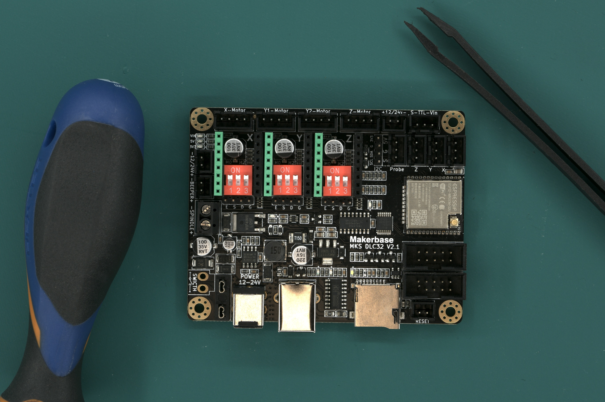
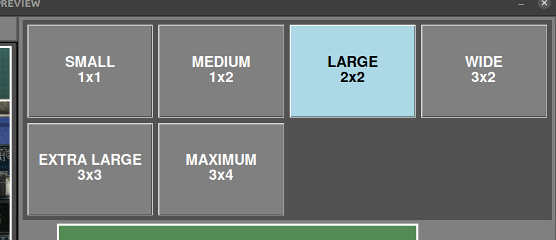

# **Tips**
---
## **Getting a good REFERENCE**

- Place the green mat under the platform covering all the inspection area and make sure the table is not visible from the camera.
- Make sure that the PCBA is correctly mounted. This is important because if there is an error on it, it will not be marked on subsequent PCBAs inspected.
- Avoid using PCBA with contamination. Clean the PCBA before taking the picture
    
    {width=400px, .center}

- Avoid mixing different components with same specifications. The software is not able to "read" the labeling and will mark them even if they have the same specifications. If a component have changed during production make a new REFERENCE image to avoid false positive marking.
- Avoid taking images with cables or components with high position variability. This would increase the false positive rate.
    
    **REFERENCE:**
    {width=300px, .center} 
    
    **UUI:**
    {width=300px, .center}

     **Result:**
    {width=300px, .center}

- Ensure the image has been taken correctly focused and all components looks sharp. If not, repeat the capture.

    {width=400px, .center}

- Ensure there are no objects other than the PCBA in the image.
    
    {width=400px, .center}

- Select the correct composition of images to avoid taking unnecessary images and to shorten processing time.
    
    {width=600px, .center}

    {width=400px, .center}

- Do not mix soldered and pre-soldered PCBAs. If you take a picture of a REFERENCE image with soldered components, do not inspect unsoldered UUI PCBAs, it will result in a marking with a very high false positive rate.
- As with soldered/pre-soldered PCBAs, do not mix coated and uncoated PCBAs.

## **Making a good inspection**

- Follow the REFERENCE taking tips
- Place the PCBA to inspect in the same location and position as the REFERENCE PCBA was captured. The live view will display a phantom image of the REFERENCE PCBA to assist with alignment. It is not necessary to place the UUI in exactly the same location as the software corrects the alignment.
