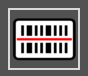

# **Barcode-Lesegerät**

Die AgnosPCB-Software enthält eine Barcode-Lesefunktion, die **1D-Barcodes, QR und Datamatrix** unterstützt.

Sie können entweder ein **REFERENZ**-Foto aufnehmen oder eines direkt aus Ihren Dateien über die Schaltfläche **"Referenz öffnen"** hochladen.

Wählen Sie die Schaltfläche **"Barcode-Bereich zeichnen"** und ziehen Sie ein Rechteck über den Barcode-Bereich.

{.center}

{.center}

Der Code wird im Rechteck und im REFERENZ-Namen oben links angezeigt. Stellen Sie sicher, dass der Barcode gelesen wurde, bevor Sie mit der Inspektion fortfahren.

Sobald die REFERENZ geladen ist, fahren Sie mit der Inspektion fort, indem Sie ein Bild der UUI aufnehmen. Der Barcode der UUI wird automatisch im selben Bereich wie der Barcode der REFERENZ gelesen.

Fahren Sie mit dem [Inspektionsprozess](Inspection_workflow.md/) wie gewohnt fort. 

Der gescannte Code wird in den endgültigen PDF-Bericht der UUI aufgenommen.

{.center}

## Eine REFERENZ per Barcode laden

Wenn Sie bereits eine **REFERENZ** gespeichert haben, können Sie diese einfach mithilfe des zugehörigen Codes abrufen. Drücken Sie dazu die Schaltfläche **"Barcode lesen"**, lesen Sie dann den Barcode mit dem Handscanner, und die **REFERENZ** wird automatisch geladen. Es ist auch möglich, den Code manuell einzugeben.

{.center}

{.center}

{.center}