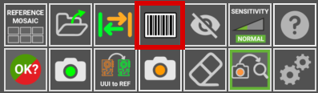

# **Lector de código de barras**

El software AgnosPCB incorpora una función de lectura de código de barras que soporta **códigos de barras 1D, QR y Datamatrix**.

Puede tomar una foto de **REFERENCIA** o subir una directamente desde sus archivos usando el botón **"Abrir referencia"**.

Seleccione el botón **"dibujar área de código de barras"** y dibuje un rectángulo en el área del código de barras.

{.center}

{.center}

El código se mostrará en el rectángulo y en el nombre de la REFERENCIA en la parte superior izquierda. Asegúrese de que el código de barras haya sido leído antes de continuar con la inspección.

Una vez que la REFERENCIA esté cargada, proceda con la inspección tomando una foto de la UUI. El código de barras de la UUI se leerá automáticamente en la misma área del código de barras de la REFERENCIA.

Continúe con el [proceso de inspección](Inspection_workflow.md/) como de costumbre. 

El código escaneado se incluirá en el informe PDF final de la UUI.

{.center}

## Cargar una REFERENCIA por código de barras

Si ya tiene una **REFERENCIA** almacenada, puede recuperarla fácilmente usando el código asociado a ella. Para hacer esto, presione el botón **"leer código de barras"**, luego lea el código de barras usando el lector de mano, y la **REFERENCIA** se cargará automáticamente. También es posible ingresar el código manualmente.

{.center}

{.center}

{.center}