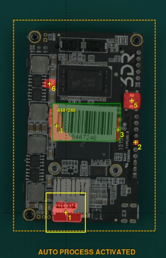
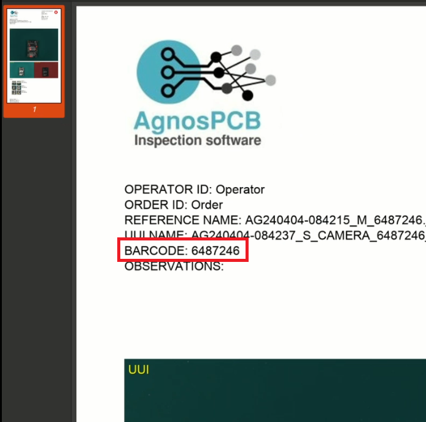

# **Barcode reader**

The AgnosPCB software incorporates a barcode reader function that supports **1D barcodes, QR and Datamatrix**.

You can either take a **REFERENCE** photo or upload one directly from your files using the **"Open reference"** button.

Select the **"draw barcode area"** button and draw a rectangle in the barcode area.

{.center}

{.center}

The code will be shown in the rectangle and in the REFERENCE name in the top left side. The Make sure the barcode has been read before proceeding with the inspection.

Once the REFERENCE is loaded, proceed with the inspection by taking a picture of the UUI. The UUI's barcode will be read automatically in the same area of the REFERENCE's barcode.

Proceed with the [inspection process](Inspection_workflow.md/#how-to-do-an-inspection) as usual. 

The scanned code will be included in the final PDF report of the UUI.

{.center}

## Load a REFERENCE by barcode

If you already have a **REFERENCE** stored, you can easily retrieve it using the code associated with it. To do this, press the **"read barcode"** button, then read the barcode using the handheld reader, and the **REFERENCE** will load automatically. It is also possible to enter the code manually.

{.center}

{.center}

{.center}

