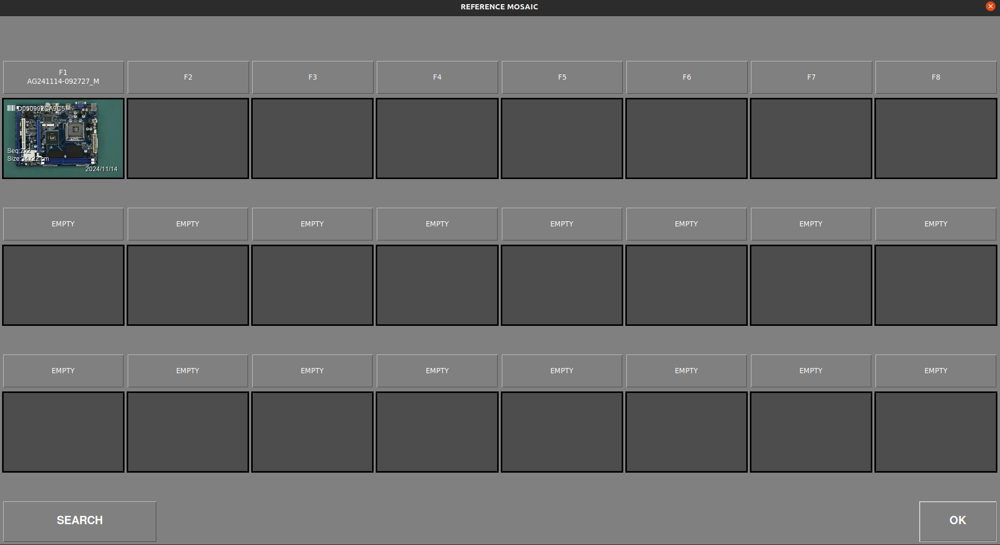
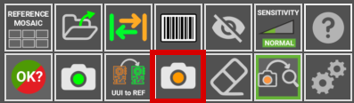

# **Inspektions-Workflow**
___

### **Starten der Software**
___

- Schließen Sie das Netzteil an die Inspektionsplattform an der Rückseite an
- Schalten Sie den Monitor ein
- Schließen Sie das Netzteil an den Computer an und schalten Sie ihn ein
- Sobald das System gestartet ist, öffnen Sie die App durch Doppelklick auf das Desktopsymbol
- **Nur für ONLINE-Einheiten**: Es wird ein Anmeldefenster angezeigt, das Ihre AgnosPCB-Kontodaten abfragt. Die Anmeldedaten werden für die zukünftige Verwendung in der Einheit gespeichert und es ist keine erneute Anmeldung erforderlich.

{.center}

## **Inspektionsprozedur**

___

<iframe width="100%" height="400" src="https://www.youtube.com/embed/FirteJF0U1E?si=IiWu4CkiELWYecYR" title="YouTube video player" frameborder="0" allow="accelerometer; autoplay; clipboard-write; encrypted-media; gyroscope; picture-in-picture; web-share" referrerpolicy="strict-origin-when-cross-origin" allowfullscreen></iframe>
___

### **Generieren einer REFERENZ**

Die AgnosPCB Inspektions-Software wird das Foto Ihrer **REFERENZ**-Leiterplatte/Ihres Panels ("golden sample") mit allen Fotos **"vergleichen"**, die Sie von der zu inspizierenden Schaltung aufnehmen (Fotos zum "ANALYSEN").

!!!warning "Wichtig"
    Wir empfehlen Ihnen, unsere [Tipps](../help/Tips.md)-Sektion zu besuchen, bevor Sie Ihr erstes Bild aufnehmen.

Um mit der Aufnahme der REFERENZ fortzufahren, klicken Sie im Hauptmenü auf das Referenzsymbol:

{.center}

Ein neues Fenster wird mit mehreren Werkzeugen geöffnet:

In diesem Fenster müssen wir die Bilder einstellen, die zur Abdeckung der gesamten PCBA erforderlich sind.

Falls Sie nicht feststellen können, wie viele Bilder zur Abdeckung Ihrer PCBA/Ihres Panels erforderlich sind, können Sie Ihre PCBA/Ihr Panel in die Mitte des Inspektionsbereichs legen und die Schaltfläche **AUTO** drücken. Das System scannt die PCBA/das Panel und **stellt die optimalen Proportionen automatisch ein.**

{.center}

Im unteren Bereich des Fensters können Sie das Raster in der Live-Vorschau ein-/ausblenden und die Belichtung für die Bildaufnahme einstellen.

{.center}

!!! warning "Wichtig"
    Der eingestellte Standardwert (16000) ist **in den meisten Fällen der optimale Wert.** Passen Sie diesen Parameter nur im Falle von sehr hellen/dunklen Komponenten an, die von der Software kaum sichtbar sind. 

Dieses Fenster ermöglicht es, die Kamera zu jedem Quadranten der PCBA zu bewegen. Klicken Sie einfach in der Miniaturansicht auf den gewünschten Quadranten.

{.center}

Die Kamera fokussiert auf den ausgewählten Bereich, sobald die Aufnahme begonnen hat.

!!! warning "Wichtig"
    Wählen Sie für eine korrekte Fokussierung einen Bereich **ohne hohe Komponenten.**

Es ist auch möglich, die Optik vor Beginn der Aufnahme durch Drücken der Schaltfläche **FOCUS** zu fokussieren. Dies hilft, einen Bereich zu finden, in dem die Optik korrekt fokussiert.

{.center}

Um die Aufnahmeverarbeitung zu starten, klicken Sie einfach auf die Schaltfläche **REFERENZ AUFNEHMEN**. Das AOI fokussiert automatisch auf den ausgewählten Quadranten und beginnt innerhalb von Sekunden mit der Aufnahme der gesamten PCBA.

{.center}

{.center}

Nach der Aufnahme der PCBA wird das Mosaik-Fenster geöffnet, das es ermöglicht, das Bild zur schnellen Verwendung zu speichern.

!!! note "Hinweis"
    Alle aufgenommenen REFERENZEN werden automatisch gespeichert. Das Mosaik hilft dabei, die am häufigsten verwendeten REFERENZEN schnell zu laden.

{.center}

Sobald der Aufnahmeprozess beendet ist, wird das REFERENZ-Bild im Hauptfenster angezeigt und ermöglicht es Ihnen, [Ausschlussmasken](Set_exclusion_area.md) festzulegen oder [einen Barcode-Bereich](Barcode_reader.md) zum Lesen zu zeichnen.

{.center}

### **Aufnehmen einer UUI**

Nach dem Generieren oder Hochladen eines vorherigen REFERENZ-Bildes können wir mit der Aufnahme des **UUI** (Unit Under Inspection)-Bildes fortfahren, indem wir auf die Schaltfläche drücken.

{.center}

Ein Live-Vorschaufenster wird geöffnet, das ein Geisterbild des REFERENZ-Bildes zeigt. Dies hilft, die UUI PCBA mit der REFERENZ auszurichten.

!!! warning "Wichtig"
    Die **AgnosPCB**-Software ist in der Lage, beide Bilder (**REFERENZ** und **UUI**) automatisch auszurichten. Es ist jedoch wichtig, die UUI PCBA korrekt zu positionieren, um geometrische Verformungen zu vermeiden, die Falsch-Positiv-Erkennungen verursachen können.

{.center}

Der Aufnahmeprozess beginnt durch Klicken auf die Schaltfläche **INSPEKTION STARTEN**.

!!! note "Hinweis"
    Eine Fokussierung ist nicht erforderlich, da der Fokusparameter bereits mit dem REFERENZ-Bild gespeichert ist, was die Inspektion sehr schnell macht.

Der Inspektionsprozess wird im Falle einer Multi-Bild-Inspektion parallel ausgeführt.

Sobald der Aufnahmeprozess beendet ist, wird das Endergebnis zurückgegeben, das die erkannten Fehler anzeigt, falls vorhanden. Es ist möglich, die [Erkennungsempfindlichkeit](Set_sensitivity.md) durch Drücken der Schaltfläche im Hauptfenster oder durch Drücken der **Tasten 1, 2 oder 3** zu ändern.

{.center}

{.center}

Wenn Fehler erkannt werden, erscheint ein **roter Rahmen** um das Hauptfenster. Ein **grüner Rahmen**, wenn keine Fehler vorliegen.

### **Melden von Fehlern**

Sobald die Inspektion abgeschlossen ist, muss der Bediener die markierten Fehler überwachen und sie entweder als **tatsächlichen Fehler** oder als **Falsch-Positiv-Erkennung** kennzeichnen.
Dazu blättern Sie einfach mit den **linken und rechten Pfeiltasten** auf der Tastatur durch die Fehler.

Um einen echten Fehler zu markieren, bewegen Sie sich einfach zum Fehler und drücken Sie die **Pfeiltaste nach oben** auf Ihrer Tastatur. Ein neues Fenster wird angezeigt, das den Fehler detailliert zeigt und es Ihnen ermöglicht, ihn zu kategorisieren, indem Sie einen Fehlertyp aus der Liste auswählen.

{.center}

Zusätzlich gibt es ein leeres Feld zum **Hinzufügen eines Kommentars.**

Falls der Bediener einen von der Software **nicht erkannten** Fehler findet, ist es möglich, diesen zu markieren und zu melden, indem der Cursor auf den Fehlerbereich bewegt und die **Pfeiltaste nach oben** gedrückt wird. Das Meldefenster wird wie gewohnt angezeigt. 

Wenn die Software einen Bereich markiert, der kein tatsächlicher Fehler ist, kann der Bediener ihn als **Falsch-Positiv** kennzeichnen, indem er die **Pfeiltaste nach unten** drückt. Auch hier wird ein Fenster angezeigt, das das Hinzufügen eines Kommentars ermöglicht.

{.center}

!!! note "Hinweis"
    Beachten Sie, dass das **rote Symbol** {width=20px} die tatsächlichen Fehler und das **grüne Symbol** {width=20px} die Falsch-Positiv-Fehler kennzeichnet.

### **Generieren eines endgültigen PDF-Berichts**

Nach Abschluss der Meldung kann der Bediener einen endgültigen PDF-Bericht generieren, indem er auf die folgende Schaltfläche drückt:

{.center}

Ein Fenster erscheint, das es Ihnen ermöglicht, die Inspektion als **OK** oder **NICHT OK** zu markieren. Wenn die PCBA die Qualitätsprüfung erfolgreich besteht, drücken Sie das grüne Symbol.

{.center}

Es ist möglich, Kommentare hinzuzufügen, die in den Bericht aufgenommen werden. Das PDF wird im Ordner **REPORTS** generiert.

{.center}

{.center}