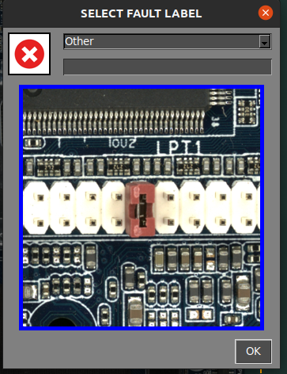

# **Flux de travail d'inspection**
___

### **Lancement du logiciel**
___

- Connectez l'alimentation à la plateforme d'inspection sur le panneau arrière
- Allumez le moniteur
- Connectez l'alimentation à l'ordinateur et allumez-le
- Une fois que le système a démarré, ouvrez l'application en double-cliquant sur l'icône du bureau
- **Pour les unités EN LIGNE (ONLINE) uniquement** : une fenêtre de connexion apparaîtra, demandant les identifiants de votre compte AgnosPCB. Les identifiants seront stockés dans l'unité pour une utilisation future et il ne sera pas nécessaire de se reconnecter.

{.center}

## **Procédure d'inspection**

___

<iframe width="100%" height="400" src="https://www.youtube.com/embed/FirteJF0U1E?si=IiWu4CkiELWYecYR" title="YouTube video player" frameborder="0" allow="accelerometer; autoplay; clipboard-write; encrypted-media; gyroscope; picture-in-picture; web-share" referrerpolicy="strict-origin-when-cross-origin" allowfullscreen></iframe>
___

### **Génération d'une RÉFÉRENCE**

Le logiciel AgnosPCB Inspection tool va **« comparer »** la photographie de votre circuit/panneau de **RÉFÉRENCE** (« échantillon d'or ») avec toutes les photos que vous prendrez du circuit à inspecter (photos à « ANALYSER »).

!!!warning "Important"
    Nous vous recommandons de consulter notre section [conseils](../help/Tips.md) avant de prendre votre première image.

Pour procéder à la prise de la RÉFÉRENCE, cliquez sur l'icône de référence dans le menu principal :

{.center}

Une nouvelle fenêtre apparaîtra avec plusieurs outils :

Dans cette fenêtre, nous devons définir les images nécessaires pour couvrir l'ensemble de la PCBA.

Si vous ne parvenez pas à déterminer le nombre d'images nécessaires pour couvrir votre PCBA/panneau, vous pouvez placer votre PCBA/panneau au milieu de la zone d'inspection et appuyer sur le bouton **AUTO**. Le système scannera la PCBA/le panneau et **définira automatiquement les proportions optimales.**

{.center}

Dans la partie inférieure de la fenêtre, vous pouvez définir/annuler la grille dans la prévisualisation en direct et régler l'exposition pour prendre l'image.

{.center}

!!! warning "Important"
    La valeur par défaut définie (16000) est **la valeur optimale dans la plupart des cas.** Ajustez ce paramètre uniquement en cas de composants très clairs/sombres qui sont difficilement visibles par le logiciel. 

Cette fenêtre permet de déplacer la caméra vers n'importe quel quadrant de la PCBA. Cliquez simplement sur le quadrant souhaité dans la miniature.

{.center}

La caméra fera la mise au point sur la zone sélectionnée une fois la capture démarrée.

!!! warning "Important"
    Pour une mise au point correcte, sélectionnez une zone **sans composants hauts.**

Il est également possible de faire la mise au point de l'optique avant de commencer la capture en appuyant sur le bouton **FOCUS**. Cela aide à trouver une zone où l'optique fait la mise au point correctement.

{.center}

Pour démarrer le traitement de la capture, cliquez simplement sur le bouton **CAPTURER RÉFÉRENCE**. L'AOI fera la mise au point automatiquement sur le quadrant sélectionné et commencera à capturer l'ensemble de la PCBA en quelques secondes.

{.center}

{.center}

Après la capture de la PCBA, la fenêtre mosaïque apparaîtra, permettant de stocker l'image pour une utilisation rapide.

!!! note "Note"
    Toutes les RÉFÉRENCES prises seront stockées automatiquement. La mosaïque aide à charger rapidement les RÉFÉRENCES les plus utilisées.

{.center}

Une fois le processus de capture terminé, l'image de RÉFÉRENCE sera affichée dans la fenêtre principale et vous permettra de définir [un masque d'exclusion](Set_exclusion_area.md) ou [de dessiner une zone de code-barres](Barcode_reader.md) pour la lecture.

{.center}

### **Capture d'une UUI**

Après avoir généré ou téléchargé une image de RÉFÉRENCE précédente, nous pouvons procéder à la capture de l'image **UUI** (Unité Sous Inspection) en appuyant sur le bouton.

{.center}

Une fenêtre de prévisualisation en direct apparaîtra, montrant un fantôme de l'image de RÉFÉRENCE. Cela aide à aligner la PCBA UUI avec la RÉFÉRENCE.

!!! warning "Important"
    Le logiciel **AgnosPCB** est capable d'aligner les deux images (**RÉFÉRENCE** et **UUI**) automatiquement. Cependant, il est important de positionner correctement la PCBA UUI pour éviter les déformations géométriques qui peuvent causer de fausses détections positives.

{.center}

Le processus de capture démarrera en cliquant sur le bouton **DÉMARRER L'INSPECTION**.

!!! note "Note"
    La mise au point n'est pas nécessaire car le paramètre de mise au point est déjà stocké avec l'image de RÉFÉRENCE, ce qui rend l'inspection très rapide.

Le processus d'inspection sera exécuté en parallèle dans le cas d'une inspection multi-images.

Une fois le processus de capture terminé, le résultat final sera retourné, affichant les erreurs détectées s'il y en a. Il est possible de modifier la [sensibilité de détection](Set_sensitivity.md) en appuyant sur le bouton dans la fenêtre principale ou en appuyant sur la **touche 1, 2 ou 3.**

{.center}

{.center}

Si des erreurs sont détectées, un **cadre rouge** apparaîtra autour de la fenêtre principale. Un **cadre vert** s'il n'y a pas d'erreurs.

### **Signalement des erreurs**

Une fois l'inspection terminée, l'opérateur doit surveiller les erreurs signalées, en les marquant comme **erreur réelle** ou **fausse détection positive**.
Pour ce faire, faites simplement défiler les erreurs en utilisant les **flèches gauche et droite** du clavier.

Pour marquer une erreur réelle, déplacez-vous simplement vers le défaut et appuyez sur la **flèche haut** de votre clavier. Une nouvelle fenêtre apparaîtra, montrant le défaut en détail et vous permettant de le catégoriser en sélectionnant un type de défaut dans la liste.

{.center}

De plus, il y a un champ vide pour **ajouter un commentaire.**

Dans le cas où l'opérateur trouve une erreur **non détectée** par le logiciel, il est possible de la signaler en déplaçant le curseur sur la zone du défaut et en appuyant sur la **touche flèche haut**. La fenêtre de signalement apparaîtra comme d'habitude. 

Lorsque le logiciel marque une zone qui n'est pas une erreur réelle, l'opérateur peut la signaler comme un **faux positif** en appuyant sur la **touche flèche bas**. Une fenêtre apparaîtra également, permettant d'ajouter un commentaire.

{.center}

!!! note "Note"
    Notez que l'**icône rouge** {width=20px} marque les défauts réels et l'**icône verte** {width=20px} les défauts faux positifs.

### **Génération d'un rapport PDF final**

Une fois le signalement terminé, l'opérateur peut générer un rapport PDF final en appuyant sur le bouton suivant :

{.center}

Une fenêtre apparaît, vous permettant de marquer l'inspection comme **OK** ou **NON OK**. Si la PCBA réussit le contrôle qualité, appuyez sur l'icône verte.

{.center}

Il est possible d'ajouter des commentaires qui seront inclus dans le rapport. Le PDF sera généré dans le dossier **REPORTS**.

{.center}

{.center}