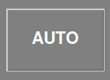
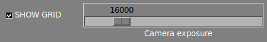
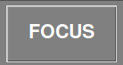
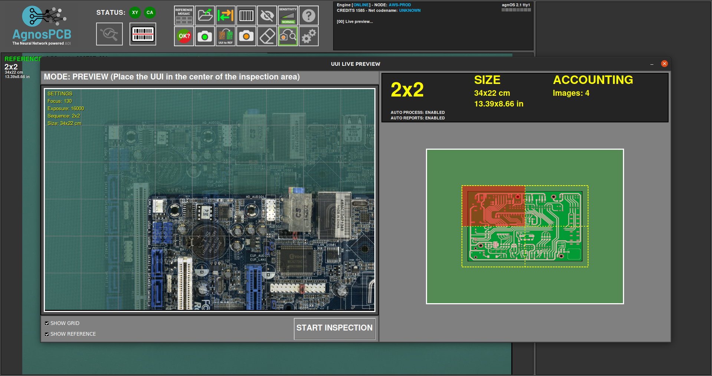

# **Flusso di lavoro dell'ispezione**
___

### **Avvio del software**
___

- Collegare l'alimentazione alla piattaforma di ispezione sul pannello posteriore
- Accendere il monitor
- Collegare l'alimentazione al computer e accenderlo
- Una volta che il sistema si è avviato, aprire l'app facendo doppio clic sull'icona del desktop
- **Solo per unità ONLINE**: apparirà una finestra di accesso che richiederà le credenziali dell'account AgnosPCB. Le credenziali verranno memorizzate nell'unità per usi futuri e non sarà richiesto di accedere nuovamente.

{.center}

## **Procedura di ispezione**

___

<iframe width="100%" height="400" src="https://www.youtube.com/embed/FirteJF0U1E?si=IiWu4CkiELWYecYR" title="YouTube video player" frameborder="0" allow="accelerometer; autoplay; clipboard-write; encrypted-media; gyroscope; picture-in-picture; web-share" referrerpolicy="strict-origin-when-cross-origin" allowfullscreen></iframe>
___

### **Generazione di un RIFERIMENTO**

Il software AgnosPCB Inspection tool **"confronterà"** la fotografia del circuito/pannello di **RIFERIMENTO** ("golden sample") con tutte le foto che scatterete del circuito da ispezionare (foto da "ANALIZZARE").

!!!warning "Importante"
    Si consiglia di visitare la nostra sezione [suggerimenti](../help/Tips.md) prima di scattare la prima immagine.

Per procedere con l'acquisizione del RIFERIMENTO, fare clic sull'icona del riferimento nel menu principale:

{.center}

Apparirà una nuova finestra con diversi strumenti:

In questa finestra dobbiamo impostare le immagini necessarie per coprire l'intera PCBA.

Nel caso in cui non riusciate a determinare quante immagini sono necessarie per coprire la vostra PCBA/pannello, potete posizionare la vostra PCBA/pannello al centro dell'area di ispezione e premere il pulsante **AUTO**. Il sistema scansionerà la PCBA/il pannello e **imposterà automaticamente le proporzioni ottimali.**

{.center}

Nella parte inferiore della finestra è possibile impostare/rimuovere la griglia nell'anteprima live e impostare l'esposizione per scattare l'immagine.

{.center}

!!! warning "Importante"
    Il valore predefinito impostato (16000) è **il valore ottimale nella maggior parte dei casi.** Regolare questo parametro solo in caso di componenti molto chiari/scuri che sono difficilmente visibili dal software. 

Questa finestra consente di spostare la telecamera in qualsiasi quadrante della PCBA. Basta fare clic sul quadrante desiderato nella miniatura.

{.center}

La telecamera metterà a fuoco l'area selezionata una volta iniziata l'acquisizione.

!!! warning "Importante"
    Per una corretta messa a fuoco, selezionare un'area **senza componenti alti.**

È anche possibile mettere a fuoco l'ottica prima di avviare l'acquisizione premendo il pulsante **FOCUS**. Ciò aiuta a trovare un'area in cui l'ottica mette a fuoco correttamente.

{.center}

Per avviare l'elaborazione dell'acquisizione, è sufficiente fare clic sul pulsante **CATTURA RIFERIMENTO**. L'AOI metterà a fuoco automaticamente nel quadrante selezionato e inizierà a catturare l'intera PCBA in pochi secondi.

{.center}

{.center}

Dopo aver catturato la PCBA, apparirà la finestra del mosaico che consente di archiviare l'immagine per un utilizzo rapido.

!!! note "Nota"
    Tutti i RIFERIMENTI acquisiti verranno archiviati automaticamente. Il mosaico aiuta a caricare rapidamente i RIFERIMENTI più utilizzati.

{.center}

Una volta terminato il processo di acquisizione, l'immagine di RIFERIMENTO verrà visualizzata nella finestra principale e vi consentirà di impostare [maschere di esclusione](Set_exclusion_area.md) o [disegnare un'area codice a barre](Barcode_reader.md) per la lettura.

{.center}

### **Acquisizione di una UUI**

Dopo aver generato o caricato una precedente immagine di RIFERIMENTO, possiamo procedere con l'acquisizione dell'immagine **UUI** (Unità Sotto Ispezione) premendo il pulsante.

{.center}

Apparirà una finestra di anteprima live che mostra un'immagine fantasma dell'immagine di RIFERIMENTO. Questo aiuta ad allineare la PCBA UUI con il RIFERIMENTO.

!!! warning "Importante"
    Il software **AgnosPCB** è in grado di allineare automaticamente entrambe le immagini (**RIFERIMENTO** e **UUI**). Tuttavia, è importante posizionare correttamente la PCBA UUI per evitare deformazioni geometriche che possono causare rilevamenti di falsi positivi.

{.center}

Il processo di acquisizione inizierà facendo clic sul pulsante **AVVIA ISPEZIONE**.

!!! note "Nota"
    La messa a fuoco non è necessaria poiché il parametro di messa a fuoco è già memorizzato con l'immagine di RIFERIMENTO, rendendo l'ispezione molto veloce.

Il processo di ispezione sarà eseguito in parallelo in caso di ispezione multi-immagine.

Una volta terminato il processo di acquisizione, verrà restituito il risultato finale che mostra gli errori rilevati, se presenti. È possibile modificare la [sensibilità di rilevamento](Set_sensitivity.md) premendo il pulsante nella finestra principale o premendo il **tasto 1, 2 o 3.**

{.center}

{.center}

Se vengono rilevati errori, apparirà una **cornice rossa** attorno alla finestra principale. **Cornice verde** se non ci sono errori.

### **Segnalazione degli errori**

Una volta completata l'ispezione, l'operatore deve monitorare gli errori segnalati, contrassegnandoli come **errore effettivo** o **rilevamento falso positivo**.
Per fare ciò, è sufficiente scorrere gli errori utilizzando le **frecce sinistra e destra** sulla tastiera.

Per contrassegnare un errore reale, basta spostarsi sul difetto e premere la **freccia su** sulla tastiera. Apparirà una nuova finestra che mostra il difetto in dettaglio e consente di classificarlo selezionando un tipo di difetto dall'elenco.

{.center}

Inoltre, c'è un campo vuoto per **aggiungere un commento.**

Nel caso in cui l'operatore trovi un errore **non rilevato** dal software, è possibile segnalarlo e riportarlo spostando il cursore sull'area del difetto e premendo il **tasto freccia su**. La finestra di segnalazione apparirà come di consueto. 

Quando il software segnala un'area che non è un errore effettivo, l'operatore può contrassegnarla come **falso positivo** premendo il **tasto freccia giù**. Apparirà anche una finestra che consente di aggiungere un commento.

{.center}

!!! note "Nota"
    Si noti che l'**icona rossa** {width=20px} contrassegna i difetti effettivi e l'**icona verde** {width=20px} i difetti falso positivo.

### **Generazione di un report PDF finale**

Una volta terminata la segnalazione, l'operatore può generare un report PDF finale premendo il seguente pulsante:

{.center}

Appare una finestra che consente di contrassegnare l'ispezione come **OK** o **NON OK**. Se la PCBA supera il controllo qualità con successo, premere l'icona verde.

{.center}

È possibile aggiungere commenti che verranno inclusi nel report. Il PDF verrà generato nella cartella **REPORTS**.

{.center}

{.center}