# **Inspection workflow**
___

### **Launching the software**
___

- Connect the power supply to the inspection platform on the rear panel
- Turn on the monitor
- Connect the power supply to the computer and turn on it
- Once the system has started, open the app by double-clicking the desktop icon
- **For ONLINE units only**: a login window will pop up asking for your AgnosPCB's account credentials. The credentials will be stored on the unit for future use, and you will not need to log in again.

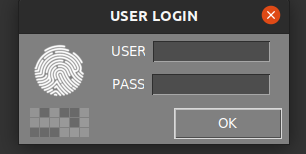{.center}

## **Inspection procedure**

___

<iframe width="100%" height="400" src="https://www.youtube.com/embed/FirteJF0U1E?si=IiWu4CkiELWYecYR" title="YouTube video player" frameborder="0" allow="accelerometer; autoplay; clipboard-write; encrypted-media; gyroscope; picture-in-picture; web-share" referrerpolicy="strict-origin-when-cross-origin" allowfullscreen></iframe>
___

### **Generating a REFERENCE**

The AgnosPCB Inspection tool software will **“compare”** the photograph of your **REFERENCE** circuit or panel (“golden sample”) with all the [UUI](terminology.md#uui).

!!!warning "Important"
    We recommend you to visit our [tips](../help/Tips.md) section before taking your first image.

To proceed with the REFERENCE taken, click in the reference icon in the main menu:

{.center}

A new window will pop up with multiple tools:

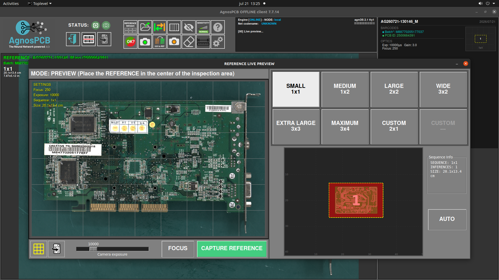{ width=600 .center }

---

#### Capturing the PCB Size

For larger PCBAs, the camera field of view may not be sufficient to capture the entire board in a single image. In these cases, the system captures multiple images and automatically stitches them together using AI into a single image ready for inspection.In this window we have to set the proper capturing sequence needed to cover all the PCBA or panel.

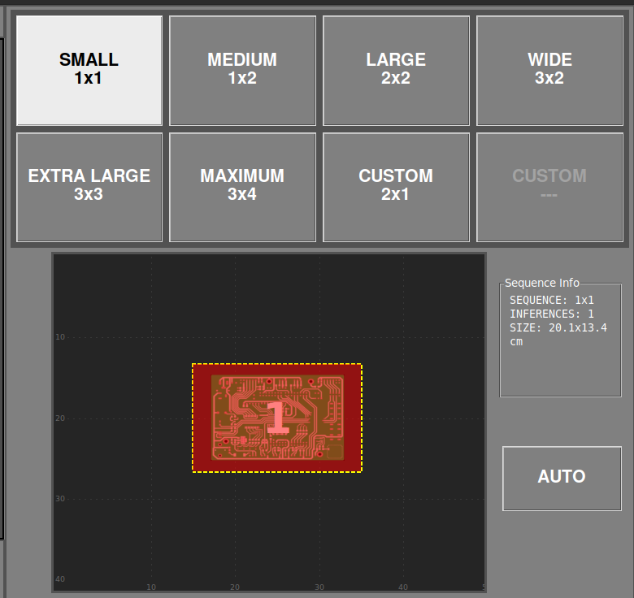{ width=600 .center }

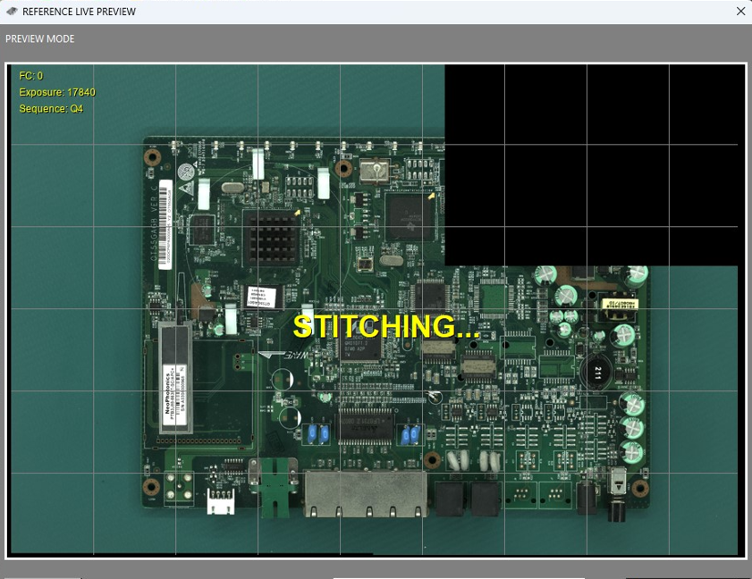{ width=600 .center }

If you are unsure how many images are required, place the PCBA in the center of the inspection area and press the **AUTO** button. The system will scan the board and automatically set the optimal configuration for the current PCBA or panel.

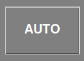{ .center }

You can also move the camera to any quadrant of the PCBA by clicking on the desired area in the miniature view.

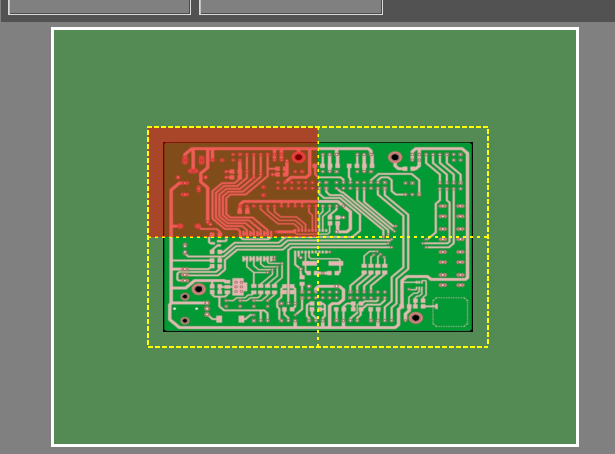{ .center }

---

#### TOP/BOTTOM inspection

The inspection tool software integrate a functionallity to analyze both sides of the PCBAs to be inspected.
This feature should be enabled during the REFERENCE capturing from the live preview window.

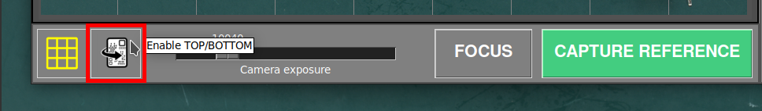{ width=600 .center }

Once the correct sequence has been set and the PCBA is correctly placed, press the **CAPTURE TOP** button to start the capture the top side of the PCBA.

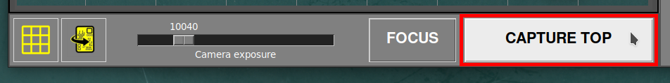{ width=600 .center }

Once the process has finished, the mosaic window will pop up and the REFERENCE can be store in one of the slots. After, the procedure can continue by flipping the panel and capturing the bottom side.

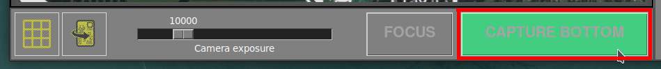{ width=600 .center }

Use the button in the main window to switch bettwen **TOP** and **BOTTOM** images.

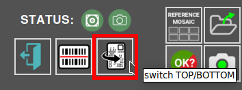{ width=400 .center }

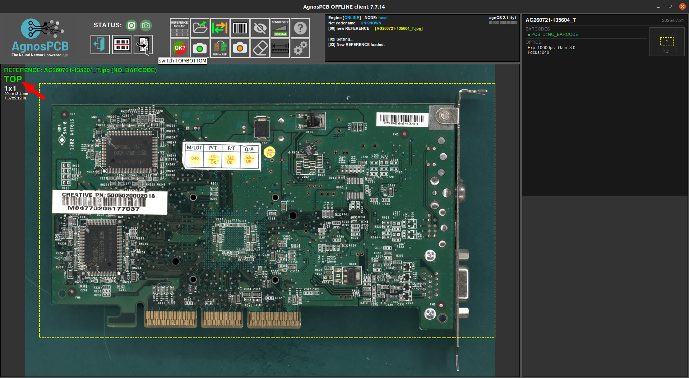{ .center }

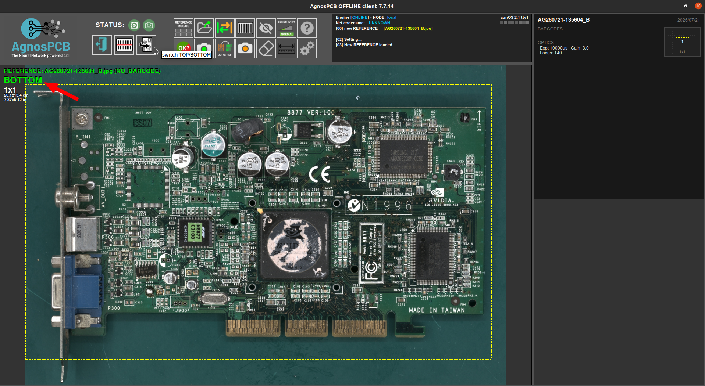{ .center }

---

#### Focus

The system allows manual focusing of the PCB before starting the capture process. Press the **FOCUS** button to adjust the optics and verify that the selected area is correctly focused.

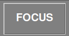{ .center }

By default, the camera focuses automatically on the center of the PCB. However, this may not always be the optimal area due to the presence of tall components.

For accurate inspection, it is essential to focus on the **base of the PCB**, where the components are mounted. Avoid focusing on tall components, as this may reduce inspection accuracy.

The PCB does not need to be centered during manual focusing. The operator can move it freely and select any suitable area to achieve proper focus, as long as the base of the PCB is clearly in focus.

After completing the focusing process, the PCB must be repositioned at the center of the inspection area before capturing the reference image.

!!! warning "Important"
    Select an area without tall components and ensure that the PCB base is sharply focused.

The lower section of the window allows enabling or disabling the grid in the live preview and adjusting the exposure.

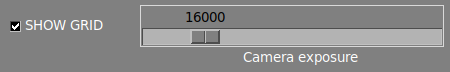{ .center }

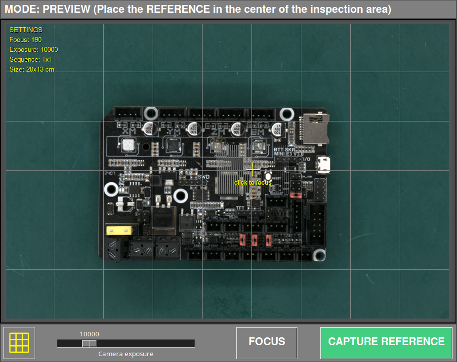{ .center }

---

To start the capture process, simply click the **CAPTURE REFERENCE** button. The AOI will focus automatically on the selected quadrant and start capturing the entire PCBA in a matter of seconds.

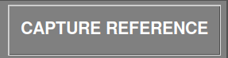{.center}

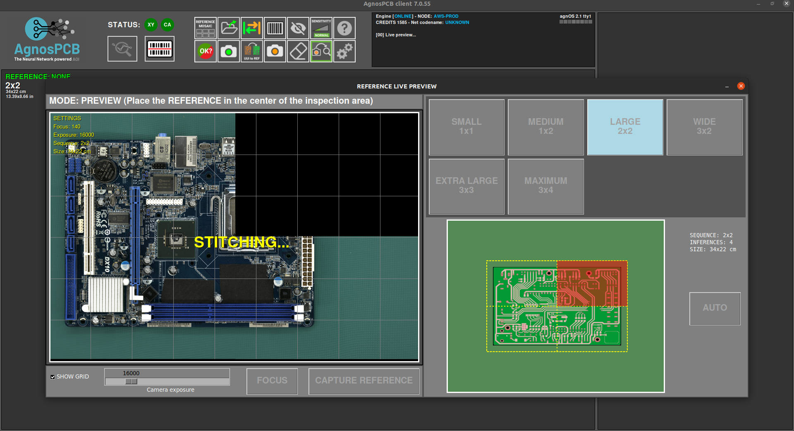{.center}

After capturing the PCBA, the mosaic window will pop up allowing you to store the image for quick access.

!!! note "Note"
    All taken REFERENCES will be stored automatically. The mosaic helps to quickly load the most used REFERENCES.

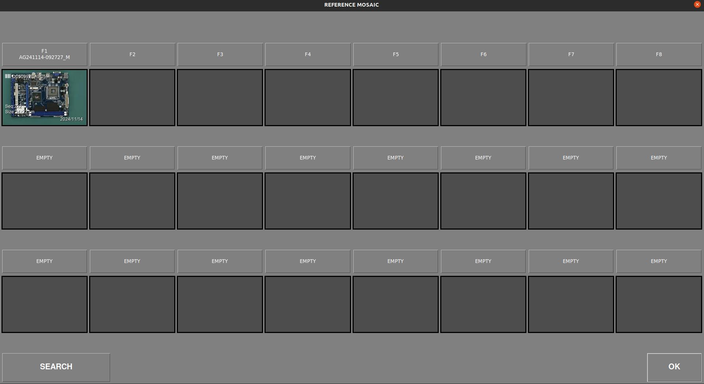{.center}

Once the capture process is finished, the REFERENCE image will be displayed in the main window and will allow you to set [exclusion mask](Set_exclusion_area.md) or [draw a barcode](Barcode_reader.md) area for reading.

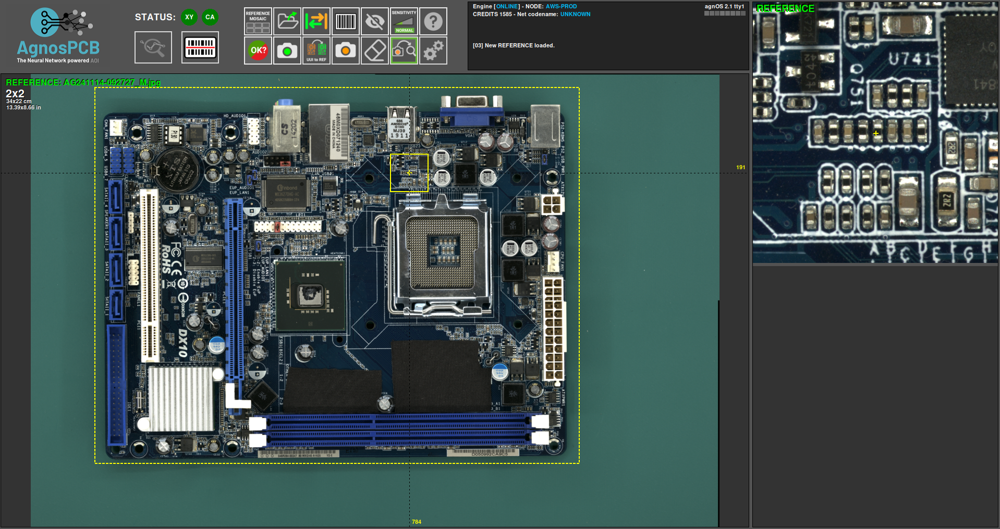{.center}

### **Capturing an UUI**

After generating or uploading a previous REFERENCE image, we can proceed with the capture of the **UUI** (Unit Under Inspection) image by pressing the button.

{.center}

A live preview window will pop up showing a ghosted overlay of the REFERENCE image. This helps to align the UUI PCBA with the REFERENCE.

!!! warning "Important"
    The **AgnosPCB** software is capable of aligning both images (**REFERENCE** and **UUI**) automatically. However, it is important to position the UUI PCBA correctly to avoid geometric deformations that can cause false positive detections.

{.center}

The capturing process will start by clicking the **START INSPECTION** button.

!!! note "Note"
    Focusing is not necessary as the focus parameter is already stored with the REFERENCE image, making the inspection very fast.

The inspection process is executed in parallel in the case of a multi-image inspection.

Once the capturing process has ended, the final result will be returned showing the detected errors, if any. It is possible to change the [detection sensitivity](Set_sensitivity.md) by pressing the button in the main window or by pressing the **1, 2, or 3 key.**

{.center}

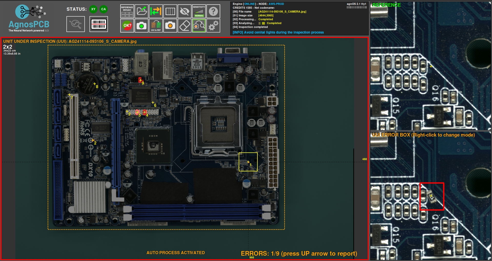{.center}

If errors are detected, a **red frame** will appear around the main window. A **green frame** will appear if there are no errors.

### **Reporting errors**

Once the inspection is complete, the operator must monitor the flagged errors, marking them as an **actual error** or a **false positive detection**.
To do this, simply scroll through the errors using the **left and right arrows** on the keyboard.

To mark a real error, just move to the fault and press the **up arrow** on your keyboard. A new window will appear showing the bug in detail and allowing you to categorise it by selecting a type of fault from the list.

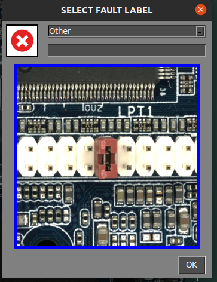{.center}

In addition, there is an empty field to **add a comment.**

In case the operator finds an error **not detected** by the software, it is possible to flag and report it by moving the cursor to the fault area and pressing the **up arrow** key. The reporting window will appear as usual. 

When the software marks an area that is not an actual error, the operator can flag it as a **false positive** by pressing the **down arrow** key. A window will also appear, allowing you to add a comment.

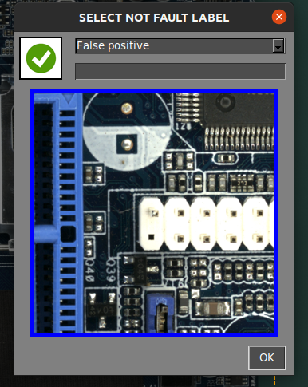{.center}

!!! note "Note"
    Note the **red icon** {width=20px} marks the actual faults and the **green icon** {width=20px} marks the false positive faults.

### **Generating a final PDF report**

Once the reporting has finished, the operator can generate a final PDF report by pressing the following button:

{.center}

A window appears allowing you to mark the inspection as **OK** or **NOT OK**. If the PCBA passes the quality check successfully, press the green icon.

{.center}

It is possible to add comments that will be included in the report. The PDF will be generated in the **REPORTS** folder.

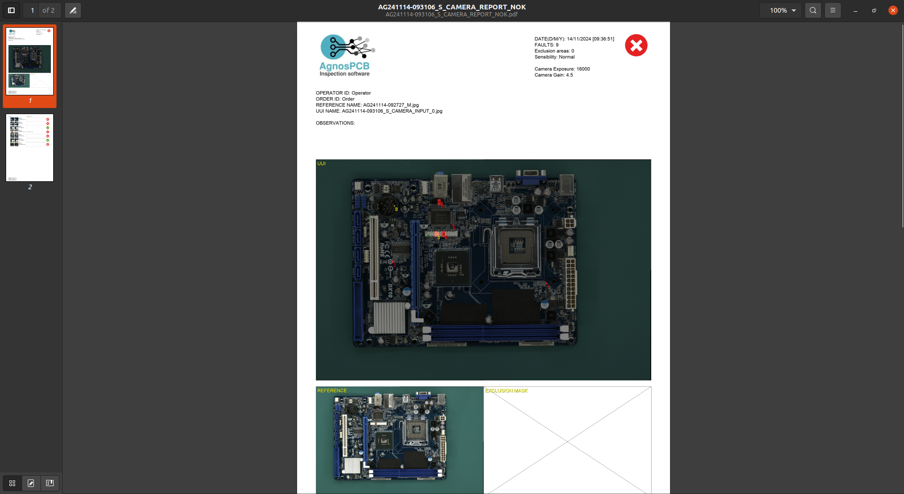{.center}

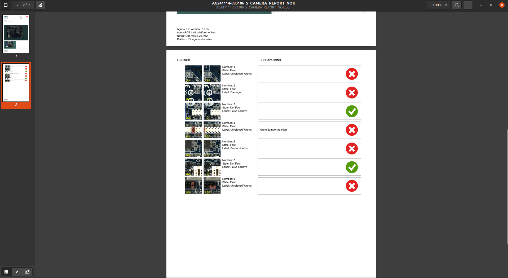{.center}