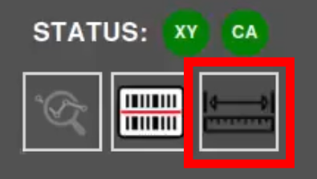
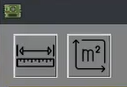
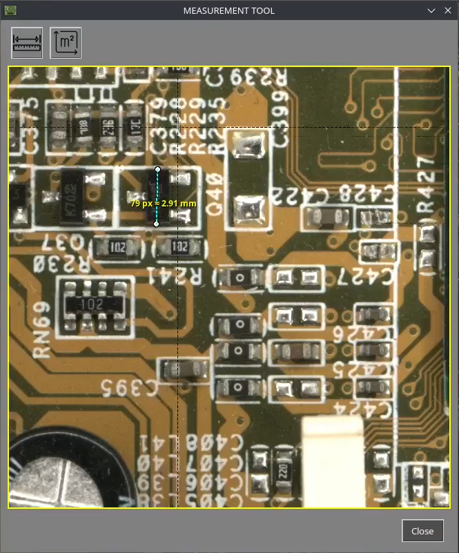

# Herramienta de medición

El sistema AOI AgnosPCB incluye una herramienta de medición que permite a los operadores verificar las dimensiones de los componentes, medir distancias entre componentes y calcular áreas directamente dentro de la interfaz, sin utilizar herramientas externas.

## Video

Para una explicación completa de esta funcionalidad, mira el siguiente video:
 
___

<iframe width="100%" height="400" src="." title="YouTube video player" frameborder="0" allow="accelerometer; autoplay; clipboard-write; encrypted-media; gyroscope; picture-in-picture; web-share" referrerpolicy="strict-origin-when-cross-origin" allowfullscreen></iframe>
___

## 1. Seleccionar la imagen

[Selecciona una imagen de referencia](../how_to/Screen-layout.md#load-reference-as-file) donde desees realizar una medición, o bien [captura una UUI](../how_to/Inspection_workflow.md#capturing-an-uui).

## 2. Abrir la herramienta de medición

Haz clic en el botón de la herramienta de medición en la barra de herramientas superior. Luego, haz clic en el área de interés para abrir una vista ampliada de la región seleccionada.

{width=200, .center}

## 3. Realizar la medición

Selecciona el modo de medición:

- **Distancia (mm/px)** para medir la distancia entre dos puntos.
- **Área (mm²/px²)** para medir una superficie.

{width=200, .center}

A continuación, define la medición seleccionando los puntos o el área deseados en la imagen.

## Resultado

El sistema muestra la medición directamente en la pantalla, lo que permite verificar rápidamente dimensiones y distancias durante la inspección.

{width=500, .center}