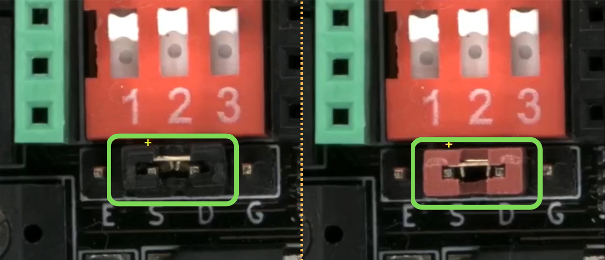

# Reference Variants

When inspecting a PCB, some components may differ from the reference and be detected by the software as errors (e.g., a red jumper instead of a black one).

{width=500, .center}

By marking this type of error as a **Reference Variant**, the system will recognize it in future inspections and will not flag it as an error again.

## 1. Start the inspection
[Create a reference image](../how_to/Inspection_workflow.md#generating-a-reference) or select one [from the repository](../how_to/Screen-layout.md#load-reference-as-file). Then, place the UUI and start the inspection.

## 2. Identify the error
Navigate to the detected error with the **Left/Right Arrow keys (←/→)**.

{width=600, .center}

## 3. Classify as Reference Variant
Press the **Down Arrow key (↓)** to reject the error. In the classification panel, select **Reference Variant** and press **OK**.

{width=400, .center}

## Result

Once classified, the reference variant is stored and linked to the reference image. 

{width=600, .center}

It will appear in the final inspection report and will no longer be flagged as an error in future inspections.

<!--Añadir captura de PDF Report con la variante registrada-->

{width=400, .center}
{width=40, .center}
{width=400, .center}

## Video

For a complete walkthrough of this feature, watch the following video:

<video width="800" controls style="display: block; margin: 0 auto;">
  <source src="../assets/ref-variant-video.mp4" type="video/mp4">
  Your browser does not support the video tag.
</video>