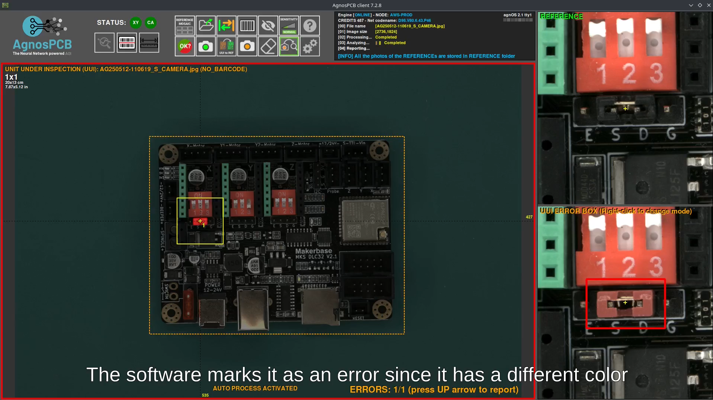
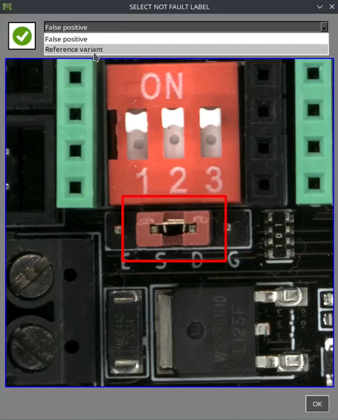
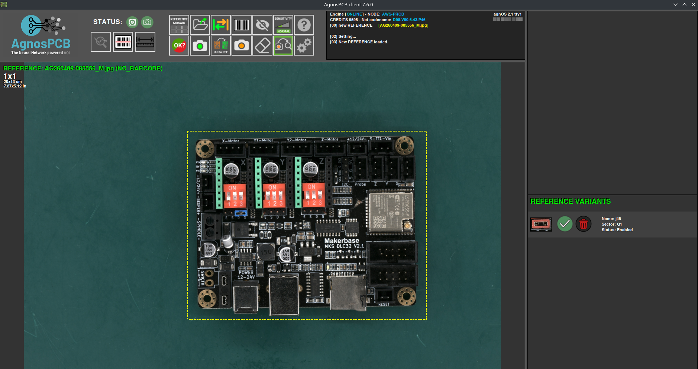
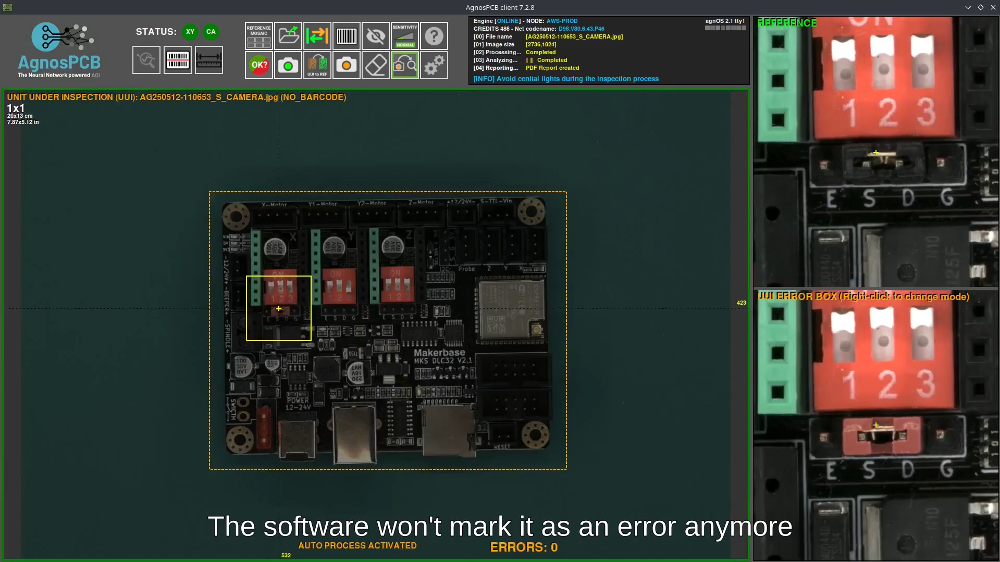
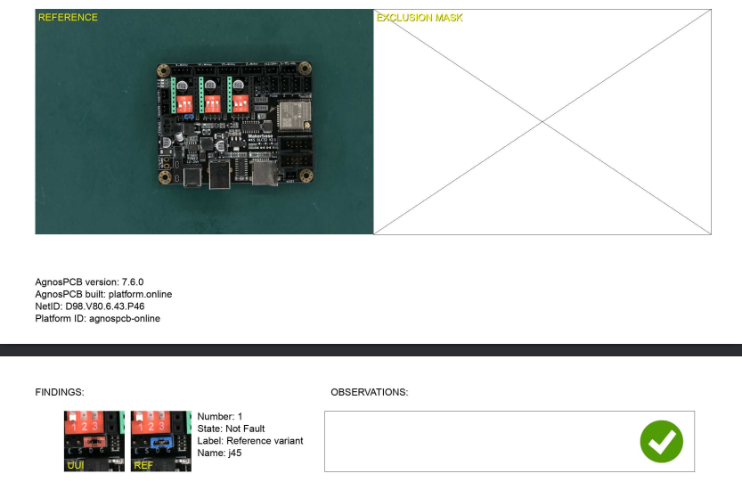

# Reference Variants

When inspecting a PCB, some components may differ from the reference and be detected by the software as errors (e.g., due to component supply changes or labeling differences).

By marking this type of error as a **Reference Variant**, the system will recognize it in future inspections and will not flag it as an error again.

## Video

For a complete walkthrough of this feature, watch the following video:
 
___

<iframe width="100%" height="400" src="." title="YouTube video player" frameborder="0" allow="accelerometer; autoplay; clipboard-write; encrypted-media; gyroscope; picture-in-picture; web-share" referrerpolicy="strict-origin-when-cross-origin" allowfullscreen></iframe>
___

## 1. Start the inspection

[Create a reference image](../how_to/Inspection_workflow.md#generating-a-reference) or select one [from the repository](../how_to/Screen-layout.md#load-reference-as-file). Then, place the UUI and start the inspection.

## 2. Identify the error

Navigate to the detected error with the **Left/Right Arrow keys (←/→)**.

{width=600, .center}

## 3. Classify as Reference Variant

Press the **Down Arrow key (↓)** to reject the error. In the classification panel, select **Reference Variant**.

 A dialog will appear where you must enter a name for the new variant (required) and optionally add a description. Once completed, press **Confirm**.

{width=400, .center}

## Result

Once classified, the reference variant is stored and linked to the reference image. Saved variants can be viewed by opening a stored reference image. They are displayed in the right-side panel, below the zoomed reference view. From this panel, variants can be enabled, disabled, or deleted.

{width=600, .center}

This variant will no longer be flagged as an error in future inspections.

!!! warning "Caution"
    A reference variant must be manually created for each location on the PCB where the variation appeard. The system does not automatically apply the variant to identical components in other positions.

{width=400, .center}
{width=40, .center}
{width=400, .center}

Even after creating a reference variant, the system will still detect real defects on that component if they occur.

The final inspection report will also include the reference variant, along with its image, assigned name, and any additional observations.

{width=600, .center}