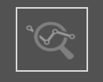
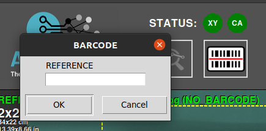
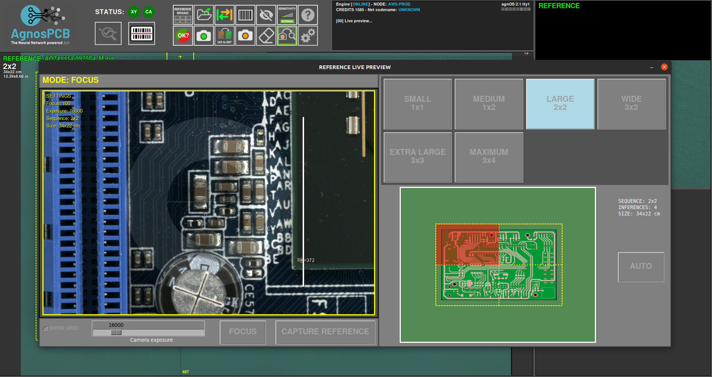

# Benutzeroberfläche

## **Hauptarbeitsbereiche**

Die folgende Abbildung beschreibt die Hauptarbeitsbereiche der **AgnosPCB Inspektionssoftware**.

{.center}

## **Plattformstatus**

{.center}

Dieser Bereich zeigt den Verbindungsstatus zur Inspektionsplattform und Kamera an. Wenn die Verbindung fehlschlägt, werden die Symbole rot. Dieser Bereich enthält auch die folgenden Aktionsschaltflächen:

### **Inspektion starten**

{.center}

Die Schaltfläche **Inspektion starten** löst die Inspektion des aktuellen **UUI**-Bildes aus. Diese Schaltfläche ist verfügbar, wenn die [Schaltfläche Automatischer Prozess](#auto-process) auf **AUS** gestellt ist. Dies ist nützlich, um den Verbrauch von Credits zu vermeiden, wenn Sie testen, wie Sie Bilder Ihrer PCBAs aufnehmen.

### **REFERENZ per Barcode laden**

{.center}

{.center}

Diese Schaltfläche öffnet ein Pop-up-Fenster zur Eingabe einer Barcode-Nummer. Beim Generieren einer REFERENZ kann jeder [enthaltene Barcode gelesen werden](#barcode-area-drawing). Dieser Barcode wird der REFERENZ zugeordnet und kann mit dieser Funktion unter Verwendung dieser Nummer geladen werden. Es ist auch möglich, den Barcode mit einem Handscanner zu lesen und in dieses Feld einzufügen. Weitere Informationen zu dieser Funktion finden Sie [hier](./Barcode_reader.md#load-a-reference-by-barcode).

## **Aktivitätsprotokoll**

{.center}

Der Bereich **Aktivitätsprotokoll** befindet sich oben rechts und zeigt die **aktuell verfügbaren Credits** sowie operative Details der Anwendung, wie den Status des Analyseprozesses.

## **Hauptarbeitsbereich**

{.center}

Dies ist der Hauptbereich, in dem Sie mit den **REFERENZ**- und **UUI**-Bildern arbeiten, die durch Drücken der TAB-Taste auf der Tastatur oder [der Schaltfläche in der Anwendung](#swap) umgeschaltet werden können. Die Inspektionsergebnisse werden ebenfalls in diesem Bereich mithilfe von Fadenkreuzen und Nummern neben den erkannten Fehlern angezeigt.

## **Seiten-an-Seiten-Vergleich**

{width=400px; .center}

Dieser Bereich der Benutzeroberfläche ist in zwei Teile unterteilt. Der obere Teil zeigt das **REFERENZ**-Bild, das als Standard für den Vergleich dient, während der untere Teil das **UUI**-Bild zeigt. Diese Bilder werden vergrößert und bewegen sich parallel, wobei genau derselbe Bereich in der **REFERENZ** und **UUI** angezeigt wird, auf den der Cursor im Hauptarbeitsbereich zeigt.

## **Schaltflächen-Panel**

{.center}

Hier befinden sich verschiedene **Funktionen und Optionen**, die darauf ausgelegt sind, Ihren Workflow zu **optimieren** und Ihre Aufgaben zu beschleunigen. Jede Funktion wird unten definiert:

### **Referenz-Mosaik**

{width=350px; .center}

{width=600px; .center}

Das Referenz-Mosaik wird verwendet, um REFERENZEN als Dateien zu speichern, um jede davon schnell zu finden und zu laden. Das Mosaik-Menü wird automatisch angezeigt, nachdem eine REFERENZ mit der [Schaltfläche Foto REFERENZ aufnehmen](#take-a-reference-image) aufgenommen oder [als Datei geladen](#load-reference-as-file) wurde. In diesem Fenster ist es auch möglich, die aufgenommene REFERENZ im oberen rechten Teil des Fensters zu benennen. Eine im Mosaik gespeicherte REFERENZ kann schnell durch Drücken einer **F-Taste** (F1-F10) geladen werden.

### **REFERENZ als Datei laden**

{width=350px; .center}

{.center}

Verwenden Sie dieses Symbol, um ein zuvor als **REFERENZ** aufgenommenes Bild zu laden, und es ermöglicht Ihnen, diese nach Name oder Datum zu sortieren. Alle **REFERENZ**-Bilder finden Sie innerhalb des Ordners **APP/REFERENCE** in einem Ordner, der nach der Uhrzeit der Aufnahme benannt ist.

!!! note "Hinweis"
    Seit Version 7 **erlaubt** die Software **nicht**, Bilder zu laden, die von einer anderen Quelle als der Plattform selbst stammen, da die Bilder spezifische Parameter für die Optik enthalten. Jedes REFERENZ-Bild muss mit der **AI-4050 AOI** aufgenommen werden.

### **Wechseln (Swap)**
 
{width=350px; .center}

Schaltet zwischen den **REFERENZ**- und **UUI**-Bildern im [Hauptarbeitsbereich](#main-workspace) um.

### **Barcode-Bereich zeichnen**

{width=350px; .center}

{.center}

Klicken Sie auf diese Schaltfläche, um manuell ein Rechteck in das **REFERENZ**-Bild zu zeichnen, wo sich ein Barcode befindet. Die Software liest ihn und verwendet diesen Code, um die Bilder zu benennen und ihn in den endgültigen **PDF-Bericht** aufzunehmen. Weitere Informationen zur Barcode-Lesefunktion finden Sie im [folgenden Abschnitt](./Barcode_reader.md).

### **Ausschluss**

{width=350px; .center}

{.center}

Erstellt einen Ausschlussbereich, in dem das System nicht nach Fehlern suchen wird. Sie können beliebig viele Bereiche erstellen. Diese Funktion wird im [folgenden Abschnitt](Set_exclusion_area.md) detailliert beschrieben.

### **Empfindlichkeit**

{width=350px; .center}

Wenn der Fertigungsprozess eine strengere Qualitätskontrolle erfordert, können Sie die Empfindlichkeit der Fehlererkennung mit dieser Funktion erhöhen. Durch Erhöhen der Empfindlichkeit markiert die Software Fehler, die sie mit einer niedrigeren Empfindlichkeitseinstellung normalerweise nicht markieren würde. Es gibt drei Empfindlichkeitsstufen: Normal, Hoch und Sehr Hoch. Sie kann mit den Tasten 1, 2, 3 der Tastatur eingestellt werden. Diese Funktion wird im [folgenden Abschnitt](./Set_sensitivity.md) detailliert beschrieben.

### **Hilfe**

{width=350px; .center}

Diese Schaltfläche führt Sie zu dieser Dokumentation.

### **Endergebnis**

{.center}

{.center}

Nachdem die erkannten Fehler vom Bediener überwacht wurden, kann die Inspektion durch Drücken dieser Schaltfläche abgeschlossen und die inspizierte PCBA je nach Fertigungskriterien als **OK** oder **NICHT OK** markiert werden. Danach erstellt die Software einen Bericht, der die vom Bediener gemeldeten Fehler in einem PDF-Dokument enthält. Um mehr über diese Funktion zu erfahren, gehen Sie zum [folgenden Abschnitt](./Inspection_workflow.md#generating-a-final-pdf-report).

### **Ein REFERENZ-Bild aufnehmen**

{.center}

{.center}

Diese Schaltfläche öffnet ein Fenster mit den Dienstprogrammen zum Generieren eines **REFERENZ**-Bildes von einer PCB oder einem Panel. Diese Funktion kann durch Drücken der Taste **r** auf der Tastatur aktiviert werden. Im Abschnitt [eine Referenz generieren](./Inspection_workflow.md/#generating-a-reference) erfahren Sie mehr über diese Funktion.

### **UUI zu REFERENZ**

{.center}

Diese Funktion wandelt das aktuelle **UUI**-Bild in eine **REFERENZ** um. Dies ist nützlich, wenn einige der Komponenten der PCBA durch ein Äquivalent ersetzt wurden und das **Neuronale Netzwerk** dies aufgrund eines visuellen Unterschieds als Fehler erkennt, die PCBA aber korrekt ist. Um mehr über diese Funktion zu erfahren, gehen Sie zum [folgenden Abschnitt](UUI_to_REFERENCE.md).

### **Ein UUI-Bild aufnehmen**

{.center}

{.center}

Diese Funktion öffnet ein Fenster mit einer Live-Vorschau des Inspektionsbereichs. Sobald die PCBA korrekt platziert ist, drücken Sie die Schaltfläche **Inspektion starten**, um ein Foto oder Fotos der PCBA/des Panels der **Unit Under Inspection** aufzunehmen. Wenn die [Schaltfläche Automatischer Prozess](#auto-process) aktiv ist, beginnt die Inspektion automatisch, sobald das UUI-Bild aufgenommen wurde. Diese Funktion kann auch durch Drücken der Taste **s** auf der Tastatur oder der physischen Aktionstaste auf der rechten Seite des AOI aktiviert werden. Weitere Informationen zu dieser Funktion finden Sie im [folgenden Abschnitt](./Inspection_workflow.md/#capturing-an-uui).

### **Radiergummi**

{.center}

Löscht einen gezeichneten [**Ausschlussbereich**](./Set_exclusion_area.md).

### **Automatischer Prozess**

{.center}

Wenn aktiviert, wird das nächste aufgenommene **UUI**-Foto **automatisch** verarbeitet. Das bedeutet, dass das Bild sofort nach der Aufnahme auf Fehler analysiert wird. Wir empfehlen, diese Funktion zu aktivieren, um den Inspektionsprozess zu beschleunigen.

!!!warning "Wichtig"
    Für **ONLINE-EINHEITEN** beachten Sie bitte, dass jedes aufgenommene UUI-Bild automatisch zur Verarbeitung an unseren Server gesendet wird und **Credits verbraucht**. Wenn Sie nur testen, wie Sie Ihre Fotos aufnehmen, empfehlen wir Ihnen, diese Funktion zu deaktivieren, bis Sie sicher sind, dass die Fotos die PCBA korrekt abdecken.

### **Einstellungen**

{.center}

Diese Schaltfläche öffnet das [Einstellungsmenü](./Settings_menu.md).