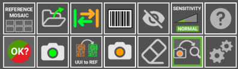
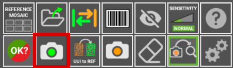
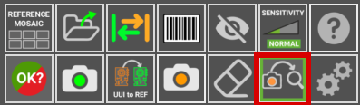

# Interfaz de Usuario

## **Áreas de trabajo principales**

La siguiente imagen describe las áreas de trabajo principales del **software de inspección AgnosPCB**.

{.center}

## **Estado de la plataforma**

{.center}

Esta área muestra el estado de la conexión con la plataforma de inspección y la cámara. Si la conexión falla, los iconos se volverán rojos. Esta área también contiene los siguientes botones de acción:

### **Iniciar inspección**

{.center}

El botón **Iniciar inspección** activa la inspección de la imagen **UUI** actual. Este botón está disponible cuando el [botón de Proceso automático](#auto-process) está en **OFF**. Esto es útil para evitar gastar créditos cuando está probando cómo tomar fotografías de sus PCBA.

### **Cargar REFERENCIA por código de barras**

{.center}

{.center}

Este botón abre una ventana emergente para insertar un número de código de barras. Al generar una REFERENCIA, cualquier [código de barras que contenga puede ser leído](#barcode-area-drawing). Este código de barras se asociará con la REFERENCIA y podrá cargarse usando ese número con esta función. También es posible leer el código de barras con un lector de mano e insertarlo en este campo. Más información sobre esta característica [aquí](./Barcode_reader.md#load-a-reference-by-barcode).

## **Registro de actividad**

{.center}

El área de **registro de actividad** está ubicada en la parte superior derecha y muestra los **créditos disponibles actuales** y los detalles operativos de la aplicación, como el estado del proceso de análisis.

## **Espacio de trabajo principal**

{.center}

Esta es la sección principal donde se trabaja con las imágenes de **REFERENCIA** y **UUI**, las cuales se pueden alternar presionando la tecla TAB en el teclado o [el botón en la aplicación](#swap). Los resultados de la inspección también se muestran en esta área utilizando retículos y números junto a los errores detectados.

## **Comparación lado a lado**

{width=400px; .center}

Esta sección de la interfaz está dividida en dos partes. La parte superior muestra la imagen de **REFERENCIA**, que sirve como estándar para la comparación, mientras que la parte inferior muestra la imagen **UUI**. Estas imágenes se magnifican y se mueven en paralelo mostrando exactamente la misma área en la **REFERENCIA** y **UUI** donde apunta el cursor en el espacio de trabajo principal.

## **Panel de botones**

{.center}

Aquí se encuentran varias **funciones y opciones** diseñadas para **optimizar** su flujo de trabajo y acelerar sus tareas. Cada característica se define a continuación:

### **Mosaico de referencias**

{width=350px; .center}

{width=600px; .center}

El mosaico de referencias se utiliza para almacenar REFERENCIAS como archivos para encontrar y cargar rápidamente cualquiera de ellas. El menú mosaico aparece automáticamente después de tomar una REFERENCIA usando el [botón para tomar foto de REFERENCIA](#take-a-reference-image) o cargándola [como un archivo](#load-reference-as-file). En esta ventana también es posible nombrar la REFERENCIA tomada en la parte superior derecha de la ventana. Una REFERENCIA almacenada en el mosaico se puede cargar rápidamente presionando un **botón F** (F1-F10).

### **CARGAR REFERENCIA como archivo**

{width=350px; .center}

{.center}

Use este icono para cargar una imagen capturada previamente como **REFERENCIA** y le permite ordenarlas por nombre o fecha. Todas las imágenes de **REFERENCIA** se pueden encontrar dentro de la carpeta **APP/REFERENCE** en una carpeta nombrada según la hora en que se tomó la foto.

!!! note "Nota"
    Desde la versión 7, el software **no permite** cargar imágenes tomadas de cualquier fuente que no sea la plataforma misma, ya que las imágenes contienen parámetros específicos para la óptica. Cada imagen de REFERENCIA debe capturarse utilizando la **AI-4050 AOI**.

### **Intercambiar**
 
{width=350px; .center}

Alterna entre las imágenes de **REFERENCIA** y **UUI** en el [área principal del espacio de trabajo](#main-workspace).

### **Dibujo de área de código de barras**

{width=350px; .center}

{.center}

Haga clic en este botón para dibujar manualmente un rectángulo en la imagen **REFERENCIA** donde hay un código de barras. El software lo leerá y usará ese código para nombrar las imágenes e incluirlo en el **informe PDF** final. Más información sobre la función de lectura de código de barras en la [siguiente sección](./Barcode_reader.md).

### **Exclusión**

{width=350px; .center}

{.center}

Crea un área de exclusión donde el sistema no buscará fallos. Puede crear tantas áreas como sea necesario. Esta función se detalla en la [siguiente sección](Set_exclusion_area.md).

### **Sensibilidad**

{width=350px; .center}

Si el proceso de fabricación requiere un control de calidad más riguroso, puede aumentar la sensibilidad de detección de errores con esta función. Al aumentar la sensibilidad, el software marcará errores que normalmente no lo haría con una configuración de sensibilidad más baja. Hay tres niveles de sensibilidad: Normal, Alto y Muy Alto. Se puede configurar usando las teclas 1, 2, 3 del teclado. Esta función se detalla en la [siguiente sección](./Set_sensitivity.md).

### **Ayuda**

{width=350px; .center}

Este botón le llevará a esta documentación.

### **Resultado final**

{.center}

{.center}

Una vez que los errores detectados han sido supervisados por el operador, la inspección se puede completar presionando este botón y, dependiendo del criterio de fabricación, marcar la PCBA inspeccionada como **OK** o **NO OK**. Después de eso, el software creará un informe que incluye los errores reportados por el operador en un documento PDF. Para obtener más información sobre esta función, vaya a la [siguiente sección](./Inspection_workflow.md#generating-a-final-pdf-report).

### **Tomar una imagen de REFERENCIA**

{.center}

{.center}

Este botón abre una ventana con las utilidades para generar una imagen de **REFERENCIA** a partir de una PCB o panel. Esta función se puede activar presionando el botón **r** en el teclado. En la sección [generar una referencia](./Inspection_workflow.md/#generating-a-reference) aprenderá más sobre esta función.

### **UUI a REFERENCIA**

{.center}

Esta función convierte la imagen **UUI** actual en una **REFERENCIA**. Esto es útil cuando algunos de los componentes de la PCBA han sido cambiados por uno equivalente y la **Red Neuronal** lo detecta como un error debido a una diferencia visual, pero la PCBA es correcta. Para obtener más información sobre esta característica, vaya a la [siguiente sección](UUI_to_REFERENCE.md).

### **Tomar una imagen UUI**

{.center}

{.center}

Esta función abre una ventana con una vista previa en vivo del área de inspección. Una vez que la PCBA esté colocada correctamente, presione el botón **Iniciar inspección** para tomar una foto o fotos de la PCBA/Panel de la **Unidad Bajo Inspección**. Si el [botón de proceso automático](#auto-process) está activo, la inspección comenzará automáticamente una vez que se tome la imagen UUI. Esta función también se puede activar presionando la tecla **s** en el teclado o el botón de acción físico ubicado en el lado derecho de la AOI. Consulte la [siguiente sección](./Inspection_workflow.md/#capturing-an-uui) para obtener más información sobre esta característica.

### **Borrador**

{.center}

Elimina un [**área de exclusión**](./Set_exclusion_area.md) dibujada.

### **Proceso automático**

{.center}

Si está activado, la siguiente foto **UUI** tomada se procesará **automáticamente**. Esto significa que la imagen se analizará en busca de fallos justo después de ser tomada. Recomendamos habilitar esta función para acelerar el proceso de inspección.

!!!warning "Importante"
    Para **UNIDADES ONLINE**, tenga en cuenta que cada imagen UUI tomada se enviará automáticamente a nuestro servidor para su procesamiento y **consumirá créditos**. Si solo está probando cómo tomar sus fotos, le recomendamos deshabilitar esta función hasta que esté seguro de que las fotos cubren la PCBA correctamente.

### **Configuración**

{.center}

Este botón abre el [menú de configuración](./Settings_menu.md).