# Interface utilisateur

## Zones de travail principales

L'image suivante décrit les principales zones de travail du **logiciel d'inspection AgnosPCB**.

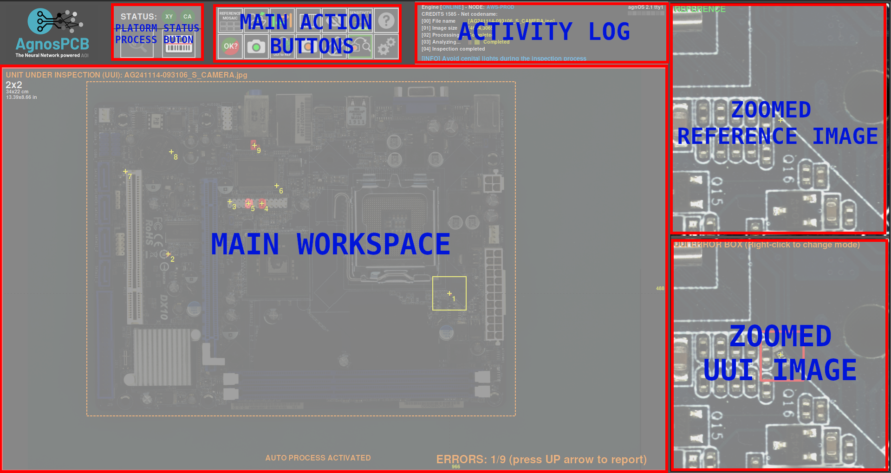{.center}

## Statut de la plateforme

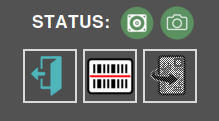{.center}

Cette zone affiche l'état de la connexion avec la plateforme d'inspection et la caméra. Si la connexion échoue, les icônes deviennent rouges. Cette zone contient également les boutons d'action suivants :

### Déconnexion

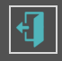{.center}

Si des utilisateurs sont définis dans le menu des paramètres, ce bouton permet à l'utilisateur de se déconnecter.

### Chargement de la RÉFÉRENCE par code-barres

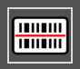{.center}

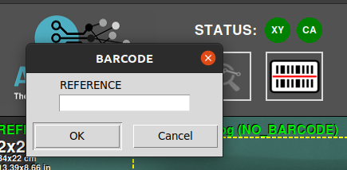{.center}

Ce bouton ouvre une fenêtre contextuelle pour insérer un numéro de code-barres. Lors de la génération d'une RÉFÉRENCE, tout [code-barres qu'elle contient peut être lu](#dessin-de-la-zone-de-code-barres). Ce code-barres sera associé à la RÉFÉRENCE et pourra être chargé en utilisant ce numéro avec cette fonction. Il est également possible de lire le code-barres avec un lecteur portable et de l'insérer dans ce champ. Plus d'informations sur cette fonctionnalité [ici](../features/Barcode_reader.md#charger-une-reference-par-code-barres).

### Basculer TOP/BOTTOM

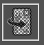{width=80 .center}

Si l'image de RÉFÉRENCE contient à la fois la face supérieure et la face inférieure de la PCBA, bascule entre les deux images.

### Outil de mesure

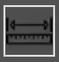{width=80 .center}

Ce bouton vous permet de sélectionner une région du PCB afin de mesurer une zone d'intérêt. Vous trouverez plus d'informations sur cette fonction [ici](../features/Measurement_tool.md).

## Journal d'activité

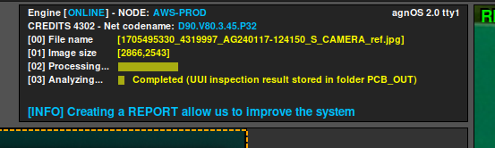{.center}

La zone du **journal d'activité** est située dans la partie supérieure droite et affiche les **crédits disponibles actuels** et les détails opérationnels de l'application, tels que l'état du processus d'analyse.

## Espace de travail principal

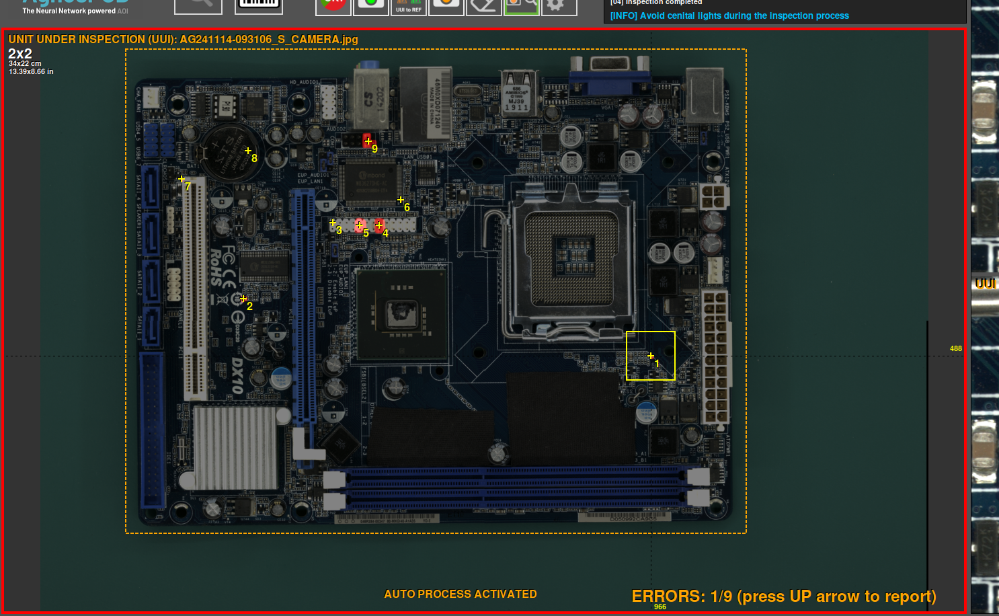{.center}

C'est la section principale où vous travaillez avec les images de **RÉFÉRENCE** et **UUI**, qui peuvent être commutées en appuyant sur la touche TAB du clavier ou [le bouton sur l'application](#echange). Les résultats de l'inspection sont également affichés dans cette zone à l'aide de réticules et de numéros à côté des erreurs détectées.

## Comparaison côte à côte

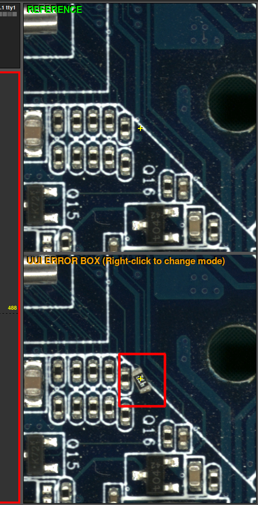{width=400px .center}

Cette section de l'interface est divisée en deux parties. La partie supérieure affiche l'image de **RÉFÉRENCE**, servant de standard de comparaison, tandis que la partie inférieure montre l'image **UUI**. Ces images sont agrandies et se déplacent en parallèle, montrant exactement la même zone dans la **RÉFÉRENCE** et l'**UUI** où le curseur pointe dans l'espace de travail principal.

## Panneau de boutons

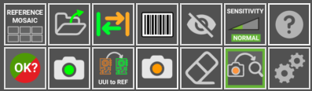{.center}

Voici diverses **fonctions et options** conçues pour **optimiser** votre flux de travail et accélérer vos tâches. Chaque fonctionnalité est définie ci-dessous :

### Mosaïque de références

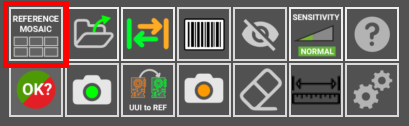{width=350px .center}

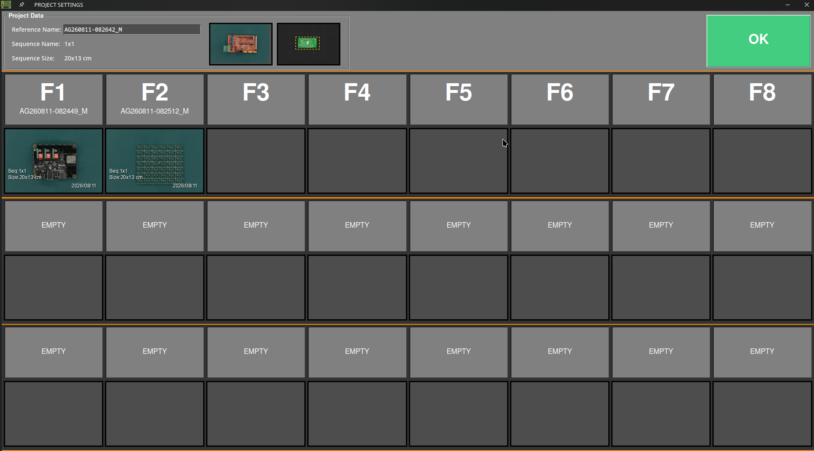{width=600px .center}

La mosaïque de références est utilisée pour stocker les RÉFÉRENCES en tant que fichiers afin de les trouver et de les charger rapidement. Le menu mosaïque apparaît automatiquement après avoir pris une RÉFÉRENCE en utilisant le [bouton prendre une photo RÉFÉRENCE](#prendre-une-image-de-reference) ou en la chargeant [comme un fichier](#charger-reference-en-tant-que-fichier). Dans cette fenêtre, il est également possible de nommer la RÉFÉRENCE prise dans la partie supérieure droite de la fenêtre. Une RÉFÉRENCE stockée dans la mosaïque peut être rapidement chargée en appuyant sur un **bouton F** (F1-F10).

### CHARGER RÉFÉRENCE en tant que fichier

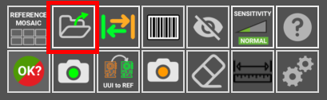{width=350px .center}

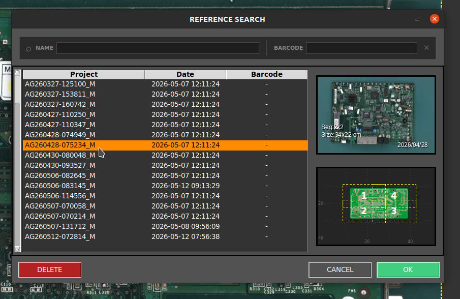{.center}

Utilisez cette icône pour charger une image précédemment capturée en tant que **RÉFÉRENCE**, et elle vous permet de les trier par nom ou par date. Toutes les images de **RÉFÉRENCE** se trouvent dans le dossier **APP/REFERENCE** dans un dossier nommé d'après l'heure à laquelle la photo a été prise.

!!! note "Note"
    Depuis la version 7, le logiciel **n'autorise pas** le chargement d'images provenant d'une source autre que la plateforme elle-même, car les images contiennent des paramètres spécifiques pour l'optique. Chaque image de RÉFÉRENCE doit être capturée à l'aide de l'**AOI AI-4050**.

### Échange

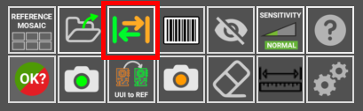{width=350px .center}

Bascule entre les images de **RÉFÉRENCE** et **UUI** dans l'[espace de travail principal](#espace-de-travail-principal).

### Dessin de la zone de code-barres

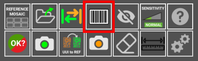{width=350px .center}

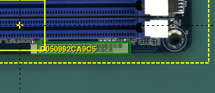{.center}

Cliquez sur ce bouton pour dessiner manuellement un rectangle dans l'image de **RÉFÉRENCE** où se trouve un code-barres. Le logiciel le lira et utilisera ce code pour nommer les images et l'inclure dans le **rapport PDF** final. Plus d'informations sur la fonction de lecture de code-barres dans la [section suivante](../features/Barcode_reader.md).

### Exclusion

{width=350px .center}

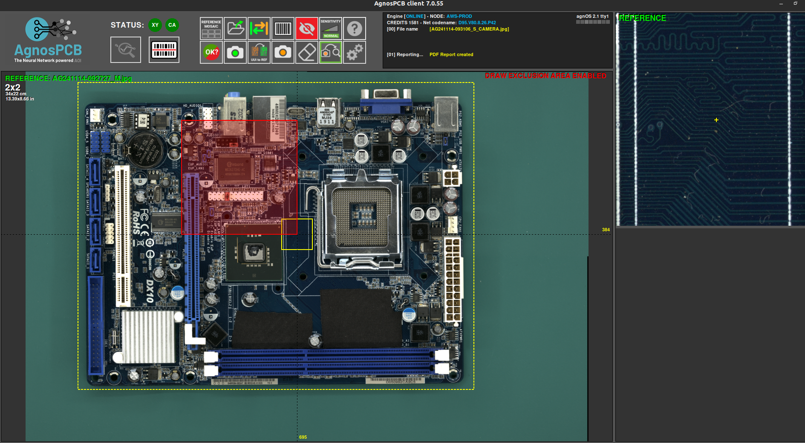{.center}

Crée une zone d'exclusion où le système ne recherchera pas de défauts. Vous pouvez créer autant de zones que nécessaire. Cette fonction est détaillée dans la [section suivante](Set_exclusion_area.md).

### Sensibilité

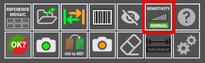{width=350px .center}

Si le processus de fabrication nécessite un contrôle qualité plus rigoureux, vous pouvez augmenter la sensibilité de détection d'erreurs avec cette fonctionnalité. En augmentant la sensibilité, le logiciel signalera des erreurs qu'il ne détecterait pas normalement avec un réglage de sensibilité plus faible. Il existe trois niveaux de sensibilité : Normal, Élevé et Très Élevé. Il peut être réglé en utilisant les touches 1, 2, 3 du clavier. Cette fonction est détaillée dans la [section suivante](./Set_sensitivity.md).

### Aide

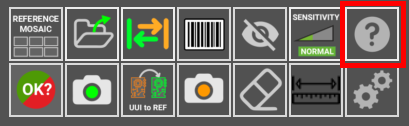{width=350px .center}

Ce bouton vous mènera à cette documentation.

### Résultat final

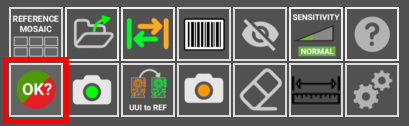{.center}

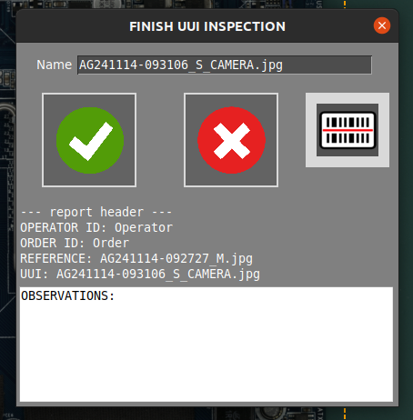{.center}

Une fois que les erreurs détectées ont été supervisées par l'opérateur, l'inspection peut être complétée en appuyant sur ce bouton et, selon les critères de fabrication, en marquant la PCBA inspectée comme **OK** ou **NON OK**. Après cela, le logiciel créera un rapport qui inclut les erreurs signalées par l'opérateur dans un document PDF. Pour en savoir plus sur cette fonctionnalité, rendez-vous à la [section suivante](./Inspection_workflow.md#generation-dun-rapport-pdf-final).

### Prendre une image de RÉFÉRENCE

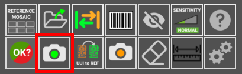{.center}

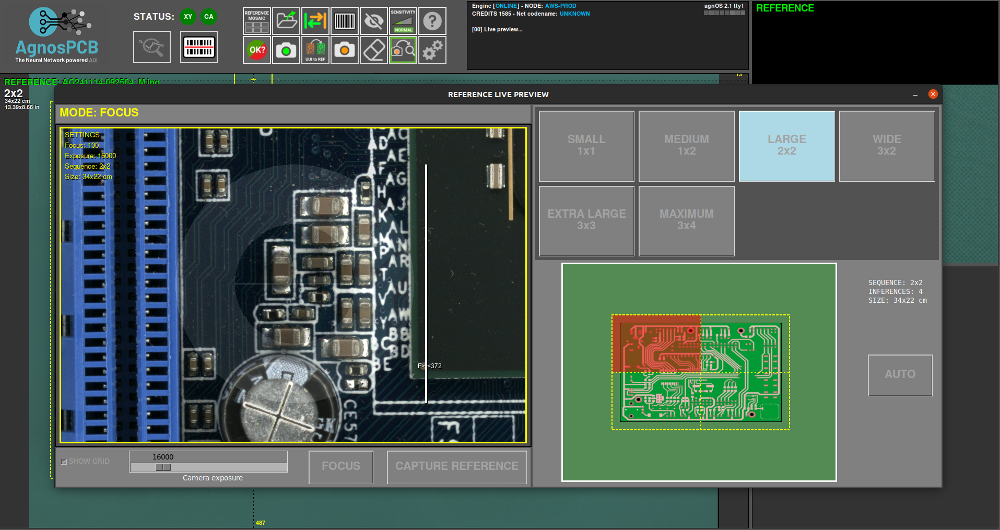{.center}

Ce bouton ouvre une fenêtre avec les utilitaires pour générer une image de **RÉFÉRENCE** à partir d'une PCB ou d'un panneau. Cette fonction peut être activée en appuyant sur la touche **r** du clavier. Dans la section [générer une référence](./Inspection_workflow.md#generation-dune-reference), vous en apprendrez davantage sur cette fonction.

### UUI vers RÉFÉRENCE

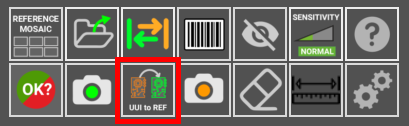{.center}

Cette fonction convertit l'image **UUI** actuelle en une **RÉFÉRENCE**. C'est utile lorsqu'un des composants de la PCBA a été remplacé par un équivalent et que le **Réseau de Neurones** le détecte comme une erreur en raison d'une différence visuelle, alors même que la PCBA elle-même est correcte. Pour en savoir plus sur cette fonctionnalité, rendez-vous à la [section suivante](UUI_to_REFERENCE.md).

### Prendre une image UUI

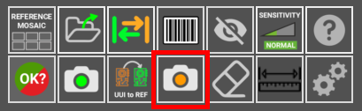{.center}

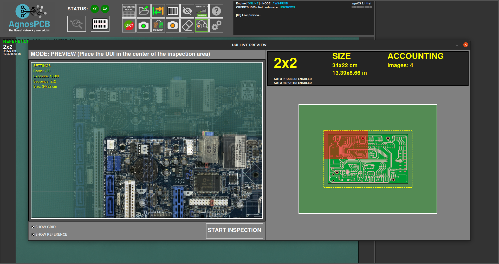{.center}

Cette fonction ouvre une fenêtre avec un aperçu en direct de la zone d'inspection. Une fois la PCBA correctement placée, appuyez sur le bouton **Démarrer l'inspection** pour prendre une photo ou des photos de la PCBA/Panneau de l'**Unité Sous Inspection**. Si le [bouton traitement automatique](./Workspace_icons.md#traitement-automatique) est actif, l'inspection démarrera automatiquement une fois l'image UUI prise. Cette fonctionnalité peut également être activée en appuyant sur la touche **s** du clavier ou sur le bouton d'action physique situé sur le côté droit de l'AOI. Consultez la [section suivante](./Inspection_workflow.md#capture-dune-uui) pour en savoir plus sur cette fonctionnalité.

### Gomme

{.center}

Supprime une [**zone d'exclusion**](./Set_exclusion_area.md) dessinée.

### Outil de mesure

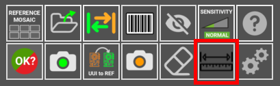{.center}

Le logiciel AgnosPCB fournit un outil précis pour mesurer des composants à partir des images capturées par la plateforme d'inspection. Pour plus d'informations sur cet outil, veuillez consulter la [page de documentation](../features/Measurement_tool.md) suivante.

### Paramètres

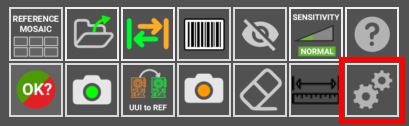{.center}

Ce bouton ouvre le [menu des paramètres](./Settings_menu.md).
