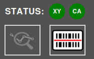
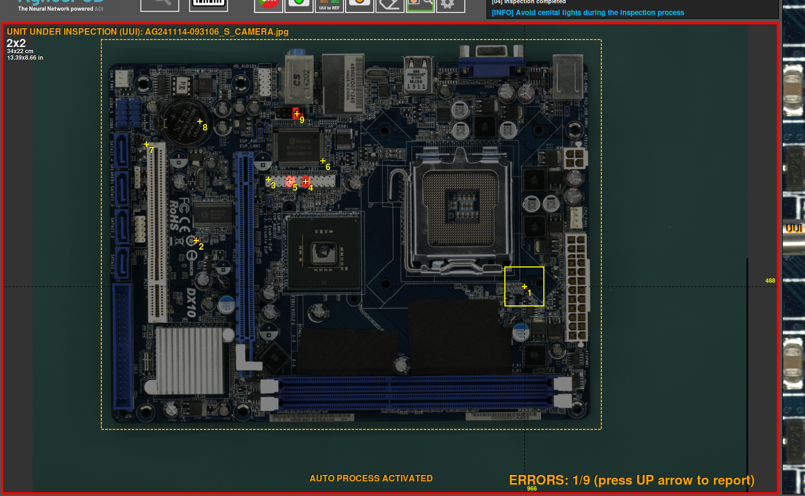
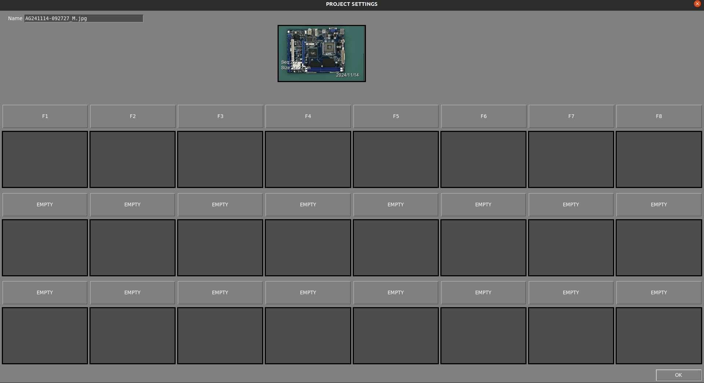
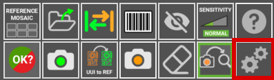

# Interface Utilisateur

## **Zones de travail principales**

L'image suivante décrit les principales zones de travail du **logiciel d'inspection AgnosPCB**.

{.center}

## **Statut de la plateforme**

{.center}

Cette zone affiche l'état de la connexion avec la plateforme d'inspection et la caméra. Si la connexion échoue, les icônes deviennent rouges. Cette zone contient également les boutons d'action suivants :

### **Démarrer l'inspection**

{.center}

Le bouton **Démarrer l'inspection** déclenche l'inspection de l'image **UUI** actuelle. Ce bouton est disponible lorsque le [bouton Traitement automatique](#auto-process) est réglé sur **OFF**. C'est utile pour éviter de dépenser des crédits lorsque vous testez la manière de prendre des photos de vos PCBA.

### **Chargement de la RÉFÉRENCE par code-barres**

{.center}

{.center}

Ce bouton ouvre une fenêtre contextuelle pour insérer un numéro de code-barres. Lors de la génération d'une RÉFÉRENCE, tout [code-barres qu'elle contient peut être lu](#barcode-area-drawing). Ce code-barres sera associé à la RÉFÉRENCE et pourra être chargé en utilisant ce numéro avec cette fonction. Il est également possible de lire le code-barres avec un lecteur portable et de l'insérer dans ce champ. Plus d'informations sur cette fonctionnalité [ici](./Barcode_reader.md#load-a-reference-by-barcode).

## **Journal d'activité**

{.center}

La zone du **journal d'activité** est située dans la partie supérieure droite et affiche les **crédits disponibles actuels** et les détails opérationnels de l'application, tels que l'état du processus d'analyse.

## **Espace de travail principal**

{.center}

C'est la section principale où vous travaillez avec les images de **RÉFÉRENCE** et **UUI**, qui peuvent être commutées en appuyant sur la touche TAB du clavier ou [le bouton sur l'application](#swap). Les résultats de l'inspection sont également affichés dans cette zone à l'aide de réticules et de numéros à côté des erreurs détectées.

## **Comparaison côte à côte**

{width=400px; .center}

Cette section de l'interface est divisée en deux parties. La partie supérieure affiche l'image de **RÉFÉRENCE**, servant de standard de comparaison, tandis que la partie inférieure montre l'image **UUI**. Ces images sont agrandies et se déplacent en parallèle, montrant exactement la même zone dans la **RÉFÉRENCE** et l'**UUI** où le curseur pointe dans l'espace de travail principal.

## **Panneau de boutons**

{.center}

Voici diverses **fonctions et options** conçues pour **optimiser** votre flux de travail et accélérer vos tâches. Chaque fonctionnalité est définie ci-dessous :

### **Mosaïque de références**

{width=350px; .center}

{width=600px; .center}

La mosaïque de références est utilisée pour stocker les RÉFÉRENCES en tant que fichiers afin de les trouver et de les charger rapidement. Le menu mosaïque apparaît automatiquement après avoir pris une RÉFÉRENCE en utilisant le [bouton prendre une photo RÉFÉRENCE](#take-a-reference-image) ou en la chargeant [comme un fichier](#load-reference-as-file). Dans cette fenêtre, il est également possible de nommer la RÉFÉRENCE prise dans la partie supérieure droite de la fenêtre. Une RÉFÉRENCE stockée dans la mosaïque peut être rapidement chargée en appuyant sur un **bouton F** (F1-F10).

### **CHARGER RÉFÉRENCE en tant que fichier**

{width=350px; .center}

{.center}

Utilisez cette icône pour charger une image précédemment capturée en tant que **RÉFÉRENCE**, et elle vous permet de les trier par nom ou par date. Toutes les images de **RÉFÉRENCE** se trouvent dans le dossier **APP/REFERENCE** dans un dossier nommé d'après l'heure à laquelle la photo a été prise.

!!! note "Note"
    Depuis la version 7, le logiciel **n'autorise pas** le chargement d'images provenant d'une source autre que la plateforme elle-même, car les images contiennent des paramètres spécifiques pour l'optique. Chaque image de RÉFÉRENCE doit être capturée à l'aide de l'**AOI AI-4050**.

### **Échange**
 
{width=350px; .center}

Bascule entre les images de **RÉFÉRENCE** et **UUI** dans l'[espace de travail principal](#main-workspace).

### **Dessin de la zone de code-barres**

{width=350px; .center}

{.center}

Cliquez sur ce bouton pour dessiner manuellement un rectangle dans l'image de **RÉFÉRENCE** où se trouve un code-barres. Le logiciel le lira et utilisera ce code pour nommer les images et l'inclure dans le **rapport PDF** final. Plus d'informations sur la fonction de lecture de code-barres dans la [section suivante](./Barcode_reader.md).

### **Exclusion**

{width=350px; .center}

{.center}

Crée une zone d'exclusion où le système ne recherchera pas de défauts. Vous pouvez créer autant de zones que nécessaire. Cette fonction est détaillée dans la [section suivante](Set_exclusion_area.md).

### **Sensibilité**

{width=350px; .center}

Si le processus de fabrication nécessite un contrôle qualité plus rigoureux, vous pouvez augmenter la sensibilité de détection d'erreurs avec cette fonctionnalité. En augmentant la sensibilité, le logiciel signalera des erreurs qu'il ne détecterait pas normalement avec un réglage de sensibilité plus faible. Il existe trois niveaux de sensibilité : Normal, Élevé et Très Élevé. Il peut être réglé en utilisant les touches 1, 2, 3 du clavier. Cette fonction est détaillée dans la [section suivante](./Set_sensitivity.md).

### **Aide**

{width=350px; .center}

Ce bouton vous mènera à cette documentation.

### **Résultat final**

{.center}

{.center}

Une fois que les erreurs détectées ont été supervisées par l'opérateur, l'inspection peut être complétée en appuyant sur ce bouton et, selon les critères de fabrication, en marquant la PCBA inspectée comme **OK** ou **NON OK**. Après cela, le logiciel créera un rapport qui inclut les erreurs signalées par l'opérateur dans un document PDF. Pour en savoir plus sur cette fonctionnalité, rendez-vous à la [section suivante](./Inspection_workflow.md#generating-a-final-pdf-report).

### **Prendre une image de RÉFÉRENCE**

{.center}

{.center}

Ce bouton ouvre une fenêtre avec les utilitaires pour générer une image de **RÉFÉRENCE** à partir d'une PCB ou d'un panneau. Cette fonction peut être activée en appuyant sur la touche **r** du clavier. Dans la section [générer une référence](./Inspection_workflow.md/#generating-a-reference), vous en apprendrez davantage sur cette fonction.

### **UUI vers RÉFÉRENCE**

{.center}

Cette fonction convertit l'image **UUI** actuelle en une **RÉFÉRENCE**. C'est utile lorsque certains des composants de la PCBA ont été changés pour un équivalent et que le **Réseau de Neurones** le détecte comme une erreur en raison d'une différence visuelle, mais que la PCBA est correcte. Pour en savoir plus sur cette fonctionnalité, rendez-vous à la [section suivante](UUI_to_REFERENCE.md).

### **Prendre une image UUI**

{.center}

{.center}

Cette fonction ouvre une fenêtre avec un aperçu en direct de la zone d'inspection. Une fois la PCBA correctement placée, appuyez sur le bouton **Démarrer l'inspection** pour prendre une photo ou des photos de la PCBA/Panneau de l'**Unité Sous Inspection**. Si le [bouton traitement automatique](#auto-process) est actif, l'inspection démarrera automatiquement une fois l'image UUI prise. Cette fonctionnalité peut également être activée en appuyant sur la touche **s** du clavier ou sur le bouton d'action physique situé sur le côté droit de l'AOI. Consultez la [section suivante](./Inspection_workflow.md/#capturing-an-uui) pour en savoir plus sur cette fonctionnalité.

### **Gomme**

{.center}

Supprime une [**zone d'exclusion**](./Set_exclusion_area.md) dessinée.

### **Traitement automatique**

{.center}

S'il est activé, la prochaine photo **UUI** prise sera traitée **automatiquement**. Cela signifie que l'image sera analysée à la recherche de défauts juste après avoir été prise. Nous vous recommandons d'activer cette fonctionnalité pour accélérer le processus d'inspection.

!!!warning "Important"
    Pour les **UNITÉS EN LIGNE**, veuillez noter que chaque image UUI prise sera automatiquement envoyée à notre serveur pour traitement et **consommera des crédits**. Si vous ne faites que tester la manière de prendre vos photos, nous vous recommandons de désactiver cette fonctionnalité jusqu'à ce que vous soyez certain que les photos couvrent correctement la PCBA.

### **Paramètres**

{.center}

Ce bouton ouvre le [menu des paramètres](./Settings_menu.md).