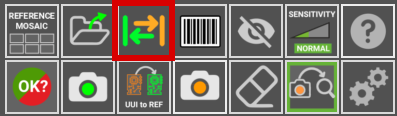

# User Interface

## **Main working areas**

The following image describes the main working areas of the **AgnosPCB inspection software**.

{.center}

## **Platform status**

{.center}

This area displays the connection status with the inspection platform and camera. If the connection fails, the icons will turn red. This area also contains the following action buttons:

### **Start inspection**

{.center}

The **Inspection start** button triggers the inspection of the current **UUI** image. This buttom is available when the [Auto process button](#auto-process) is set **OFF**. This is useful to avoid spend credits when you are testing how to take pictures of your PCBAs.

### **Loading REFERENCE by barcode**

{.center}

{.center}

This button opens a pop-up window for inserting a barcode number. When generating a REFERENCE, any [barcode it contains can be read](#barcode-area-drawing). This barcode will be associated with the REFERENCE and can be loaded using that number with this function. It is also possible to read the barcode with a handheld reader and insert it into this field. More information about this feature [here](./Barcode_reader.md#load-a-reference-by-barcode).

## **Activity log**

{.center}

The **activity log** area is located in the top right side and shows the **current avaible credits** and application's operational details such as the status of analysis process.

## **Main workspace**

{.center}

This is the main section where you work with the **REFERENCE** and the **UUI** images, which can be switched by pressing the TAB key on the keyboard or [the button on the application](#swap). The inspection results are also displayed in this area using crosshairs and numbers next to the detected errors.

## **Side-by-side comparison**

{width=400px; .center}

This interface section, is divided in two parts. The top part displays the **REFERENCE** image, serving as a standard for comparison, while the botton part shows the **UUI** image. These images are maginified and move in parallel showing exactly the same area in the **REFERENCE** and **UUI** where the cursor is pointing in the main workspace.

## **Buttons panel**

{.center}

Here are located various **functions and options** designed to **optimize** your workflow and speed up your tasks. Each feature is defined below:

### **Reference mosaic**

{width=350px; .center}

{width=600px; .center}

The reference mosaic is used to store REFERENCES as files to quickly find and load any of them. The mosaic menu automatically appears after taking a REFERENCE by using the [take REFERENCE photo button](#take-reference-image) or by loading it [as a file](#load-reference-as-file). In this windows it is also possible to name the taken REFERENCE in the top right part of the window. A REFERENCE stored in the mosaic can be quickly loaded by pressing a **F button** (F1-F10).

### **LOAD REFERENCE as file**

{width=350px; .center}

{.center}

Use this icon to load a image previously captured as a **REFERENCE** and it allows you to sort them by name or date. All the **REFERENCE** images can be found inside the folder **APP/REFERENCE** in a folder named after the time the picture was taken.

!!! note "Note"
    Since version 7, the software **does not allows** to load images taken from any source other than the platform itself as the images contains specific parametres for the optics. Every REFERENCE image has to be captured using the **AI-4050 AOI**.

### **Swap**
 
{width=350px; .center}

It toggles between **REFERENCE** and **UUI** images in the [main workspace area](#main-workspace).

### **Barcode area drawing**

{width=350px; .center}

{.center}

Click this button to manually draw a rectangle in the **REFERENCE** image where there is a barcode. The software will read it and use that code to name the images and include it in the final **PDF report**. More information about the barcode reading function in the [following section](./Barcode_reader.md).

### **Exclusion**

{width=350px; .center}

{.center}

Creates an exclusion area where the system will not look for faults. You can create as many areas as required. This function is detailed in the [following section](Set_exclusion_area.md).

### **Sensitivity**

{width=350px; .center}

If the manufacturing process requires more rigorous quality control, you can increase the error detection sensitivity with this feature. By increasing the sensitivity, the software will flag errors that it normally wouldn't with a lower sensitivity setting. There are three levels of senstivity: Normal, High and Very High. It can be set using the 1, 2 ,3 keys of the keyboard. This function is detailed in the [following section](./Set_sensitivity.md).

### **Help**

{width=350px; .center}

This button will get you to this documentation.

### **Final result**

{.center}

{.center}

Once the detected errors has been suvervised by the operator, the inspection can be completed by pressing this button and, depending on the manufacturing criteria, mark the inspected PCBA as **OK** or **NOT OK**. After that, the software will create a report that includes the errors reported by the operator on a PDF document. To learn more about this feature go to the [following section](./Inspection_workflow.md#generating-a-final-pdf-report).

### **Take a REFERENCE image**

{.center}

{.center}

This button open a window with the utils to generate a **REFERENCE** image from a PCB or panel. This function can be activated by pressing **r** button in the keyboard. In [generate a reference](./Inspection_workflow.md/#generating-a-reference) section you will learn more about this function.

### **UUI to REFERENCE**

{.center}

This function turns the current **UUI** image in a **REFERENCE**. This is useful when some of the components of the PCBA has been changed for a equivalent and the **Neural Network** detects it as an error due to a visual difference but the PCBA is correct. To learn more about this feature go to the [following section](UUI_to_REFERENCE.md).

### **Take an UUI image**

{.center}

{.center}

This function opens a window with a live preview of the inspection area. Once the PCBA is placed correctly, press the **Start inspection** button to take a photo or photos of the **Unit Under Inspection** PCBA/Panel. If the [auto process](#auto-process) button is active, the inspection will start automatically once the UUI image is taken. This feature can also be activated by pressing the **s** key on the keyboard or the physical action button located on the right side of the AOI. See the [following section](./Inspection_workflow.md/#capturing-an-uui) to learn more about this feature.

### **Eraser**

{.center}

Deletes a drawn [**exclusion area**](./Set_exclusion_area.md).

### **Auto process**

{.center}

If activated, the next **UUI** photo taken will be **automatically** processed. That means that the image will be analyzed for faults right after being taken. We recommend enabling this feature to speed up the inspection process.

!!!warning "Important"
    For **ONLINE UNITS**, please note that each UUI image taken will be automatically sent to our server for processing and **will consume credits**. If you're just testing how to take your photos, we recommend disabling this feature until you're confident the photos covers the PCBA correctly.

### **Settings**

{.center}

This button opens the [settings menu](./Settings_menu.md).