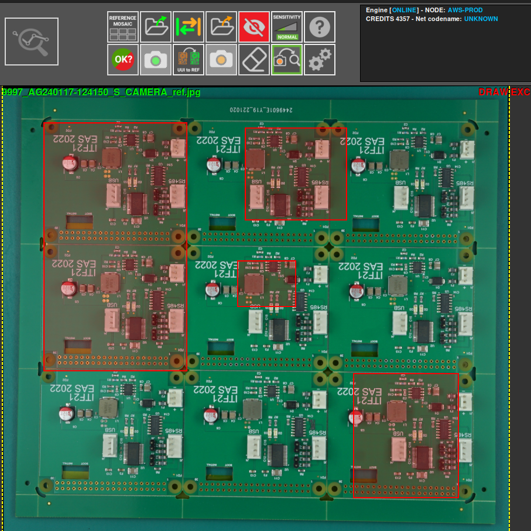
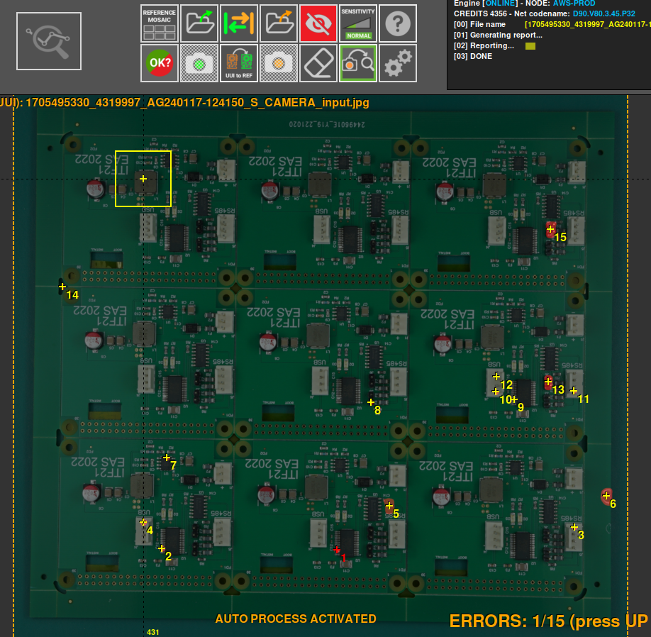
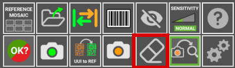
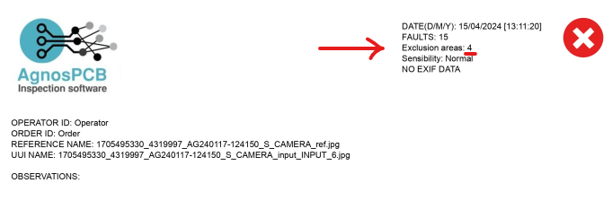
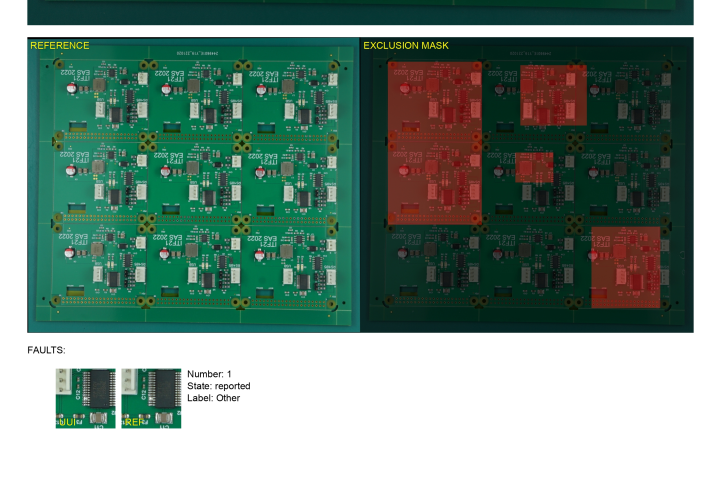

# **Ausschlussbereich festlegen**
___ 

{.center}

Der Ausschlussbereich wird verwendet, um die **PCB** zu analysieren, indem bestimmte Elemente ausgeschlossen werden, die nicht notwendig sind oder nicht analysiert werden sollen. Hierfür verwenden wir die Schaltfläche **"Ausschlussbereich zeichnen"**.

Wählen Sie dann mithilfe des **REFERENZ**-Fotos den auszuschließenden Bereich aus. Sie können beliebig viele Bereiche auswählen. 

Nachdem ein Ausschlussbereich definiert wurde, werden bei Auslösen einer Inspektion der **UUI** in den ausgewählten Bereichen keine Fehler erkannt.

Falls Sie den falschen Bereich ausgewählt haben oder ihn nicht mehr auswählen möchten, können Sie die Schaltfläche **Bereich entfernen** verwenden, um die Auswahl aufzuheben.

{.center}

Ebenso wird die Anzahl der ausgewählten Ausschlussbereiche angezeigt, wenn der Bericht **generiert** wird.

{.center}

Ein Bild der **REFERENZ** und der ausgewählten Ausschlussbereiche wird ebenfalls angezeigt.

{.center}