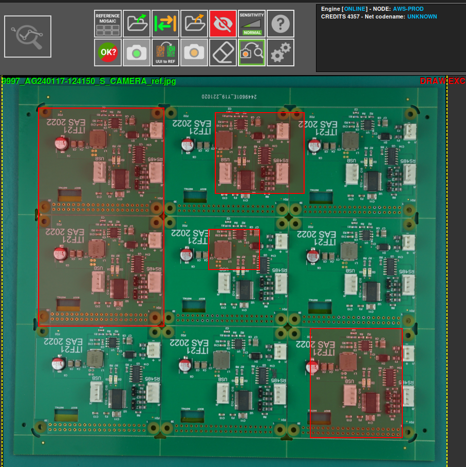
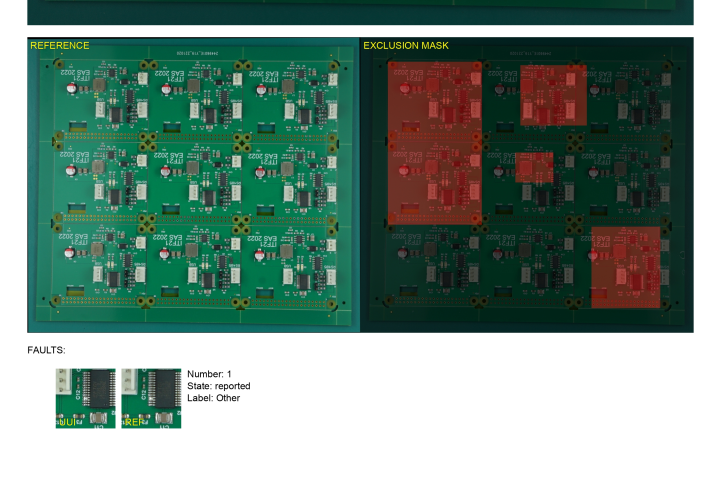

# **Establecer área de exclusión**
___ 

{.center}

El área de exclusión se utiliza para analizar la **PCB** excluyendo ciertos elementos que no son necesarios o no se desea analizar. Para esto usamos el botón **"dibujar área de exclusión"**.

Luego, usando la foto **REFERENCIA**, seleccione el área a excluir. Puede seleccionar tantas áreas como desee. 

Una vez que se ha definido un área de exclusión, al activar una inspección en la **UUI** no se detectará ningún error en las áreas seleccionadas.

En caso de que haya seleccionado un área incorrecta o ya no quiera seleccionarla, puede usar el botón **eliminar área** para deseleccionarla.

{.center}

Del mismo modo, el número de áreas de exclusión seleccionadas se muestra cuando se **genera** el informe.

{.center}

También aparecerá una imagen de la **REFERENCIA** y las áreas de exclusión seleccionadas.

{.center}