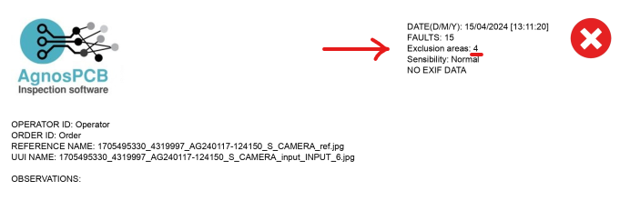

# **Définir la zone d'exclusion**
___ 

{.center}

La zone d'exclusion est utilisée pour analyser la **PCB** en excluant certains éléments qui ne sont pas nécessaires ou que l'on ne souhaite pas analyser. Pour cela, nous utilisons le bouton **"dessiner la zone d'exclusion"**.

Ensuite, en utilisant la photo de **RÉFÉRENCE**, sélectionnez la zone à exclure. Vous pouvez sélectionner autant de zones que vous le souhaitez. 

Une fois qu'une zone d'exclusion a été définie, le déclenchement d'une inspection sur l'**UUI** ne détectera aucune erreur dans les zones sélectionnées.

Au cas où vous auriez sélectionné une mauvaise zone ou que vous ne souhaiteriez plus la sélectionner, vous pouvez utiliser le bouton **supprimer zone** pour la désélectionner.

{.center}

De même, le nombre de zones d'exclusion sélectionnées est affiché lorsque le rapport est **généré**.

{.center}

Une image de la **RÉFÉRENCE** et des zones d'exclusion sélectionnées apparaîtra également.

{.center}