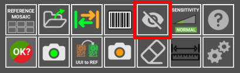
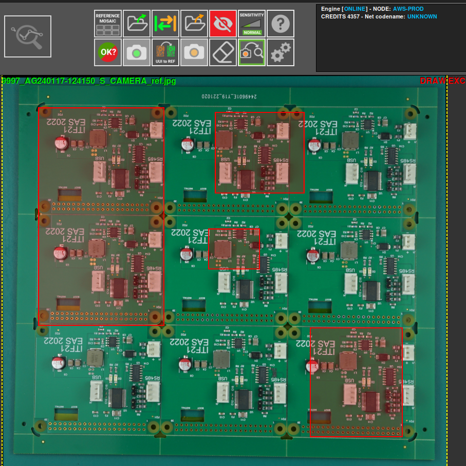
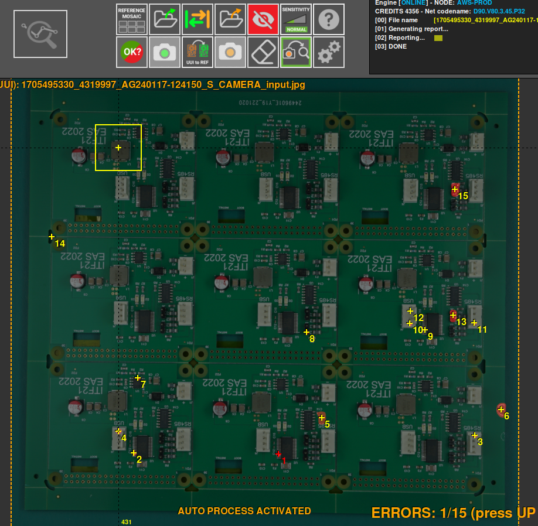
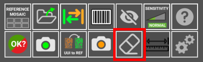
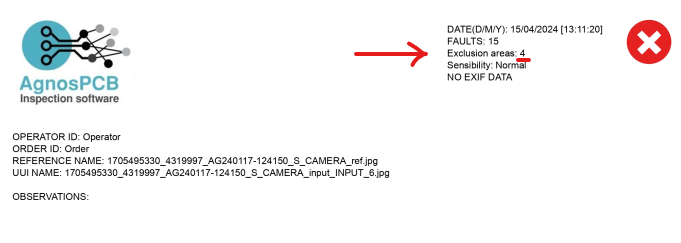
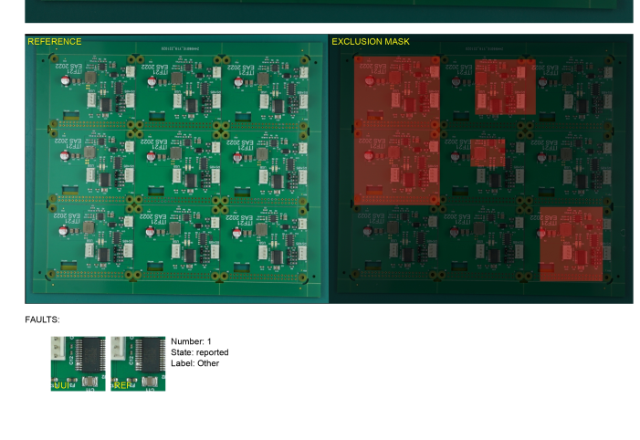

# Set exclusion area

{.center}

An exclusion area lets you inspect the **PCB** while leaving out regions that do not need to be inspected, or that legitimately change from board to board — a serial number label, a connector that is not always fitted, or a hand-written mark. To define one, use the **draw exclusion area** button.

Then, using the **REFERENCE** photo, select the area to be excluded. You can select as many areas as you want. 

{.center}

After an exclusion area has been defined, triggering an inspection on the **UUI** will not detect any errors in the selected areas.

{.center}

If you have selected the wrong area, or no longer need it, use the **remove area** button to remove it.

{.center}

The number of exclusion areas defined is also shown when the report is **generated**.

{.center}

An image of the **REFERENCE** and the selected exclusion areas will also appear.

{.center}
