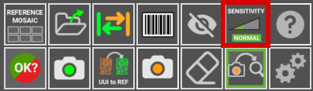

# **Empfindlichkeit einstellen**
___
{width=350px; .center}

Die Empfindlichkeit bezieht sich auf den Grad der Akribie oder Strenge, den das Inspektionssystem beim Scannen nach Fehlern anwendet. Im Wesentlichen bestimmt sie die Fähigkeit des Systems, selbst kleinste Abweichungen oder Anomalien innerhalb der inspizierten Materialien zu erkennen.

!!!warning "Wichtig"
    Höhere Empfindlichkeitsstufen führen zu einer höheren Rate an **Falsch-Positiv**-Erkennungen.

{.center}

**Normale Empfindlichkeit:** Dies ist die Standardeinstellung für die Empfindlichkeit und **reicht typischerweise aus**, um die Mehrheit der Fehler innerhalb der inspizierten Komponenten zu erkennen. Sie schafft ein Gleichgewicht zwischen Gründlichkeit und Effizienz und ist somit für die meisten Inspektionsszenarien geeignet.

{.center}

**Hohe Empfindlichkeit:** Für Benutzer, die einen umfassenderen Inspektionsprozess wünschen oder mit besonders komplizierten oder empfindlichen Komponenten arbeiten, bietet die Einstellung für hohe Empfindlichkeit ein erhöhtes Maß an Genauigkeit. Sie ist darauf ausgelegt, selbst kleinste Abweichungen oder Anomalien zu erkennen und gewährleistet eine gründliche Untersuchung der Materialien.

{.center}

**Sehr hohe Empfindlichkeit:** Diese Einstellung repräsentiert die höchste Stufe der Strenge bei der Fehlererkennung und ist ideal für Situationen, in denen absolute Präzision von größter Bedeutung ist. Sie lässt keinen Raum für Fehler und prüft jedes Detail akribisch, um selbst die geringsten Mängel oder Inkonsistenzen zu identifizieren.

