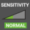
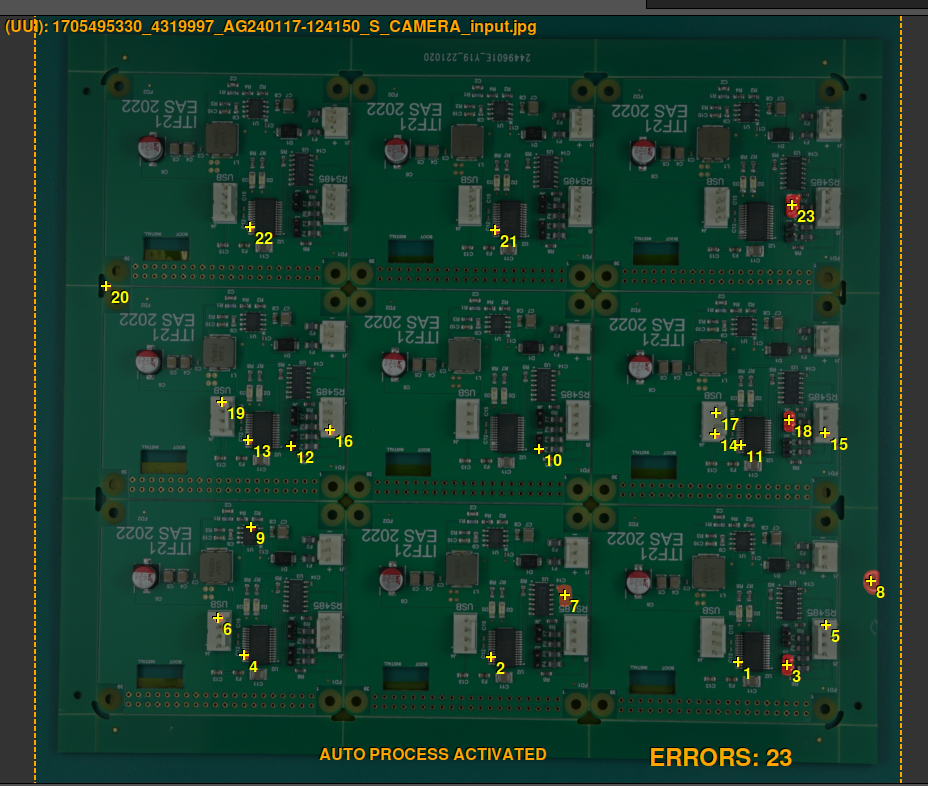
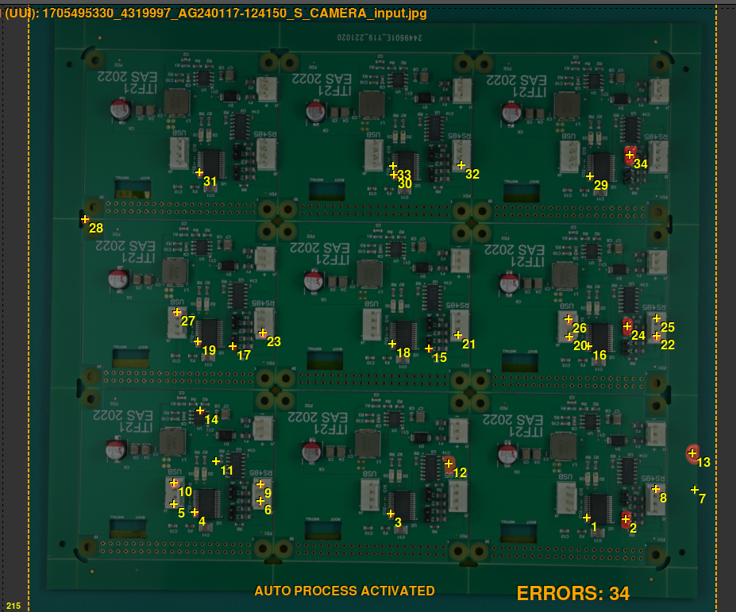
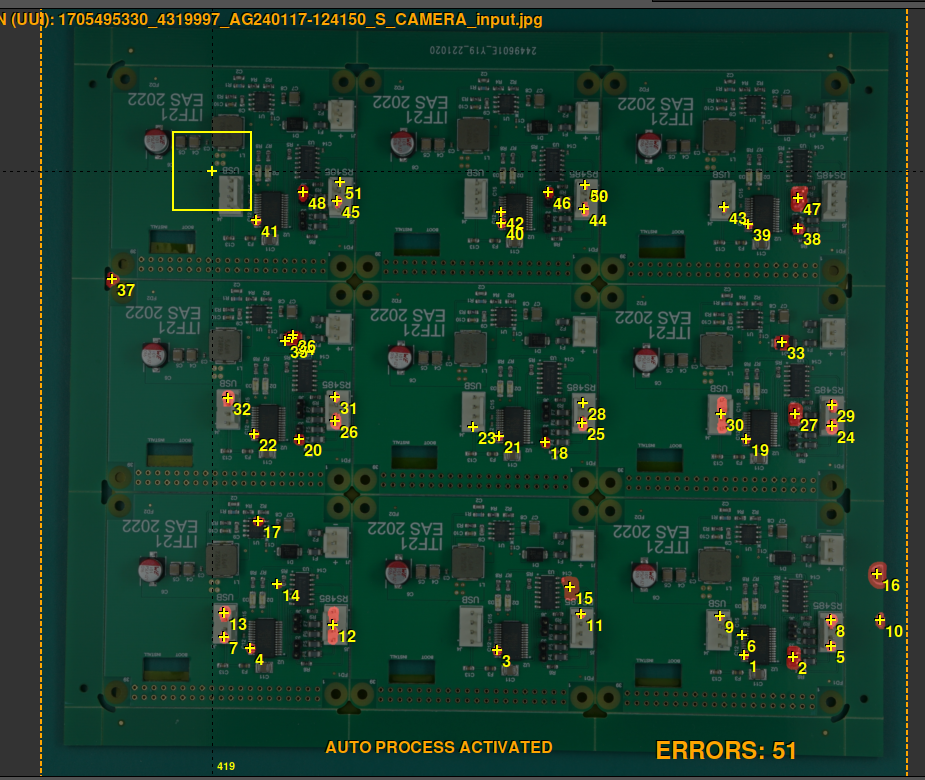

# Set sensitivity

{width=350px .center}

Sensitivity determines how strict the inspection is when looking for errors. It governs how small a difference between the [REFERENCE](./terminology.md#reference) and the [UUI](./terminology.md#uui) has to be before the software flags it.

!!! warning "Important"
    Higher sensitivity levels also produce a higher [**false positive**](./terminology.md#false-positive) rate. If a REFERENCE generates too many false positives at normal sensitivity, review the [tips](../help/Tips.md) and the [exclusion areas](./Set_exclusion_area.md) before raising it.

{.center}

**Normal Sensitivity:** This is the default sensitivity setting and **is typically sufficient** to detect the majority of errors within the inspected components. It strikes a balance between thoroughness and efficiency, making it suitable for most inspection scenarios.

{.center}

{.center}

**High Sensitivity:** For users who need a more thorough inspection process or are working with intricate or delicate components, the high sensitivity setting increases the level of scrutiny. It is designed to detect even slight deviations or abnormalities for a more thorough examination.

{.center}

{.center}

**Very High Sensitivity:** This setting applies the strictest level of error detection and is best suited for situations where absolute precision is required. It examines every detail closely to identify even minor flaws or inconsistencies. Expect a noticeably higher number of false positives at this level.

{.center}
