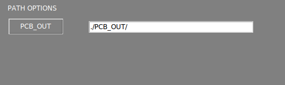

# Einstellungsmenü

Das **Einstellungsmenü** ist in mehrere Abschnitte unterteilt, die nachfolgend beschrieben werden.

{.center}

## **Oberflächenoptionen**

{width=350px; .center}

#### Exif anzeigen
Zeigt die Metadaten des aktuellen Bildes im [Hauptarbeitsbereich](./Screen-layout.md#main-workspace) an.

#### Symbole des Arbeitsbereichs anzeigen

Aktiviert eine Reihe von Funktionen im [Hauptarbeitsbereich](./Screen-layout.md#main-workspace). Erfahren Sie mehr über diese Funktionen im [nächsten Abschnitt](./Workspace_icons.md).

#### Automatische Signalisierung

Standardmäßig nummeriert die Software die Fehler nach der Inspektion. Wenn diese Option deaktiviert wird, wird nur der betroffene Bereich farblich hervorgehoben.

#### Maskenfarbe

Diese Option ermöglicht es Ihnen, die Farbe der markierten Fehler zu ändern. Wenn die Farbe des markierten Fehlers mit der Farbe der PCBA übereinstimmt, ist es ratsam, sie in eine kontrastreichere Farbe zu ändern, um die markierten Bereiche besser sichtbar zu machen.

#### Sprache

Ändert die Sprache der Benutzeroberfläche. Die aktuell verfügbaren Sprachen sind: **Englisch, Französisch, Deutsch, Italienisch und Spanisch**.

## **Workflow-Optionen**

{width=350px; .center}

#### Automatischer Prozess

Schaltet die [Funktion "Automatischer Prozess"](./Screen-layout.md#auto-process) ein/aus.

#### Barcode verwenden

Schaltet die [Barcode-Lesefunktion](./Barcode_reader.md) ein/aus.

#### Automatischer Prozess Ordner PCB_IN

Wenn diese Option aktiviert ist, werden alle **UUI-Bilder** im Ordner **APP/PCB_IN** automatisch unter Verwendung der in der Anwendung geladenen REFERENZ verarbeitet. Diese Funktion ist nur in der **ONLINE**-Version verfügbar.

!!! warning "Warnung"
    Seit Version 7 ist diese Funktion nicht mehr betriebsbereit.

#### Fehler-Popup anzeigen

Durch Deaktivieren dieser Option wird das Berichtsfenster nicht mehr angezeigt, wenn ein Fehler mit der **AUF**- oder **AB**-Pfeiltaste gemeldet wird. Die gemeldeten Fehler werden im endgültigen PDF-Bericht mit der Bezeichnung "**other**" (andere) generiert.

#### Referenz-Mosaik anzeigen

Durch Deaktivieren dieser Option wird das Mosaik-Menü nach der Aufnahme eines **REFERENZ**-Bildes nicht mehr angezeigt.

#### Bediener-Modus

Das Aktivieren dieser Option blendet verschiedene Funktionen der Benutzeroberfläche aus und vereinfacht die Nutzung der Software. Es verhindert auch, dass der Bediener das REFERENZ-Bild oder die Empfindlichkeit der Inspektionen ändern kann. Es kann ein [Passwort](Settings_menu.md#settings-password) hinzugefügt werden, sodass nur der Administrator diese Option deaktivieren kann.

#### Empfindlichkeit aktiviert

Ermöglicht das Ändern der Empfindlichkeit im Bediener-Modus.

## **Berichtsoptionen**

{width=350px; .center}

#### Bediener-ID

Legt eine ID für den aktuellen Bediener fest. Diese ID wird im endgültigen PDF-Bericht nach Abschluss der Inspektion angezeigt.

#### Auftrags-ID

Legt eine ID für den aktuellen Fertigungsauftrag fest. Diese ID wird im endgültigen PDF-Bericht nach Abschluss der Inspektion angezeigt.

#### Plattform-ID

Legt eine ID für die AOI fest.

#### TAG

Legt den TAG (OK oder NOK) des endgültigen PDF-Berichts als Suffix oder Präfix zum Dateinamen fest.

#### TAG OK

Legt einen benutzerdefinierten OK-TAG für den endgültigen PDF-Bericht fest.

#### TAG NO OK

Legt einen benutzerdefinierten NO OK-TAG für den endgültigen PDF-Bericht fest.

#### Automatischer Bericht

Wenn diese Option aktiviert ist, wird automatisch ein endgültiger PDF-Bericht mit der Kennzeichnung OK generiert, wenn nach der Inspektion keine Fehler erkannt wurden. Der endgültige PDF-Bericht kann auch generiert werden, wenn während der Inspektion Fehler erkannt werden.

!!! note "Hinweis"
    Beim automatischen Generieren eines PDF-Berichts werden alle erkannten Fehler mit der Bezeichnung "unknown" (unbekannt) gekennzeichnet.

#### Alle Fehler anzeigen

Zeigt alle erkannten Fehler im PDF-Bericht an, auch wenn der Bediener sie nicht gemeldet hat.

#### Logo

Legt ein Logo für den PDF-Bericht fest.

## **Datum/Uhrzeit-Optionen**

{width=350px; .center}

#### Zeitzone

Legt die Zeitzone fest.

#### Datum und Uhrzeit

Legt Tag und Uhrzeit fest.

!!! note "Hinweis"
    Um die Änderungen zu übernehmen, drücken Sie die Schaltfläche **SET** und starten Sie das System neu.

## **Pfadoption**

{width=350px; .center}

#### PCB OUT

Ändert den Pfad, in dem die Inspektionsergebnisse generiert werden.

## **Freigabeoptionen**

{width=350px; .center}

#### Ordner freigeben

Wenn diese Optionen aktiviert sind, gibt das System die Ordner PCB_OUT und REFERENCE automatisch in Ihrem lokalen Netzwerk frei. Die Zugriffsadresse wird angezeigt, sobald die Option festgelegt wurde.

!!! note "Hinweis"
    Um die Änderungen zu übernehmen, drücken Sie die Schaltfläche **SET**.

!!! note "Hinweis"
    Für OFFLINE-Einheiten: Wenn Sie die Netzwerkschnittstelle Ihrer Einheit ändern müssen, lesen Sie bitte den [Artikel zur Netzwerkkonfiguration](./network_configuration.md).

## **Info-Abschnitt**

{width=650px; .center}

#### AOI-Informationen

Die AOI-Informationen werden in diesem Abschnitt angezeigt.

#### Sicherung

Diese Funktion generiert automatisch eine komprimierte Sicherungsdatei des Ordners PCB_OUT. Die Sicherungsdatei wird im Ordner **APP/BACKUP** gespeichert.

#### Einstellungs-Passwort

Legt ein Passwort für den Zugriff auf das Einstellungsmenü fest.

!!! note "Hinweis"
    Setzen Sie das Passwort auf leer, um die Passwortanforderung zu deaktivieren.