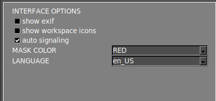

# Menú de Configuración

El **menú de configuración** está dividido en varias secciones, que se describen a continuación.

{.center}

## **Opciones de interfaz**

{width=350px; .center}

#### Mostrar exif

Muestra los metadatos de la imagen actual en el [área principal del espacio de trabajo](./Screen-layout.md#main-workspace).

#### Mostrar iconos del espacio de trabajo

Habilita un conjunto de funcionalidades en el [área principal del espacio de trabajo](./Screen-layout.md#main-workspace). Obtenga más información sobre estas funciones en la [siguiente sección](./Workspace_icons.md).

#### Señalización automática

Por defecto, el software numerará los errores después de la inspección. Al deshabilitar esta opción, solo el área afectada se resaltará en color.

#### Color de la máscara

Esta opción le permite cambiar el color del error marcado. Cuando el color del error marcado coincide con el color de la PCBA, es recomendable cambiarlo a un color de mayor contraste para hacer las áreas marcadas más visibles.

#### Idioma

Cambia el idioma de la interfaz. Los idiomas disponibles actualmente son: **Inglés, Francés, Alemán, Italiano y Español**.

## **Opciones de flujo de trabajo**

{width=350px; .center}

#### Proceso automático

Activa/desactiva la [función de proceso automático](./Screen-layout.md#auto-process).

#### Usar código de barras

Activa/desactiva la [función de lectura de código de barras](./Barcode_reader.md).

#### Procesamiento automático de la carpeta PCB_IN

Al habilitar esto, todas las **imágenes UUI** contenidas en la carpeta **APP/PCB_IN** se procesarán automáticamente utilizando la REFERENCIA cargada en la aplicación. Esta función solo está disponible en la versión **ONLINE**.

!!! warning "Advertencia"
    Desde la versión 7 esta característica ya no está operativa.

#### Mostrar ventana emergente de errores

Al deshabilitar esta opción, la ventana de reporte ya no aparecerá al reportar un error con la flecha **ARRIBA** o **ABAJO**. Los errores reportados se generarán con la etiqueta "**other**" en el informe PDF final.

#### Mostrar mosaico de referencias

Al deshabilitar esta opción, el menú de mosaico no aparecerá después de tomar una imagen de **REFERENCIA**.

#### Modo Operador

Habilitar esta opción ocultará varias funciones de la interfaz, simplificando el uso del software. También evita que el operador pueda cambiar la imagen de REFERENCIA o la sensibilidad de las inspecciones. Se puede añadir una [contraseña](Settings_menu.md#settings-password) para que solo el administrador pueda deshabilitar esta opción.

#### Sensibilidad habilitada

Permite cambiar la sensibilidad cuando está en modo operador.

## **Opciones de informe**

{width=350px; .center}

#### ID del Operador

Establece una identificación para el operador actual. Esta ID se mostrará en el informe PDF final después de completar la inspección.

#### ID de Pedido

Establece una identificación para la orden de fabricación actual. Esta ID se mostrará en el informe PDF final después de completar la inspección.

#### ID de Plataforma

Establece una identificación para la AOI.

#### ETIQUETA

Establece la ETIQUETA (OK o NOK) del informe PDF final como sufijo o prefijo del nombre del archivo.

#### ETIQUETA OK

Establece una ETIQUETA OK personalizada para el informe PDF final.

#### ETIQUETA NO OK

Establece una ETIQUETA NO OK personalizada para el informe PDF final.

#### Informe automático

Cuando esta opción está habilitada, se generará automáticamente un informe PDF final etiquetado como OK si no se detectan errores después de la inspección. El informe PDF final también se puede generar si se detecta algún error durante la inspección.

!!! note "Nota"
    Al generar un informe PDF automáticamente, todos los errores detectados se marcarán con la etiqueta "unknown" (desconocido).

#### Mostrar todos los fallos

Muestra todos los errores detectados en el informe PDF incluso si el operador no los ha reportado.

#### Logotipo

Establece un logotipo para el informe PDF.

## **Opciones de fecha/hora**

{width=350px; .center}

#### Zona horaria

Establece la zona horaria.

#### Fecha y hora

Establece el día y la hora.

!!! note "Nota"
    Para aplicar los cambios, presione el botón **SET** y reinicie el sistema.

## **Opción de ruta**

{width=350px; .center}

#### PCB OUT

Cambia la ruta donde se generan las inspecciones.

## **Opciones de compartir**

{width=350px; .center}

#### Compartir carpetas

Al habilitar estas opciones, el sistema compartirá automáticamente las carpetas PCB_OUT y REFERENCE en su red local. La dirección de acceso se mostrará una vez que se establezca la opción.

!!! note "Nota"
    Para aplicar los cambios, presione el botón **SET**.

!!! note "Nota"
    Para las unidades OFFLINE, si necesita cambiar la interfaz de red de su unidad, consulte el [artículo de configuración de red](./network_configuration.md).

## **Sección de información**

{width=650px; .center}

#### Información AOI

La información de la AOI se muestra en esta sección.

#### Copia de seguridad

Esta función genera automáticamente un archivo comprimido de copia de seguridad de la carpeta PCB_OUT. El archivo de copia de seguridad se almacena en la carpeta **APP/BACKUP**.

#### Contraseña de configuración

Establece una contraseña para acceder al menú de configuración.

!!! note "Nota"
    Establezca la contraseña en blanco para deshabilitar el requisito de contraseña.