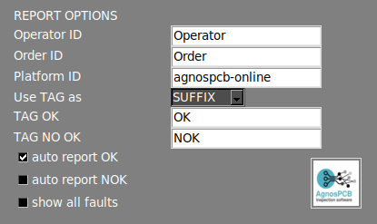

# Menu Paramètres

Le **menu Paramètres** est divisé en plusieurs sections, qui sont décrites ci-dessous.

{.center}

## **Options d'interface**

{width=350px; .center}

#### Afficher exif

Affiche les métadonnées de l'image actuelle dans la [zone de travail principale](./Screen-layout.md#main-workspace).

#### Afficher les icônes de l'espace de travail

Active un ensemble de fonctionnalités dans la [zone de travail principale](./Screen-layout.md#main-workspace). Apprenez-en davantage sur ces fonctionnalités dans la [section suivante](./Workspace_icons.md).

#### Signalisation automatique

Par défaut, le logiciel numérote les erreurs après l'inspection. En désactivant cette option, seule la zone affectée sera mise en évidence en couleur.

#### Couleur du masque

Cette option vous permet de changer la couleur de l'erreur marquée. Lorsque la couleur de l'erreur marquée correspond à la couleur de la PCBA, il est conseillé de la changer pour une couleur à contraste plus élevé afin de rendre les zones marquées plus visibles.

#### Langue

Change la langue de l'interface. Les langues actuellement disponibles sont : **Anglais, Français, Allemand, Italien et Espagnol**.

## **Options de flux de travail**

{width=350px; .center}

#### Traitement automatique

Active/désactive la [fonction de traitement automatique](./Screen-layout.md#auto-process).

#### Utiliser le code-barres

Active/désactive la [fonction de lecture de code-barres](./Barcode_reader.md).

#### Traitement automatique du dossier PCB_IN

En activant cela, toutes les **images UUI** contenues dans le dossier **APP/PCB_IN** seront automatiquement traitées en utilisant la RÉFÉRENCE chargée dans l'application. Cette fonction est uniquement disponible sur la version **ONLINE**.

!!! warning "Avertissement"
    Depuis la version 7, cette fonctionnalité n'est plus opérationnelle.

#### Afficher la fenêtre contextuelle des erreurs

En désactivant cette option, la fenêtre de rapport n'apparaîtra plus lors du signalement d'une erreur avec la flèche **HAUT** ou **BAS**. Les erreurs signalées seront générées avec l'étiquette "**other**" (autre) dans le rapport PDF final.

#### Afficher la mosaïque des références

En désactivant cette option, le menu mosaïque n'apparaîtra pas après la prise d'une image de **RÉFÉRENCE**.

#### Mode Opérateur

L'activation de cette option masquera plusieurs fonctionnalités de l'interface, simplifiant l'utilisation du logiciel. Elle empêche également l'opérateur de modifier l'image de RÉFÉRENCE ou la sensibilité des inspections. Un [mot de passe](Settings_menu.md#settings-password) peut être ajouté afin que seul l'administrateur puisse désactiver cette option.

#### Sensibilité activée

Permet de modifier la sensibilité lorsque vous êtes en mode opérateur.

## **Options de rapport**

{width=350px; .center}

#### ID Opérateur

Définit un ID pour l'opérateur actuel. Cet ID sera affiché dans le rapport PDF final une fois l'inspection terminée.

#### ID Commande

Définit un ID pour la commande de fabrication actuelle. Cet ID sera affiché dans le rapport PDF final une fois l'inspection terminée.

#### ID Plateforme

Définit un ID pour l'AOI.

#### ÉTIQUETTE (TAG)

Définit l'ÉTIQUETTE (OK ou NOK) du rapport PDF final comme suffixe ou préfixe du nom de fichier.

#### ÉTIQUETTE OK

Définit une ÉTIQUETTE OK personnalisée pour le rapport PDF final.

#### ÉTIQUETTE NON OK

Définit une ÉTIQUETTE NON OK personnalisée pour le rapport PDF final.

#### Rapport automatique

Lorsque cette option est activée, un rapport PDF final étiqueté OK sera automatiquement généré si aucune erreur n'est détectée après l'inspection. Le rapport PDF final peut également être généré si des erreurs sont détectées pendant l'inspection.

!!! note "Note"
    Lors de la génération automatique d'un rapport PDF, toutes les erreurs détectées seront marquées avec l'étiquette "unknown" (inconnu).

#### Afficher tous les défauts

Affiche toutes les erreurs détectées dans le rapport PDF même si l'opérateur ne les a pas signalées.

#### Logo

Définit un logo pour le rapport PDF.

## **Options de Date/Heure**

{width=350px; .center}

#### Fuseau horaire

Définit le fuseau horaire.

#### Date et heure

Définit le jour et l'heure.

!!! note "Note"
    Pour appliquer les changements, appuyez sur le bouton **SET** et redémarrez le système.

## **Option de Chemin**

{width=350px; .center}

#### PCB OUT

Change le chemin où les inspections sont générées.

## **Options de Partage**

{width=350px; .center}

#### Partager les dossiers

En activant ces options, le système partagera automatiquement les dossiers PCB_OUT et RÉFÉRENCE sur votre réseau local. L'adresse d'accès sera affichée une fois l'option définie.

!!! note "Note"
    Pour appliquer les changements, appuyez sur le bouton **SET**.

!!! note "Note"
    Pour les unités OFFLINE, si vous avez besoin de changer l'interface réseau de votre unité, veuillez vous référer à l'[article de configuration du réseau](./network_configuration.md).

## **Section Info**

{width=650px; .center}

#### Info AOI

Les informations AOI sont affichées dans cette section.

#### Sauvegarde

Cette fonction génère automatiquement un fichier compressé de sauvegarde du dossier PCB_OUT. Le fichier de sauvegarde est stocké dans le dossier **APP/BACKUP**.

#### Mot de passe des paramètres

Définit un mot de passe pour accéder au menu des paramètres.

!!! note "Note"
    Définissez le mot de passe comme vide pour désactiver l'exigence de mot de passe.