# Settings menu

The **settings menu** is divided into several sections, which are described below.

## **General settings**

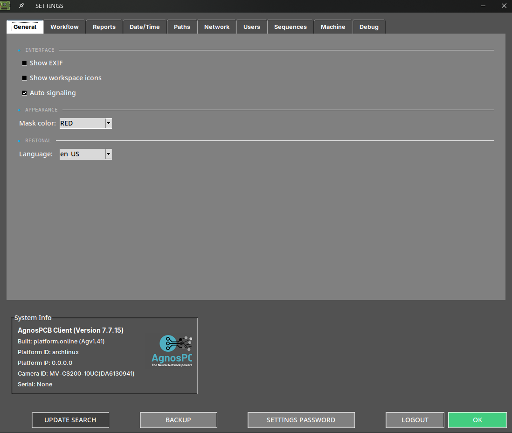{.center}

#### Show exif

Displays the metadata of the current image in the [main workspace area](./Screen-layout.md#main-workspace).

#### Show workspace icons

Enable a set of features in the main [main workspace area](./Screen-layout.md#main-workspace). Learn more about these features in the [next section](./Workspace_icons.md).

#### Auto signaling

By default, the software will numerate the errors after the inspection. Disabling this option, only the affected area will be highlighted in color.

#### Mask color

This option allows you to change the color of the marked error. When the color of the marked error matches the color of the PCBA, it's advisable to change it to a higher contrast color to make the marked areas more visible.

#### Language

Change the interface language. The current available languages are: **English, French, German, Italian and Spanish**.

## **Workflow options**

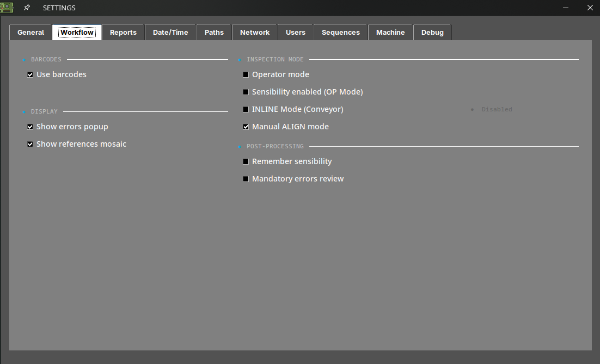{.center}

#### Use barcode

Toggles the [barcode reading function](./Barcode_reader.md)

#### Show errors popup

By disabling this option, the reporting window will no longer pop up when reporting an error with the **UP** or **DOWN** arrow keys. The reported errors will be generated with the "**other**" label in the final PDF report.

#### Show references mosaic

By disabling this option, the mosaic menu won't pop up after taking a **REFERENCE** image.

#### Operator mode

Enabling this option will hide several features from the interface, simplifying the software's use. It also prevents the operator from changing the REFERENCE image or the sensitivity of the inspections. A [password](Settings_menu.md#settings-password) can be added so that only the administrator can disable this option.

#### Sensitivity enabled

It allows you to change the sensitivity while in operator mode.

#### INLINE Mode

Select this mode the AOI is installed in a conveyor belt. Lear more about this functionality in the following section: [Conveyor integration](../getting_started/Conveyor_integration.md)

#### Manual align mode

Enable this option to align the REFERENCE and UUI images manually. Lear more about this functionality in the following section: [Manual aligment tool](../features/Manual_alignment.md)

#### Remember sensibility

By activating this option, the software will maintain the configured inspection sensitivity after performing a new inspection.

#### Mandatory errors review

If this option is enabled, the software will not continue inspecting new panels until all errors detected in the current inspection have been [reported](Inspection_workflow.html#reporting-errors) as errors or false positives.

## **Report options**

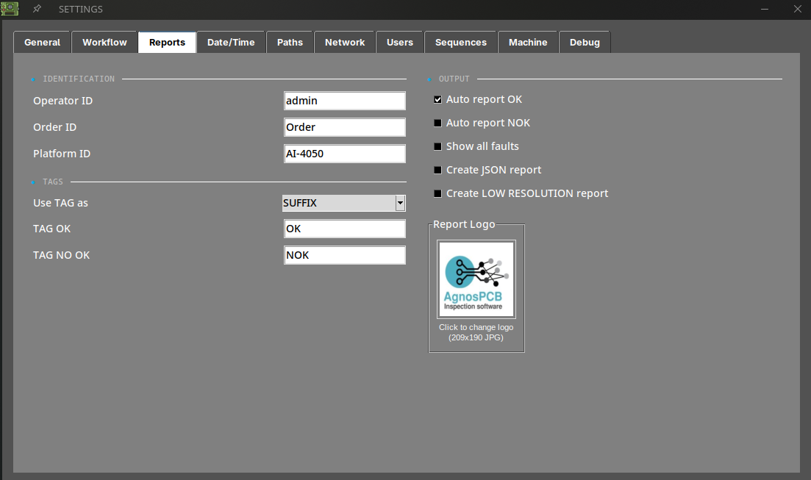{.center}

#### Operator ID

Set an ID for the current operator. This ID will be displayed in the final PDF report after the inspection is complete.

#### Order ID

Set an ID for the current manufacturing order. This ID will be displayed in the final PDF report after the inspection is complete.

#### Platform ID

Set an ID for the AOI. 

#### Use TAG as

Set the TAG (OK or NOK) of the final PDF report as a **suffix** or a **prefix** to the file name.

#### TAG OK

Set a custom OK TAG for the final PDF report. 

#### TAG NO OK

Set a custom NO OK TAG for the final PDF report.

#### Auto report

When this option is enabled, a final PDF report labeled OK will be automatically generated if no errors are detected after the inspection. The final PDF report can also be generated if any errors are detected during the inspection.

!!! note "Note"
    When generating a PDF report automatically, all errors detected will be marked with the "unknown" label.

#### Show all faults

Displays all detected errors in the PDF report even if the operator has not reported them.

#### Create JSON report

Generates a **machine-readable JSON file** with the inspection data, in addition to the PDF report. Use this option when the results have to be processed by another system — an MES, an ERP or a traceability database — instead of being read by a person.

The JSON file is written to the same folder as the PDF report, inside the [PCB OUT](#pcb-out) directory.

!!! note "Note"
    This is a licensed feature. If the option does not generate any file, contact [support@agnospcb.com](mailto:support@agnospcb.com) to check whether your account profile includes it.

#### Create LOW RESOLUTION report

Generates an **additional PDF report with a reduced file size**. The standard report is still generated: this option adds a lighter copy of it, it does not replace it.

This is useful when the reports have to be sent by email, archived long term, or transferred over a slow or metered connection, where the full resolution images would make the file impractically large.

#### Logo

Set a logo for the PDF report.

## **Date/time options**

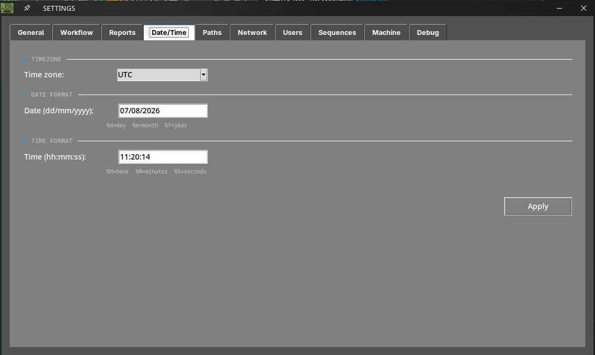{.center}

#### Time zone

Set the time zone.

#### Date and time

Set day and time.

!!! note "Note"
    To apply the changes press the **SET** button and reboot the system.

## **Path option**

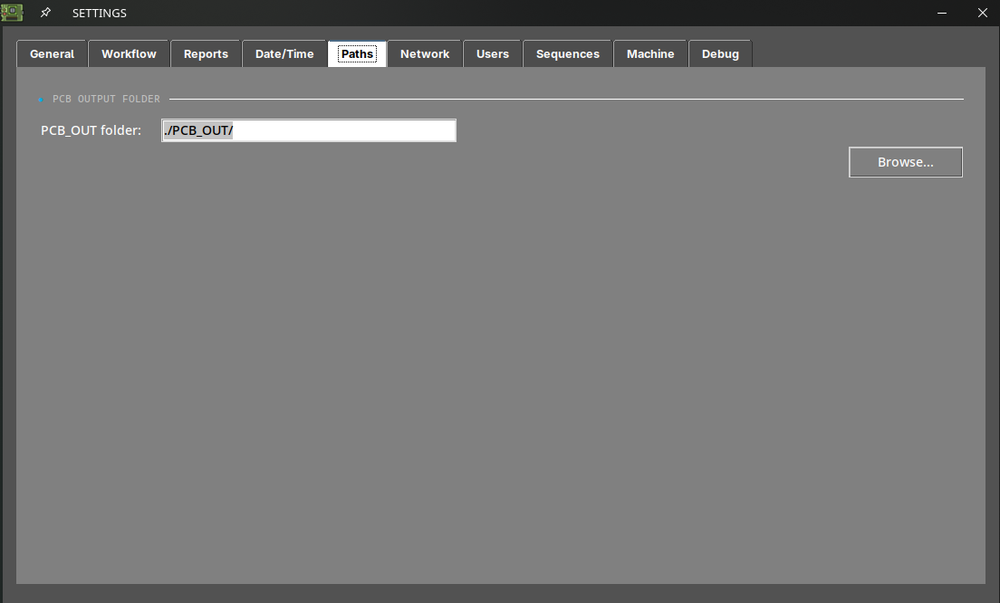{.center}

#### PCB OUT

Change the path where the inspections are generated.

## **Share options**

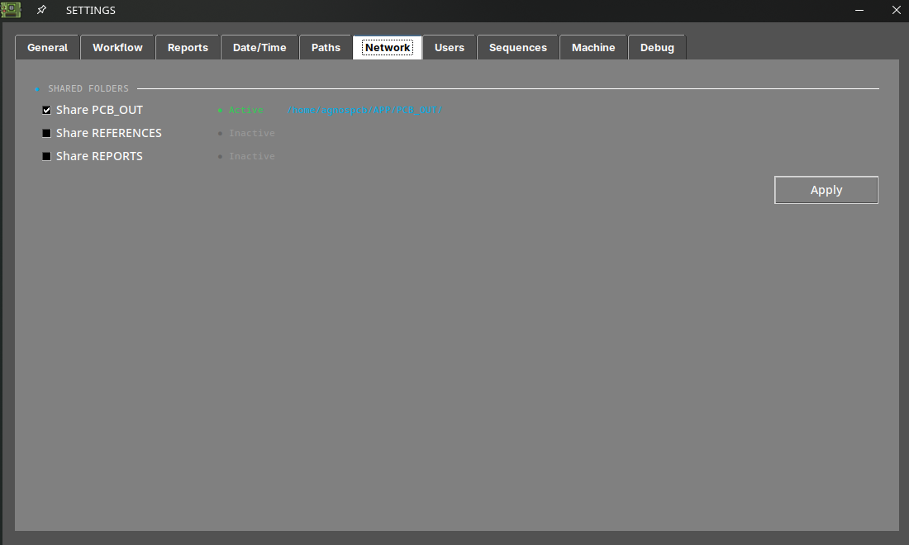{.center}

#### Share folders

By enabling these options, the system will automatically share the PCB_OUT and REFERENCE folders on your local network. The access address will be displayed once the option is set.

!!! note "Note"
    To apply the changes press the **Apply** button.

!!! note "Note"
    For the OFFLINE units, if you need to change the network interface of your unit, please refer to the [network configuration article](../maintenance/network_configuration.md).

## **Users**

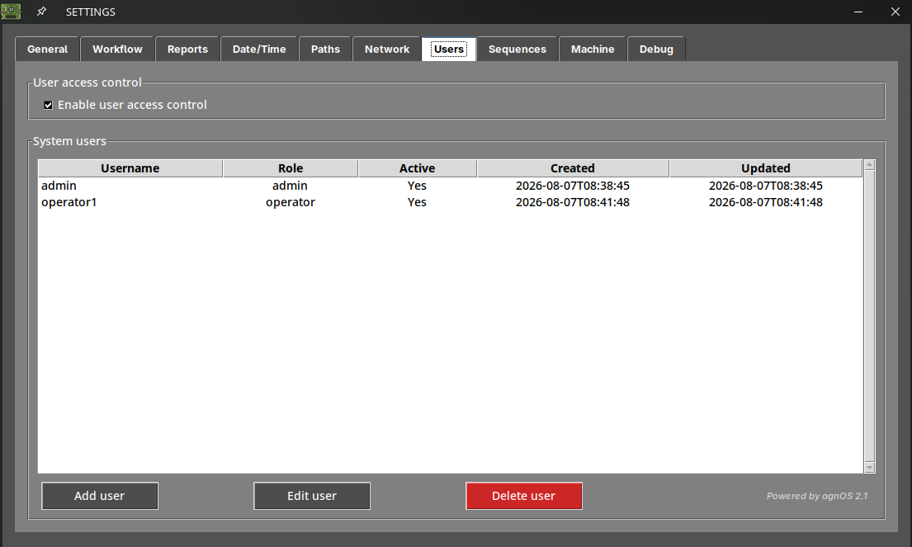{.center}

This tab is only available to users with the **admin** role. It allows you to create the accounts that can operate the AOI, each one with an **admin** or **operator** role, and to require a username and password every time the software starts.

Enabling **Enable user access control** requires at least one active **admin** account to exist.

Learn more about this functionality in the following section: [User access control](../features/User_control.md)

## **Sequences**

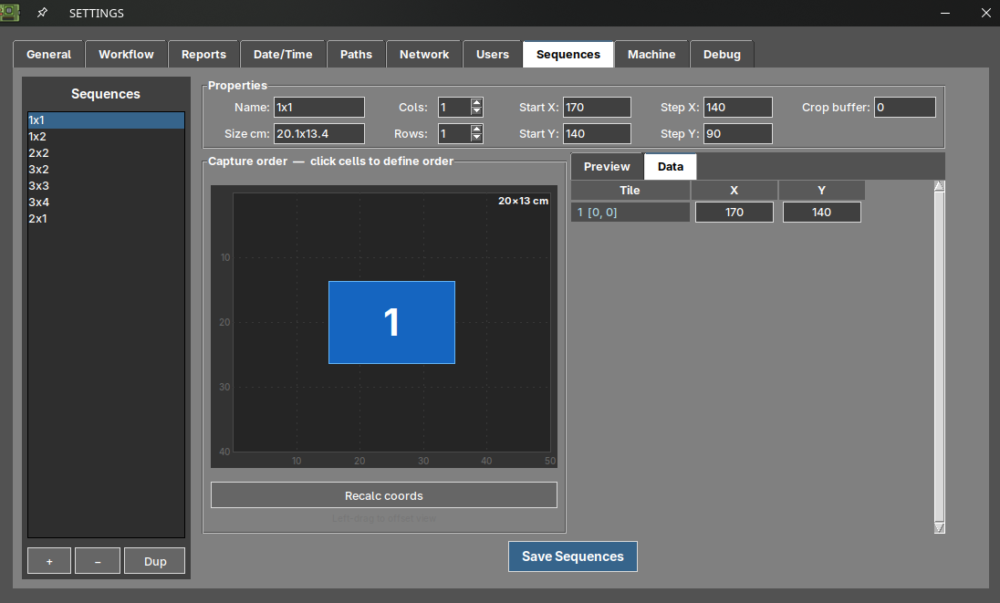{.center}

This tab is only available to users with the **admin** role. It allows you to define your own **capture sequences**, that is, the grid of photographs the camera takes and stitches together to compose the image of a large board.

Use it when none of the predefined sequences fits your board properly. The sequences you save here appear as **CUSTOM** options in the live preview window when taking a REFERENCE or starting an inspection.

Learn more about this functionality in the following section: [Custom capture sequences](../features/Custom_sequences.md)

!!! note "Note"
    This tab is not displayed on units configured in **Q1 mode**, which only take a single capture.

## **Machine**

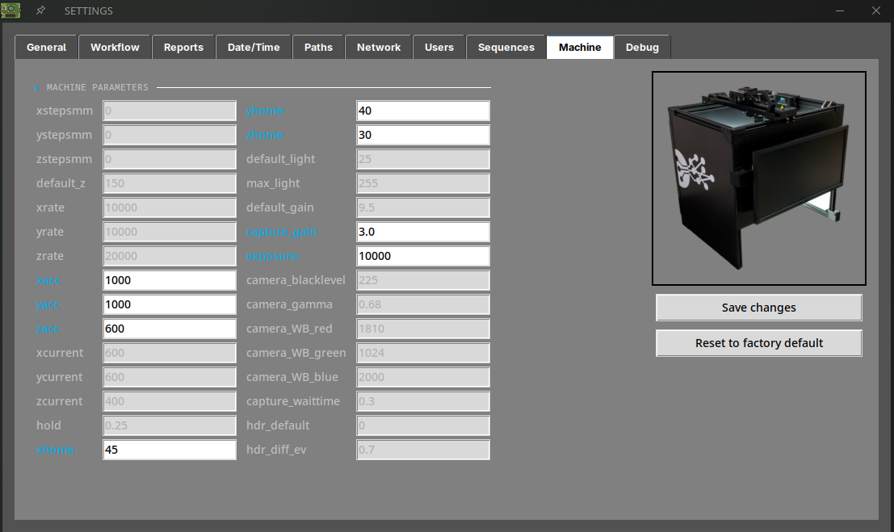{.center}

This tab is only available to users with the **admin** role. It displays the hardware parameters of your unit, stored in the **machine.json** file.

Most of the values are shown greyed out: they are displayed **for reference only** and cannot be modified. The fields highlighted in blue are the editable ones:

| Field | Description |
| --- | --- |
| **xacc** / **yacc** / **zacc** | Acceleration of each axis. |
| **xhome** / **yhome** / **zhome** | Home position offset of each axis. |
| **capture_gain** | Camera gain during the capture. |
| **exposure** | Camera exposure time. |

Press **Save changes** to apply the new values, or **Reset to factory default** to restore every parameter to its original value.

!!! warning "Important"
    These parameters affect how the platform moves and how the images are captured. Modifying them incorrectly may degrade the image quality or the movement of the axes. Change them only when [support](mailto:support@agnospcb.com) asks you to.

!!! note "Note"
    This tab is not displayed on units without an XYZ platform.

## **Debug**

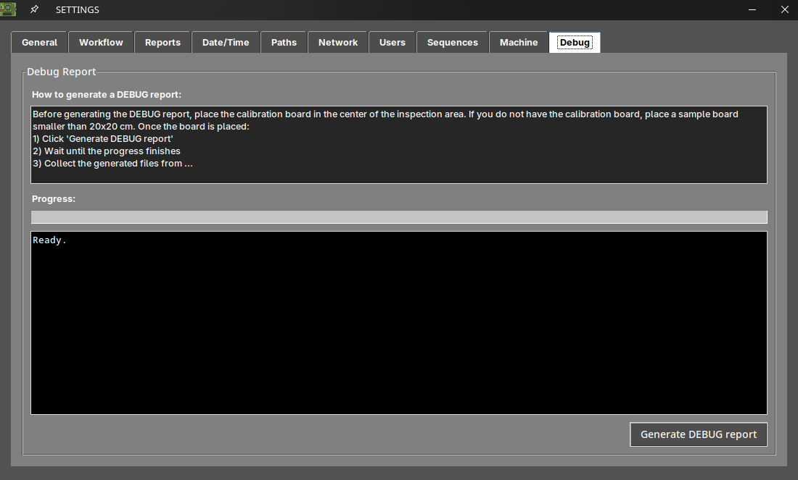{.center}

This tab is only available to users with the **admin** role. It generates a **diagnostic report** that allows our support team to analyse the behaviour of your unit.

To generate it:

1. Place the **calibration board** in the center of the inspection area. If you do not have it, use a sample board **smaller than 20x20 cm**.
2. Press **Generate DEBUG report**.
3. Wait until the progress bar is complete. The text area below displays the progress of the process.
4. Collect the generated files and send them to [support@agnospcb.com](mailto:support@agnospcb.com).

## **Info section**

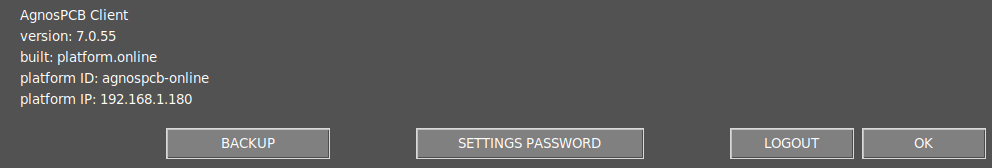{width=650px; .center}

#### AOI info

The AOI information is displayed in this section.

#### Backup

This function generates a backup compressed file of the **PCB_OUT** folder automatically. The backup file is stored in the **APP/BACKUP** folder.

#### Settings password

Set a password to access the settings menu.

!!! note "Note"
    Set the password to blank to disable the password requirement.
