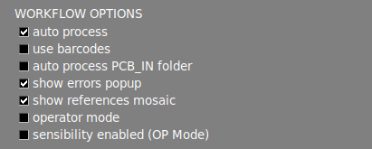
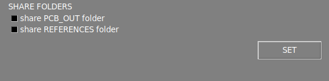

# Settings menu

The **settings menu** is divided into several sections, which are described below.

{.center}

## **Interface options**

{width=350px; .center}

#### Show exif

Displays the metadata of the current image in the [main workspace area](./Screen-layout.md#main-workspace).

#### Show workspace icons

Enable a set of features in the main [main workspace area](./Screen-layout.md#main-workspace). Learn more about these features in the [next section](./Workspace_icons.md).

#### Auto signaling

By default, the software will numerate the errors after the inspection. Disabling this option, only the affected area will be highlighted in color.

#### Mask color

This option allows you to change the color of the marked error. When the color of the marked error matches the color of the PCBA, it's advisable to change it to a higher contrast color to make the marked areas more visible.

#### Language

Change the interface language. The current avilable laguanges are: **English, French, German, Italian and Spanish**.

## **Workflow options**

{width=350px; .center}

#### Auto process

Toggles the [auto process function](./Screen-layout.md#auto-process).

#### Use barcode

Toggles the [barcode reading function](./Barcode_reader.md)

#### Auto process PCB_IN folder

Enabling this, all the **UUI images** contained in the **APP/PCB_IN** folder will be automatically process using the loaded REFERENCE in the application. This function is only available on the **ONLINE** version.

!!! warning "Warning"
    Since version 7 this feature is no longer operative.

#### Show errors popup

By disabling this option, the reporting window will no longer popup when reporting an error with **UP** or **DOWN** arrow. The reported errors will be generated with the "**other**" label in the final PDF report.

#### Show references mosaic

By disabling this option, the mosaic menu won't popup after taking a **REFERENCE** image.

#### Operator mode

#### Sensitivity enabled

## **Report options**

{width=350px; .center}

#### Operator ID

#### Order ID

#### Platform ID

#### TAG

#### TAG OK

#### TAG NO OK

#### Auto report

#### Show all faults

#### Logo

## **Date/time options**

{width=350px; .center}

#### Time zone

#### Date and time

## **Path option**

{width=350px; .center}

## **Share options**

{width=350px; .center}

## **Info section**

{width=650px; .center}

#### AOI info

#### Backup

#### Settings password
