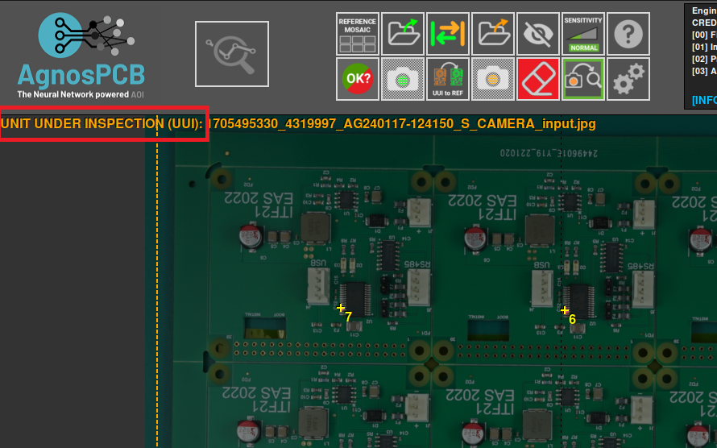
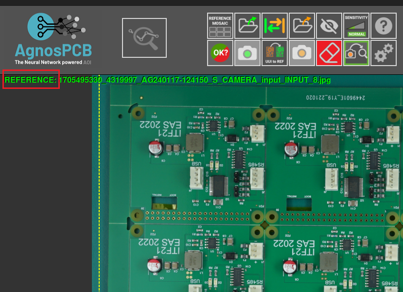

# **Da UUI a RIFERIMENTO**

Durante l'ispezione di una **PCB**, se si scopre che un'immagine **UUI** è più adatta come riferimento di quella attuale o contiene una variante di un componente che induce il software a segnalarla come errore, si ha la possibilità di convertirla in un'immagine di riferimento con un **singolo clic del pulsante**.

{.center}

Ad esempio, in questa immagine abbiamo una **UUI** che contiene una variante di un componente ed è contrassegnata come errore.

E ora, dopo aver premuto il pulsante **"Da UUI a RIFERIMENTO"**, la stessa PCBA viene utilizzata come **RIFERIMENTO**.

