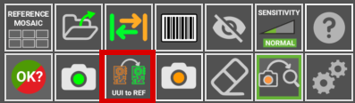
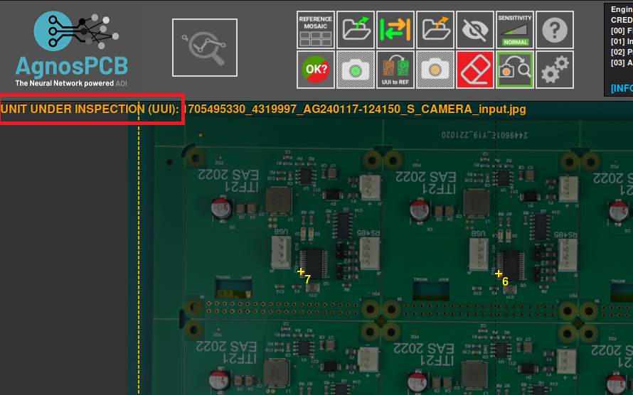
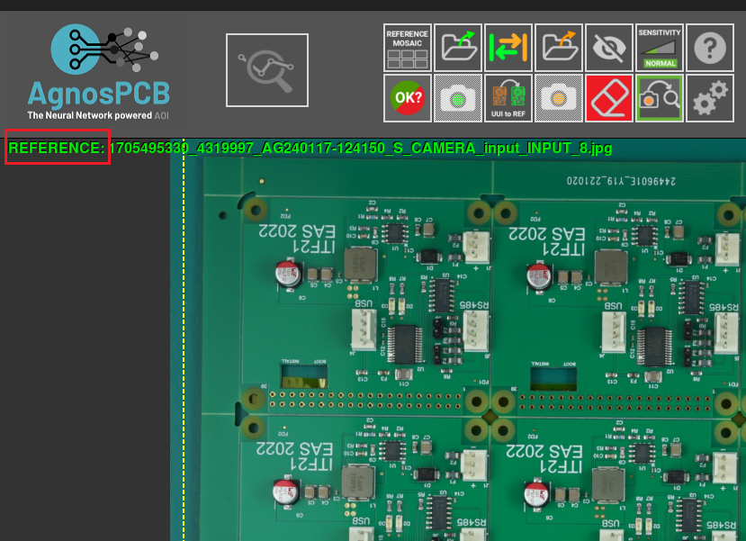

# **UUI to REFERENCE**

When inspecting a **PCB**, if you discover that a **UUI** image is more suitable as a reference than the current one or contains a component variant that causes the software to flag it as an error, you have the option to convert it to a reference image with a **single button click**.

{.center}

For example, in this image we have a **UUI** that contains a variant of a component and it is marked as an error.

And now, after pressing the button **¨UUI to REFERENCE¨** now the same PCBA is being used as **REFERENCE**

