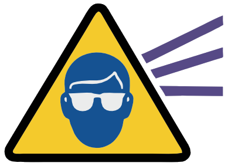
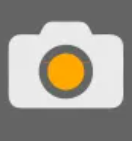
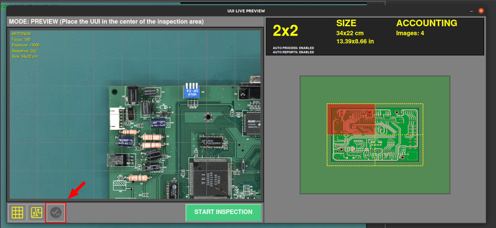
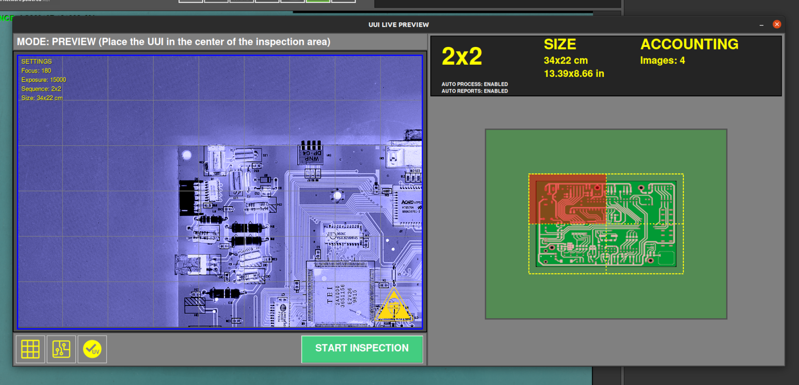
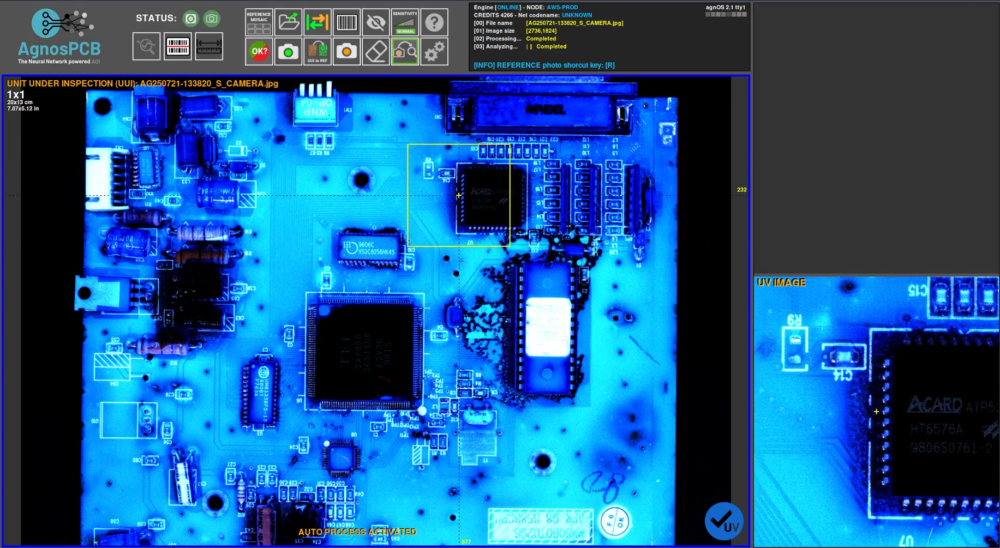
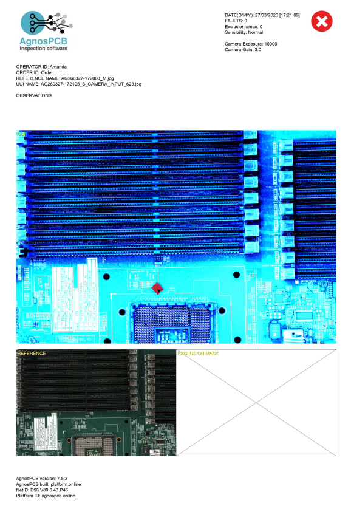

En esta guía aprenderemos a realizar la inspección del recubrimiento conformal usando **AgnosPCB AOI**.

Esta función permite a los operadores inspeccionar visualmente el recubrimiento conformal en PCBAs utilizando iluminación UV.

!!! note "Nota"
    Esta función requiere la instalación de un kit de hardware adicional. Para instalar el kit UV, siga las instrucciones en la siguiente sección:
    [Guía de instalación del recubrimiento conformal UV](../maintenance/UV_kit_install.md)

!!! warning "Precaución"
    La inspección del recubrimiento conformal utiliza iluminación UV, por lo que **recomendamos usar las gafas de seguridad** incluidas con el kit.

    { width=200px .center }

## Video

Para una explicación completa de esta funcionalidad, vea el siguiente video:
 
___

<iframe width="100%" height="400" src="." title="YouTube video player" frameborder="0" allow="accelerometer; autoplay; clipboard-write; encrypted-media; gyroscope; picture-in-picture; web-share" referrerpolicy="strict-origin-when-cross-origin" allowfullscreen></iframe>
___

## 1. Generar una imagen de REFERENCIA o cargarla

Para generar una imagen de **REFERENCIA**, siga los pasos en la [siguiente guía](../how_to/Inspection_workflow.md#generating-a-reference) o [cargue una REFERENCIA previa](../how_to/Screen-layout.md#load-reference-as-file).

## 2. Abrir la Vista en Vivo (Live View)

Utilice el botón de captura UUI para abrir la [ventana de Vista en Vivo](../how_to/Inspection_workflow.md#capturing-an-uui) del PCBA actual.

{ width=100px .center }

## 3. Activar la inspección UV

En la ventana de Vista en Vivo, active la **opción de inspección UV** ubicada en la parte inferior de la interfaz.

{ .center }

Una vez activada, se mostrará una simulación del PCB bajo iluminación UV.

{ .center }

!!! warning "Precaución"
    A partir de este momento, es obligatorio usar las gafas de seguridad incluidas con el kit.

    { width=100px .center }

Luego, coloque el UUI en el centro del área de inspección y presione el botón **Iniciar Inspección** para comenzar el proceso.

{ width=250px .center }

## 4. Inspeccionar el recubrimiento

Observe el PCB bajo iluminación UV para verificar la correcta aplicación y cobertura del recubrimiento conformal.

{ .center }

!!! note "Nota"
    Esta inspección se realiza manualmente por el operador. No hay detección basada en IA, por lo que el operador debe identificar visualmente cualquier defecto o ausencia de recubrimiento.

La imagen UV capturada se incluye en el informe final de inspección con fines de documentación y trazabilidad.

{width=500px, .center}