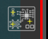

# Icônes de l'Espace de Travail

Les icônes de l'espace de travail offrent un accès rapide à des fonctionnalités utiles.

{width=600, .center}

## Afficher/masquer les croix

{width=200, .center}

Cette option affiche/masque les **lignes de visée (cross hairs)** et les **numéros d'erreur** dans la zone principale de l'espace de travail pour une meilleure visibilité de l'image UUI.

## Traitement automatique

{width=200, .center}

Active/désactive le **traitement automatique** après la prise de l'image UUI.

## Couleur du masque d'erreur

{width=200, .center}

Elle modifie la **couleur du masque d'erreur** pour une couleur plus appropriée en fonction de la couleur de la PCBA. De plus, il est possible de changer l'**opacité** du masque en appuyant sur **CTRL** + **molette de la souris haut/bas** lorsque le pointeur est sur l'icône.