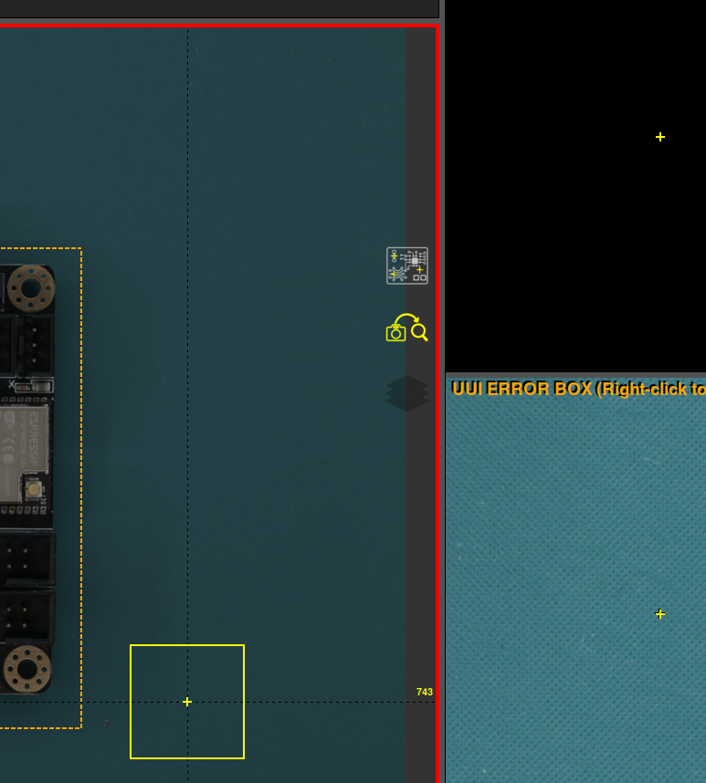

# Workspace icons

Workspace icons provide quick access to useful features.

{width=600, .center}

## Show/hide crosses

{width=200, .center}

This option shows/hides the cross hairs and error numbers in the main workspace area for greater visibility of the UUI image.

## Auto process

{width=200, .center}

Enables/disables automatic processing after taking the UUI image.

## Error mask color

{width=200, .center}

It changes the color error mask color for a more suitable color according to the PCBA color. In addition, it is possible to change the mask's oppacity by pressing **CTRL** + **mouse wheel up/down** when the pointer is over the icon.