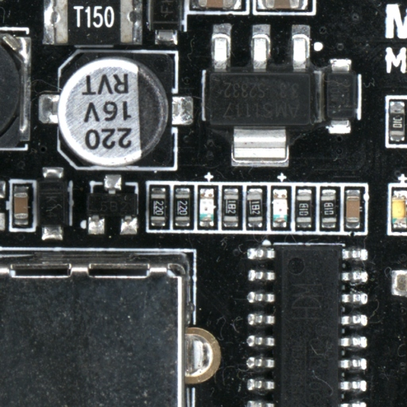

## **Neuronales Netzwerk**

Beim maschinellen Lernen bezieht sich das neuronale Netzwerk auf eine Gruppe künstlicher Neuronen, die auf eine spezifische Weise organisiert sind, um eine bestimmte Aufgabe auszuführen. Jedes Neuron stellt eine mathematische Funktion dar. Im Falle von **AgnosPCB** führen diese Neuronen eine visuelle Inspektion auf Defekte in PCBA (Leiterplatten) durch. Die Verschaltungsarchitektur dieser Neuronen wird ständig verbessert, um die Fehlererkennungsraten zu erhöhen.

{width=700px, .center}

## **REFERENZ**

Das **REFERENZ**-Bild ist das Bild einer fehlerfreien PCBA, das für Inspektionen verwendet wird. Vor der Generierung des REFERENZ-Bildes muss der Bediener die REFERENZ-PCBA (GOLDEN Board) inspizieren, um sicherzustellen, dass sie frei von Fertigungsfehlern ist.

{width=500px, .center}

## **UUI**

Die **Unit Under Inspection (UUI)** ist das Bild der PCBA, die während der Fertigung inspiziert wird. Dieses Bild wird mit dem REFERENZ-Bild verglichen, um Fertigungsfehler zu erkennen.

{width=500px, .center}

## **Inferenz**

Dies ist das Ergebnis des Vergleichs der REFERENZ- und UUI-Bilder. Fehler werden, falls vorhanden, auf dem UUI-Bild rot markiert. Alle Fehler sind zur leichteren Bezugnahme nummeriert.

{width=500px, .center}

## **Bericht (Report)**

Vom Software erkannte Fehler müssen von einem Bediener überprüft und bestätigt werden. Sie können als **echter Fehler** oder **falsch-positiv** gemeldet und mit der Fehlerart gekennzeichnet werden. Alle diese gemeldeten Fehler werden zur Erstellung eines abschließenden PDF-Inspektionsberichts verwendet.

{.center}

## **Fehler**

Wir definieren einen **Fehler** als eine Komponente, die nicht korrekt montiert, beschädigt oder fehlend ist. Jede Verunreinigung oder Beschädigung auf der Leiterplatte gilt ebenfalls als Fehler.

## **Falsch-Positiv**

Eine **Falsch-Positiv**-Kennzeichnung tritt auf, wenn die AgnosPCB-Software einen ausreichenden Unterschied zwischen der REFERENZ und der UUI an einer Komponente erkennt, um diese als Fehler zu markieren, obwohl kein tatsächlicher Defekt vorliegt, der die Funktion der PCBA beeinträchtigt. Dies kann durch eine Änderung der Markierung, Form oder Farbe einer Komponente verursacht werden, die der Referenz entspricht.