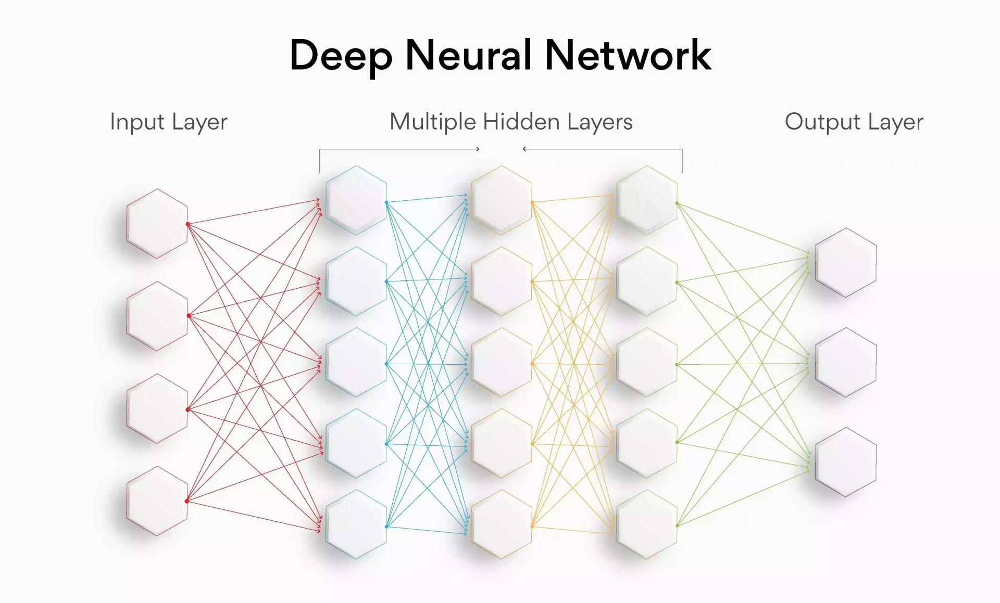

## **Rete Neurale**

Nell'apprendimento automatico, la rete neurale si riferisce a un gruppo di neuroni artificiali organizzati in un modo specifico per eseguire un compito specifico. Ciascun neurone rappresenta una funzione matematica. Nel caso di **AgnosPCB**, questi neuroni eseguono un'ispezione visiva per i difetti nelle PCBA. L'architettura di interconnessione di questi neuroni viene costantemente migliorata per aumentare i tassi di rilevamento dei guasti.

{width=700px, .center}

## **RIFERIMENTO**

L'immagine di **RIFERIMENTO** è l'immagine di una PCBA priva di difetti utilizzata per le ispezioni. Prima di generare l'immagine di RIFERIMENTO, l'operatore deve ispezionare la PCBA di RIFERIMENTO (scheda GOLDEN) per assicurarsi che sia esente da errori di fabbricazione.

{width=500px, .center}

## **UUI**

L'**Unità Sotto Ispezione (UUI)** è l'immagine della PCBA che verrà ispezionata durante la produzione. Questa immagine viene confrontata con l'immagine di RIFERIMENTO per rilevare i difetti di fabbricazione.

{width=500px, .center}

## **Inferenza**

Questo è il risultato del confronto tra le immagini di RIFERIMENTO e UUI. Gli errori, se presenti, sono contrassegnati in rosso sull'immagine UUI. Tutti gli errori sono numerati per una facile consultazione.

{width=500px, .center}

## **Report**

Gli errori rilevati dal software devono essere rivisti e confermati da un operatore. Possono essere segnalati come un **errore reale** o un **falso positivo** ed etichettati con il tipo di errore. Tutti questi errori segnalati verranno utilizzati per generare un report PDF finale di ispezione.

{.center}

## **Errore**

Definiamo un **errore** come un componente che non è assemblato correttamente, è danneggiato o mancante. Anche qualsiasi contaminazione o danno sulla scheda è considerato un errore.

## **Falso Positivo**

La segnalazione di **falso positivo** si verifica quando il software AgnosPCB rileva una differenza sufficiente tra il RIFERIMENTO e l'UUI su un componente da contrassegnarlo come errore, ma in realtà non vi è alcun guasto effettivo che influisca sul funzionamento della PCBA. Ciò può essere causato da un cambiamento nella marcatura, forma o colore di un componente che è equivalente al riferimento.