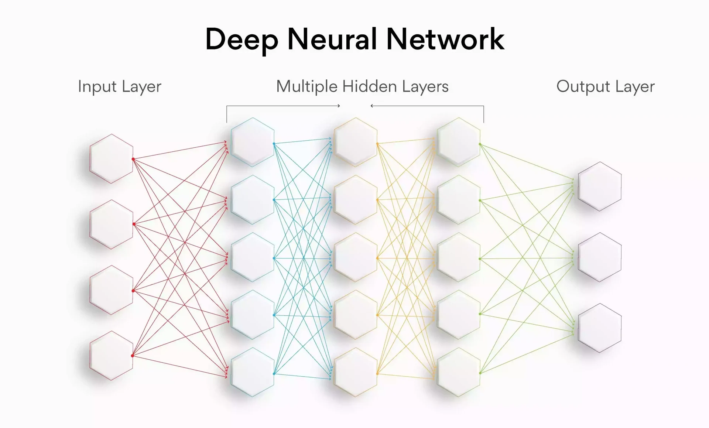
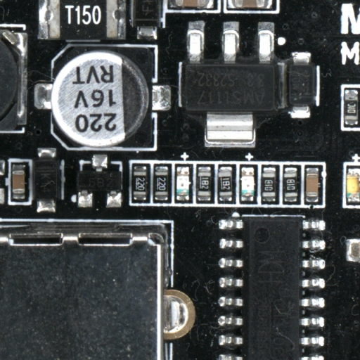
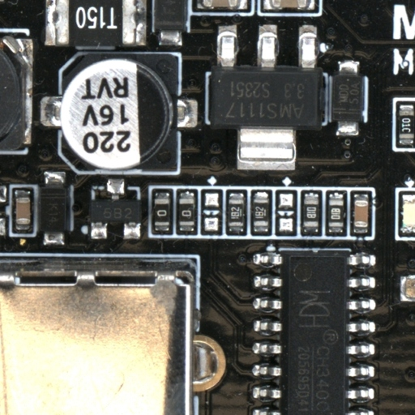
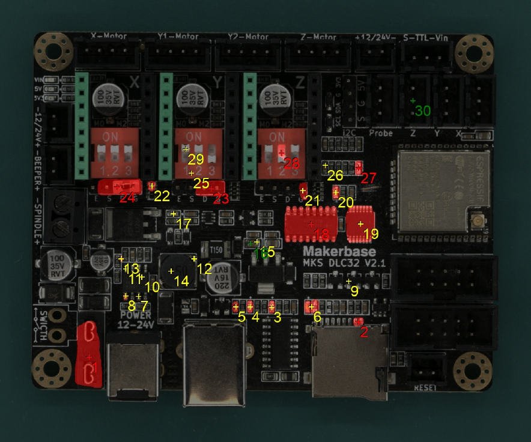

## **Neural Network**

In machine learning, neural network refers to a group of artificial neurons organized in a specific way to perform a specific task. Each neuron represents a mathematical function. In the case of **AgnosPCB**, these neurons perform a visual inspection for defects in PCBAs. The interconnection architecture of these neurons is constantly being improved to incrase the fault detection rates.

{width=700px, .center}

## **REFERENCE**

The REFERENCE image is the image of a fault-free PCBA used for inspections. Before generating the REFERENCE image, the operator must inspect the REFERENCE PCBA (GOLDEN board) to ensure it is free of manufacturing errors.

{width=500px, .center}

## **UUI**

The Unit Under Inspection (UUI) is the image of the PCBA that will be inspected during manufacturing. This image is compared to the REFERENCE image to detect manufacturing defects.

{width=500px, .center}

## **Inference**

This is the result of comparing the REFERENCE and UUI images. Errors, if any, are marked in red on the UUI image. All errors are numbered for easy reference.

{width=500px, .center}

## **Error**

We define an error as a component that is not assembled correctly, is damaged, or missing. Any contamination or damage on the board is also considered an error.

## **False positive**

False positive flagging occurs when the AgnosPCB software detects a sufficient difference between the REFERENCE and UUI on a component to flag it as an error, but there is no actual failure affecting the PCBA's operation. This can be caused by a change in the marking, shape, or color of a component that is equivalent to the reference.
