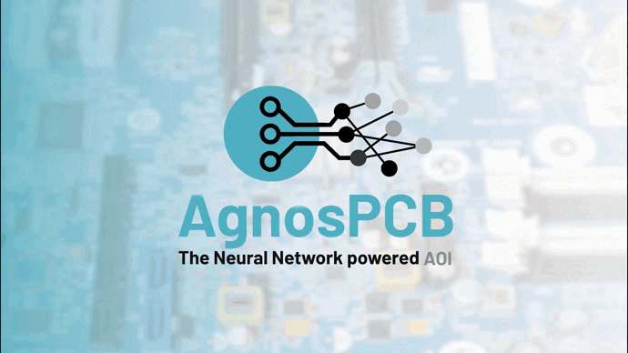

# **Willkommen bei der AgnosPCB-Dokumentation.**
___

[AgnosPCB](https://agnospcb.com/) bietet einen erschwinglichen **Service zur Automatisierten Optischen Inspektion (AOI)**, der auf fortschrittlicher **Neuronaler Netzwerk**-Technologie basiert.

Diese Dokumentation führt Sie durch alle Funktionen und Merkmale.

## **Erste Schritte**
___

Starten Sie schnell mit der **AgnosPCB Inspektionssoftware**, indem Sie unseren Schritt-für-Schritt-Anleitungen folgen. Dieser Abschnitt behandelt die Installation, die Ersteinrichtung und die ersten Schritte.

Link: [Erste Schritte](./getting_started/Package_content.md)

## **Wie man die Software benutzt**
___

Lernen Sie mit unseren detaillierten Tutorials, wie Sie unser **AOI-System** verwenden. Von grundlegenden bis zu fortgeschrittenen Aufgaben helfen Ihnen diese Anleitungen, die Anwendung zu meistern.

Link : [Wie man sie benutzt](./how_to/Screen-layout.md)

## **FAQs**
___

Haben Sie Fragen? Werfen Sie einen Blick in unseren Abschnitt **Zusätzliche Informationen** für schnelle Antworten auf häufig gestellte Fragen.

Link: [Hilfe](./help/FAQ.md)

## **Support**
___

Wenn Sie zusätzliche Unterstützung benötigen, steht Ihnen unser Support-Team zur Verfügung. Hier finden Sie Kontaktinformationen und Support-Ressourcen.

Link: [Support](./maintenance/Troubleshooting.md)

Schreiben Sie uns eine E-Mail an: [support@agnospcb.com](mailto:support@agnospcb.com)

Oder besuchen Sie unsere Webseite: [AgnosPCB.com](https://agnospcb.com/)