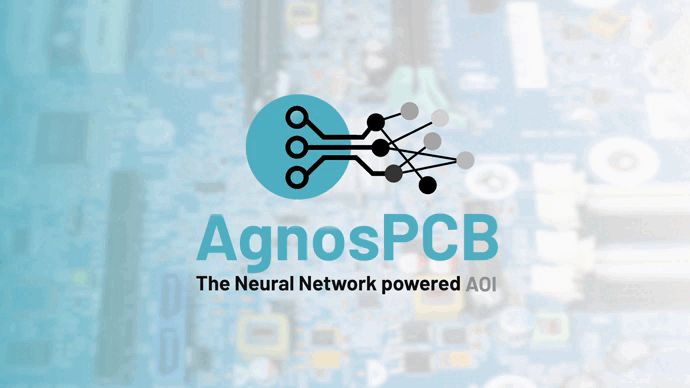

# **Bienvenidos a la documentación de AgnosPCB.**
___

[AgnosPCB](https://agnospcb.com/) ofrece un servicio asequible de **Inspección Óptica Automatizada (AOI)** impulsado por tecnología avanzada de **Redes Neuronales**.

Esta documentación le guiará a través de todas sus características y funcionalidades.

## **Primeros pasos**
___

Empiece rápidamente con el **software de inspección AgnosPCB** siguiendo nuestras guías paso a paso. Esta sección cubre la instalación, la configuración inicial y los primeros pasos.

Link: [Primeros pasos](./getting_started/Package_content.md)

## **Cómo usar el software**
___

Aprenda a usar nuestro **sistema AOI** con nuestros tutoriales detallados. Desde tareas básicas hasta avanzadas, estas guías le ayudarán a dominar la aplicación.

Link : [Cómo usarlo](./how_to/Screen-layout.md)

## **FAQs**
___

¿Tiene preguntas? Consulte nuestra sección de **Información Adicional** para obtener respuestas rápidas a las consultas más comunes.

Link: [Ayuda](./help/FAQ.md)

## **Soporte**
___

Si necesita asistencia adicional, nuestro equipo de soporte está aquí para ayudarle. Encuentre información de contacto y recursos de soporte.

Link: [Soporte](./maintenance/Troubleshooting.md)

Envíenos un correo electrónico a: [support@agnospcb.com](mailto:support@agnospcb.com)

O visite nuestra página web: [AgnosPCB.com](https://agnospcb.com/)